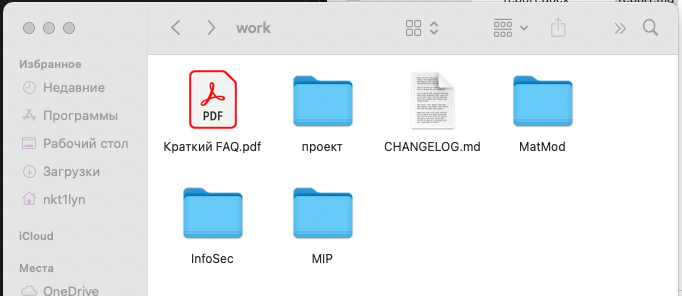
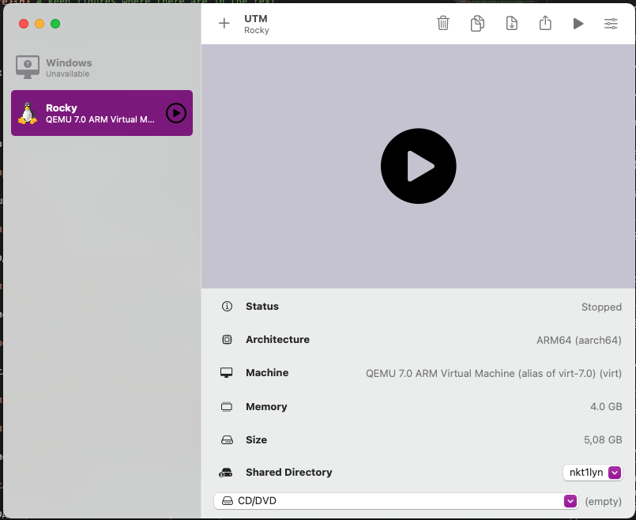
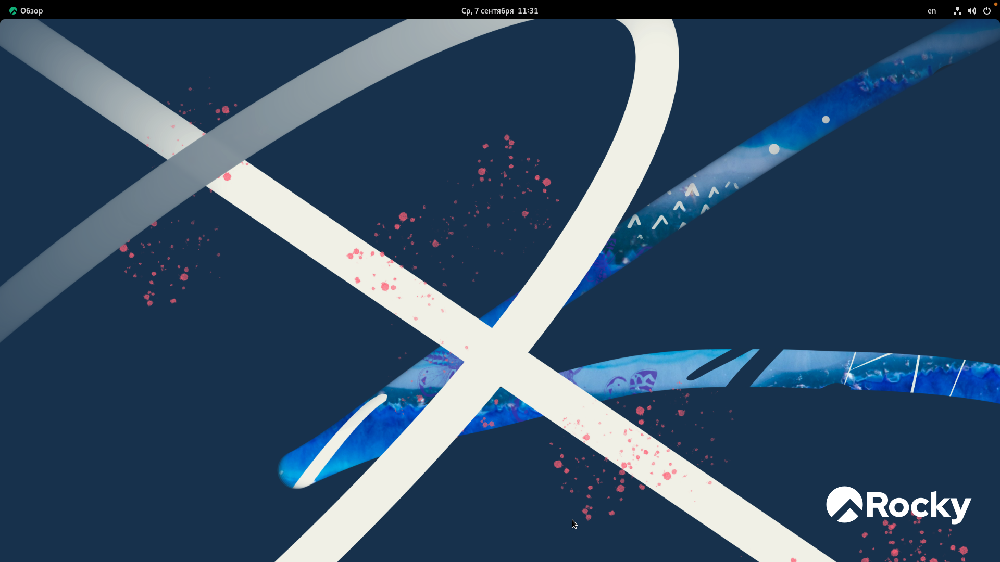

---
# Front matter
title: "Отчет по лабораторной работе №1. Установка и конфигурация операционной системы на виртуальную машину"
author: "Ильин Никита Евгеньевич, НФИбд-01-19"

# Generic otions
lang: ru-RU
toc-title: "Содержание"

# Pdf output format
toc: true # Table of contents
toc_depth: 2
lof: true # List of figures
lot: true # List of tables
fontsize: 12pt
linestretch: 1.5
papersize: a4
documentclass: scrreprt
## I18n
polyglossia-lang:
  name: russian
  options:
	- spelling=modern
	- babelshorthands=true
polyglossia-otherlangs:
  name: english
### Fonts
mainfont: PT Serif
romanfont: PT Serif
sansfont: PT Sans
monofont: PT Mono
mainfontoptions: Ligatures=TeX
romanfontoptions: Ligatures=TeX
sansfontoptions: Ligatures=TeX,Scale=MatchLowercase
monofontoptions: Scale=MatchLowercase,Scale=0.9
## Biblatex
biblatex: true
biblio-style: "gost-numeric"
biblatexoptions:
  - parentracker=true
  - backend=biber
  - hyperref=auto
  - language=auto
  - autolang=other*
  - citestyle=gost-numeric
## Misc options
indent: true
header-includes:
  - \linepenalty=10 # the penalty added to the badness of each line within a paragraph (no associated penalty node) Increasing the value makes tex try to have fewer lines in the paragraph.
  - \interlinepenalty=0 # value of the penalty (node) added after each line of a paragraph.
  - \hyphenpenalty=50 # the penalty for line breaking at an automatically inserted hyphen
  - \exhyphenpenalty=50 # the penalty for line breaking at an explicit hyphen
  - \binoppenalty=700 # the penalty for breaking a line at a binary operator
  - \relpenalty=500 # the penalty for breaking a line at a relation
  - \clubpenalty=150 # extra penalty for breaking after first line of a paragraph
  - \widowpenalty=150 # extra penalty for breaking before last line of a paragraph
  - \displaywidowpenalty=50 # extra penalty for breaking before last line before a display math
  - \brokenpenalty=100 # extra penalty for page breaking after a hyphenated line
  - \predisplaypenalty=10000 # penalty for breaking before a display
  - \postdisplaypenalty=0 # penalty for breaking after a display
  - \floatingpenalty = 20000 # penalty for splitting an insertion (can only be split footnote in standard LaTeX)
  - \raggedbottom # or \flushbottom
  - \usepackage{float} # keep figures where there are in the text
  - \floatplacement{figure}{H} # keep figures where there are in the text
---

# Цель работы

Приобретение практических навыков по установке операционных систем на виртуальные машины, а также навыков по настройке

# Ход работы

1. В своем рабочем каталоге создаю директорию InfoSec

2. Создаю виртуальную машину, из образа ОС Rocky Linux, с помощью UTM

3. Запускаю виртуальную машину, и начинаю установку ОС. После настройки попадаю на рабочий стол.(Настройки ОС показывать не стал, потому что они стандартные)

4. Образ дополнений гостевой ОС для виртуальной машины UTM не трубуется.

5. Выполняю поиск требуемой информации о системе, с помощью команды grep.
  (к содалению, не сохранился скриншот, не стал делать повторно, так как удалось найти не все данные. Вероятнее вскего, из-за процессора М1, не получилось получить данные о нем в ОС Linux)

# Контрольные вопросы

1. Какую информацию содержит учётная запись пользователя?
2. Укажите команды терминала и приведите примеры:
– для получения справки по команде;
– для перемещения по файловой системе;
– для просмотра содержимого каталога;
– для определения объёма каталога;
– для создания / удаления каталогов / файлов;
– для задания определённых прав на файл / каталог;
– для просмотра истории команд.
3. Что такое файловая система? Приведите примеры с краткой характери-
стикой.
4. Как посмотреть, какие файловые системы подмонтированы в ОС?
5. Как удалить зависший процесс?

# Ответы на контрольные вопросы

1. Учетная запись пользователя содержит информацию о пользователе, необходимую для регистрации в системе, и работы с ней. А именно: системное имя, идентификатор пользователя, идентификатор группы, полное имя, домашний каталог, оболочка и пароль.

2. 
– для получения справки по команде; help
– для перемещения по файловой системе; cd
– для просмотра содержимого каталога; ls
– для определения объёма каталога; du
– для создания / удаления каталогов / файлов; touch/rm
– для задания определённых прав на файл / каталог; chmod
– для просмотра истории команд. history.

3. Файловая система - это архитектура хранения данных в ОС. ОС Linux предпологает использование нескольких файловых систем, в основном, используются следующие: 

ext2 - Устаревшая ФС

ext3 - первая журналируемая ФС в ОС Linux.

ext4 - Самая современная ФС, имеет возможность масштабирования подкаталогов, многоблочное распределение.

4. С помощью команды findmnt.

5. С помощью команды kill.

# Выводы

Получены навыки создания виртуальных машин, и установки ОС на них.

# Библиография

1. Методические материалы курса