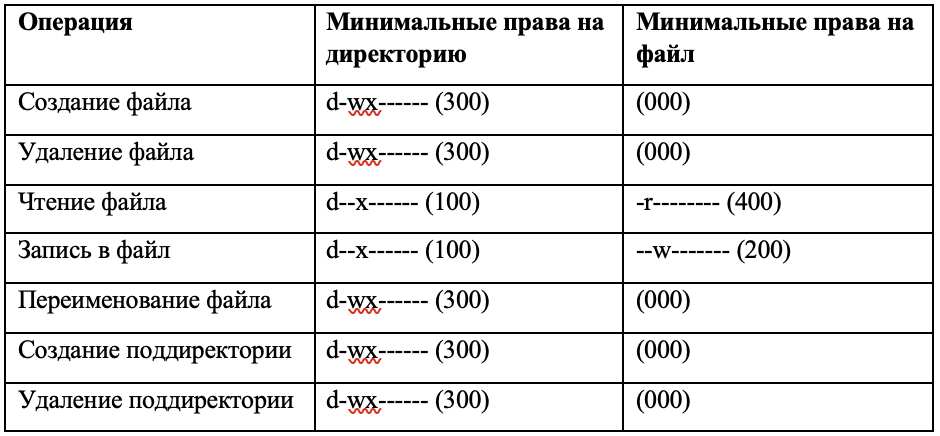

---
# Front matter
title: "Лабораторная работа № 3. Дискреционное разграничение прав в Linux. Два пользователя"
author: "Ильин Никита Евгеньевич, НФИбд-01-19"

# Generic otions
lang: ru-RU
toc-title: "Содержание"

# Pdf output format
toc: true # Table of contents
toc_depth: 2
lof: true # List of figures
lot: true # List of tables
fontsize: 12pt
linestretch: 1.5
papersize: a4
documentclass: scrreprt
## I18n
polyglossia-lang:
  name: russian
  options:
	- spelling=modern
	- babelshorthands=true
polyglossia-otherlangs:
  name: english
### Fonts
mainfont: PT Serif
romanfont: PT Serif
sansfont: PT Sans
monofont: PT Mono
mainfontoptions: Ligatures=TeX
romanfontoptions: Ligatures=TeX
sansfontoptions: Ligatures=TeX,Scale=MatchLowercase
monofontoptions: Scale=MatchLowercase,Scale=0.9
## Biblatex
biblatex: true
biblio-style: "gost-numeric"
biblatexoptions:
  - parentracker=true
  - backend=biber
  - hyperref=auto
  - language=auto
  - autolang=other*
  - citestyle=gost-numeric
## Misc options
indent: true
header-includes:
  - \linepenalty=10 # the penalty added to the badness of each line within a paragraph (no associated penalty node) Increasing the value makes tex try to have fewer lines in the paragraph.
  - \interlinepenalty=0 # value of the penalty (node) added after each line of a paragraph.
  - \hyphenpenalty=50 # the penalty for line breaking at an automatically inserted hyphen
  - \exhyphenpenalty=50 # the penalty for line breaking at an explicit hyphen
  - \binoppenalty=700 # the penalty for breaking a line at a binary operator
  - \relpenalty=500 # the penalty for breaking a line at a relation
  - \clubpenalty=150 # extra penalty for breaking after first line of a paragraph
  - \widowpenalty=150 # extra penalty for breaking before last line of a paragraph
  - \displaywidowpenalty=50 # extra penalty for breaking before last line before a display math
  - \brokenpenalty=100 # extra penalty for page breaking after a hyphenated line
  - \predisplaypenalty=10000 # penalty for breaking before a display
  - \postdisplaypenalty=0 # penalty for breaking after a display
  - \floatingpenalty = 20000 # penalty for splitting an insertion (can only be split footnote in standard LaTeX)
  - \raggedbottom # or \flushbottom
  - \usepackage{float} # keep figures where there are in the text
  - \floatplacement{figure}{H} # keep figures where there are in the text
---

# Цель работы

Получение практических навыков работы в консоли с атрибутами фай-
лов для групп пользователей.

# Ход работы

1. В установленной ОС создаю учетную запись пользователя guest. Задаю пароль для созданного пользователя

  {#fig:1 width=100%}

2. Создаю пользователя guest2.

  {#fig:2 width=100%}

3. Добавляю пользователя guest2 в группу guest. Вхожу в систему от двух пользователей, в двух разных консолях.

4. С помощью команды pwd определяю директорию. Определяю, что она является домашней.

  {#fig:3 width=100%}

5. Уточняю имя пользователя, его группу, кто входит в неё и к каким группам принадлежит он сам. Определяю командами groups guest и groups guest2, в какие группы входят пользователи guest и guest2. Сравниваю вывод команды groups с выводом команд id -Gn и id -G.

  {#fig:4 width=100%}

6. Сравниваю полученные данные с содержимым файла /etc/group.

  {#fig:5 width=100%}

7. Сравниваю полученные данные с данными в приглашении командной строке.

10. От имени пользователя guest измените права директории /home/guest, разрешив все действия для пользователей группы:

chmod g+rwx /home/guest

{#fig:6 width=100%}

11. От имени пользователя guest снимите с директории /home/guest/dir1 все атрибуты командой

chmod 000 dirl

и проверьте правильность снятия атрибутов.

Меняя атрибуты у директории dir1 и файла file1 от имени пользователя guest и делая проверку от пользователя guest2, заполните табл. 3.1, определив опытным путём, какие операции разрешены, а какие нет. Если операция разрешена, занесите в таблицу знак «+», если не разрешена, знак «-».

{ #fig:7 width=70% }

{ #fig:8 width=70% }

{ #fig:9 width=70% }

{ #fig:10 width=70% }

Сравните табл. 2.1 (из лабораторной работы № 2) и табл. 3.1. На основании заполненной таблицы определите те или иные минимально необходимые права для выполнения пользователем guest2 операций внутри директории dir1 и заполните табл. 3.2. (рис. -@fig:012)

{ #fig:11 width=70% }

# Выводы

Получены пракические навыки работы в консоли с атрибутами файлов, закреплены теоретические основы дискреционного разграничения доступа в современных системах на базе ОС Linux.

# Библиография

1. Методические материалы курса