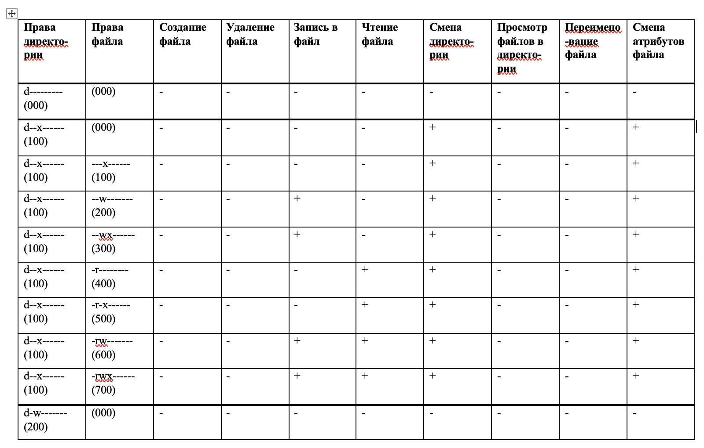

---
# Front matter
title: "Лабораторная работа № 3. Дискреционное разграничение прав в Linux. Два пользователя"
author: "Ильин Никита Евгеньевич, НФИбд-01-19"

# Formatting
toc: false
slide_level: 2
header-includes: 
 - \metroset{progressbar=frametitle,sectionpage=progressbar,numbering=fraction}
 - '\makeatletter'
 - '\beamer@ignorenonframefalse'
 - '\makeatother'
aspectratio: 43
section-titles: true
theme: metropolis
---

# Цель выполнения лабораторной работы 

Получение практических навыков работы в консоли с атрибутами фай-
лов для групп пользователей.

## Результат выполнения лабораторной работы

  { #fig:1 width=70% }

## Результат выполнения лабораорной работы

{ #fig:2 width=70% }

# Выводы по лабораторной работе

Получены пракические навыки работы в консоли с атрибутами файлов для групп пользователей.