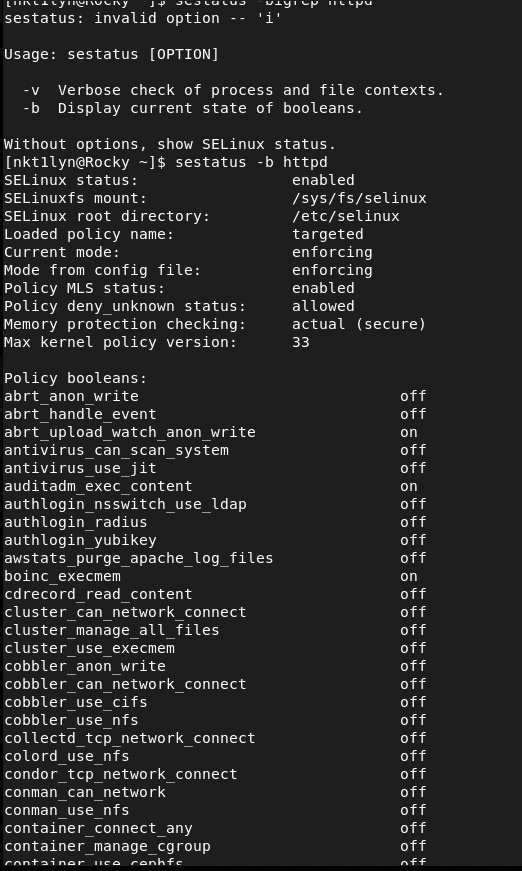

---
# Front matter
title: "Лабораторная работа № 6. Мандатное
разграничение прав в Linux"
author: "Ильин Никита Евгеньевич, НФИбд-01-19"

# Generic otions
lang: ru-RU
toc-title: "Содержание"

# Pdf output format
toc: true # Table of contents
toc_depth: 2
lof: true # List of figures
lot: true # List of tables
fontsize: 12pt
linestretch: 1.5
papersize: a4
documentclass: scrreprt
## I18n
polyglossia-lang:
  name: russian
  options:
	- spelling=modern
	- babelshorthands=true
polyglossia-otherlangs:
  name: english
### Fonts
mainfont: PT Serif
romanfont: PT Serif
sansfont: PT Sans
monofont: PT Mono
mainfontoptions: Ligatures=TeX
romanfontoptions: Ligatures=TeX
sansfontoptions: Ligatures=TeX,Scale=MatchLowercase
monofontoptions: Scale=MatchLowercase,Scale=0.9
## Biblatex
biblatex: true
biblio-style: "gost-numeric"
biblatexoptions:
  - parentracker=true
  - backend=biber
  - hyperref=auto
  - language=auto
  - autolang=other*
  - citestyle=gost-numeric
## Misc options
indent: true
header-includes:
  - \linepenalty=10 # the penalty added to the badness of each line within a paragraph (no associated penalty node) Increasing the value makes tex try to have fewer lines in the paragraph.
  - \interlinepenalty=0 # value of the penalty (node) added after each line of a paragraph.
  - \hyphenpenalty=50 # the penalty for line breaking at an automatically inserted hyphen
  - \exhyphenpenalty=50 # the penalty for line breaking at an explicit hyphen
  - \binoppenalty=700 # the penalty for breaking a line at a binary operator
  - \relpenalty=500 # the penalty for breaking a line at a relation
  - \clubpenalty=150 # extra penalty for breaking after first line of a paragraph
  - \widowpenalty=150 # extra penalty for breaking before last line of a paragraph
  - \displaywidowpenalty=50 # extra penalty for breaking before last line before a display math
  - \brokenpenalty=100 # extra penalty for page breaking after a hyphenated line
  - \predisplaypenalty=10000 # penalty for breaking before a display
  - \postdisplaypenalty=0 # penalty for breaking after a display
  - \floatingpenalty = 20000 # penalty for splitting an insertion (can only be split footnote in standard LaTeX)
  - \raggedbottom # or \flushbottom
  - \usepackage{float} # keep figures where there are in the text
  - \floatplacement{figure}{H} # keep figures where there are in the text
---

# Цель работы

Развить навыки администрирования ОС Linux. Получить первое практическое знакомство с технологией SELinux.
Проверить работу SELinx на практике совместно с веб-сервером Apache.

# Последовательность выполнения работы

1. Войдите в систему с полученными учётными данными и убедитесь, что
SELinux работает в режиме enforcing политики targeted с помощью команд getenforce и sestatus.

  {#fig:1 width=100%}

2. Обратитесь с помощью браузера к веб-серверу, запущенному на вашем
компьютере, и убедитесь, что последний работает:

        service httpd status
                или
        /etc/rc.d/init.d/httpd status

Если не работает, запустите его так же, но с параметром start.

  {#fig:2 width=100%}

3. Найдите веб-сервер Apache в списке процессов, определите его контекст
безопасности и занесите эту информацию в отчёт. Например, можно использовать команду

        ps auxZ | grep httpd
        или
        ps -eZ | grep httpd

  {#fig:3 width=100%}

4. Посмотрите текущее состояние переключателей SELinux для Apache с
помощью команды

        sestatus -bigrep httpd

Обратите внимание, что многие из них находятся в положении «off».

  {#fig:4 width=100%}

5. Посмотрите статистику по политике с помощью команды seinfo, также
определите множество пользователей, ролей, типов.

  {#fig:5 width=100%}

6. Определите тип файлов и поддиректорий, находящихся в директории
/var/www, с помощью команды

        ls -lZ /var/www

  {#fig:6 width=100%}

7. Определите тип файлов, находящихся в директории /var/www/html:

        ls -lZ /var/www/html

  {#fig:7 width=100%}

8. Определите круг пользователей, которым разрешено создание файлов в
директории /var/www/html.

9. Создайте от имени суперпользователя (так как в дистрибутиве после установки только ему разрешена запись в директорию) html-файл
/var/www/html/test.html следующего содержания:

        <html>
        <body>test</body>
        </html>

  {#fig:8 width=100%}

10. Проверьте контекст созданного вами файла. Занесите в отчёт контекст,
присваиваемый по умолчанию вновь созданным файлам в директории
/var/www/html.

11. Обратитесь к файлу через веб-сервер, введя в браузере адрес
http://127.0.0.1/test.html. Убедитесь, что файл был успешно отображён.

  {#fig:9 width=100%}

12. Изучите справку man httpd_selinux и выясните, какие контексты файлов определены для httpd. Сопоставьте их с типом файла
test.html. Проверить контекст файла можно командой ls -Z.
ls -Z /var/www/html/test.html
Рассмотрим полученный контекст детально. Обратите внимание, что так
как по умолчанию пользователи CentOS являются свободными от типа
(unconfined в переводе с англ. означает свободный), созданному нами
файлу test.html был сопоставлен SELinux, пользователь unconfined_u.
Это первая часть контекста.
        
Далее политика ролевого разделения доступа RBAC используется процессами, но не файлами, поэтому роли не имеют никакого значения для
файлов. Роль object_r используется по умолчанию для файлов на «постоянных» носителях и на сетевых файловых системах. (В директории
/ргос файлы, относящиеся к процессам, могут иметь роль system_r.
Если активна политика MLS, то могут использоваться и другие роли,
например, secadm_r. Данный случай мы рассматривать не будем, как и
предназначение :s0).

Тип httpd_sys_content_t позволяет процессу httpd получить доступ к файлу. Благодаря наличию последнего типа мы получили доступ к файлу
при обращении к нему через браузер.

13. Измените контекст файла /var/www/html/test.html с
httpd_sys_content_t на любой другой, к которому процесс httpd не
должен иметь доступа, например, на samba_share_t:

        chcon -t samba_share_t /var/www/html/test.html
        ls -Z /var/www/html/test.html

После этого проверьте, что контекст поменялся.

  {#fig:10 width=100%}

14. Попробуйте ещё раз получить доступ к файлу через веб-сервер, введя в
браузере адрес http://127.0.0.1/test.html. Вы должны получить
сообщение об ошибке:

        Forbidden
        You don't have permission to access /test.html on this server.

  {#fig:11 width=100%}

15. Проанализируйте ситуацию. Почему файл не был отображён, если права
доступа позволяют читать этот файл любому пользователю?
ls -l /var/www/html/test.html
Просмотрите log-файлы веб-сервера Apache. Также просмотрите системный лог-файл:

        tail /var/log/messages

Если в системе окажутся запущенными процессы setroubleshootd и
audtd, то вы также сможете увидеть ошибки, аналогичные указанным
выше, в файле /var/log/audit/audit.log. Проверьте это утверждение самостоятельно.

16. Попробуйте запустить веб-сервер Apache на прослушивание ТСР-порта
81 (а не 80, как рекомендует IANA и прописано в /etc/services). Для
этого в файле /etc/httpd/httpd.conf найдите строчку Listen 80 и
замените её на Listen 81.

  {#fig:12 width=100%}

17. Выполните перезапуск веб-сервера Apache. Произошёл сбой? Поясните
почему?

18. Проанализируйте лог-файлы:
tail -nl /var/log/messages
Просмотрите файлы /var/log/http/error_log,
/var/log/http/access_log и /var/log/audit/audit.log и
выясните, в каких файлах появились записи.

19. Выполните команду
semanage port -a -t http_port_t -р tcp 81
После этого проверьте список портов командой
semanage port -l | grep http_port_t
Убедитесь, что порт 81 появился в списке.

20. Попробуйте запустить веб-сервер Apache ещё раз. Поняли ли вы, почему
он сейчас запустился, а в предыдущем случае не смог?

  {#fig:13 width=100%}

21. Верните контекст httpd_sys_cоntent__t к файлу /var/www/html/ test.html:

        chcon -t httpd_sys_content_t /var/www/html/test.html

После этого попробуйте получить доступ к файлу через веб-сервер, введя в браузере адрес http://127.0.0.1:81/test.html.
Вы должны увидеть содержимое файла — слово «test».

22. Исправьте обратно конфигурационный файл apache, вернув Listen 80.

23. Удалите привязку http_port_t к 81 порту:
semanage port -d -t http_port_t -p tcp 81
и проверьте, что порт 81 удалён.

24. Удалите файл /var/www/html/test.html:

        rm /var/www/html/test.html

  {#fig:14 width=100%}

# Выводы

Развиты навыки администрирования ОС Linux. Получено первое практическое знакомство с технологией SELinux.
Проверена работу SELinx на практике совместно с веб-сервером Apache.

# Библиография

1. Методические материалы курса