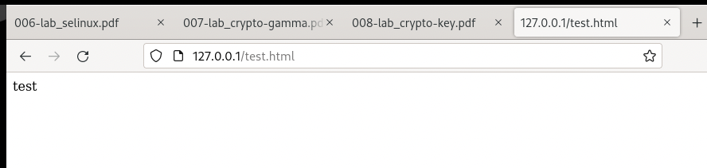

---
# Front matter
title: "Лабораторная работа № 6. Мандатное
разграничение прав в Linux"
author: "Ильин Никита Евгеньевич, НФИбд-01-19"

# Formatting
toc: false
slide_level: 2
header-includes: 
 - \metroset{progressbar=frametitle,sectionpage=progressbar,numbering=fraction}
 - '\makeatletter'
 - '\beamer@ignorenonframefalse'
 - '\makeatother'
aspectratio: 43
section-titles: true
theme: metropolis
---

# Цель выполнения лабораторной работы 

Развить навыки администрирования ОС Linux. Получить первое практическое знакомство с технологией SELinux.
Проверить работу SELinx на практике совместно с веб-сервером Apache.

## Результат выполнения лабораторной работы

  {#fig:9 width=100%}

# Выводы по лабораторной работе

Развиты навыки администрирования ОС Linux. Получено первое практическое знакомство с технологией SELinux.
Проверена работу SELinx на практике совместно с веб-сервером Apache.