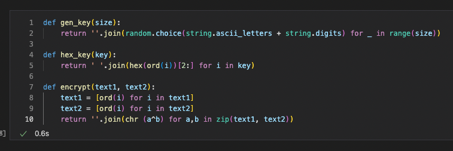
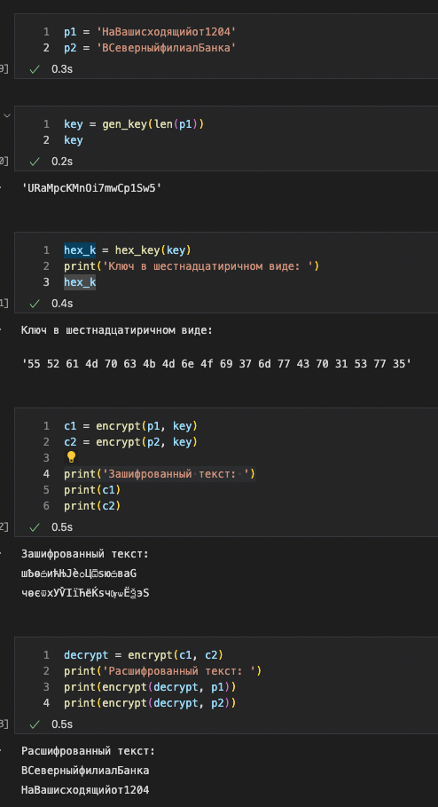

---
# Front matter
title: "Лабораторная работа № 8. Элементы
криптографии. Шифрование (кодирование)
различных исходных текстов одним ключом"
author: "Ильин Никита Евгеньевич, НФИбд-01-19"

# Formatting
toc: false
slide_level: 2
header-includes: 
 - \metroset{progressbar=frametitle,sectionpage=progressbar,numbering=fraction}
 - '\makeatletter'
 - '\beamer@ignorenonframefalse'
 - '\makeatother'
aspectratio: 43
section-titles: true
theme: metropolis
---

# Цель выполнения лабораторной работы 

Освоить на практике применение режима однократного гаммирования
на примере кодирования различных исходных текстов одним ключом [1].

## Результат выполнения лабораторной работы

  {#fig:1 width=100%}

## Результат выполнения лабораторной работы

  {#fig:2 width=100%}

# Выводы по лабораторной работе

Освоено на практике применение режима однократного гаммирования на примере различных исходных текстов одним ключом.