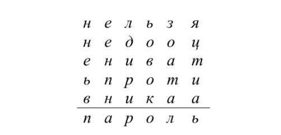
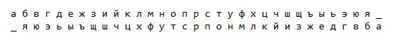
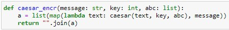
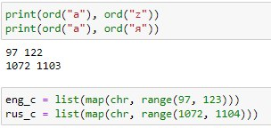
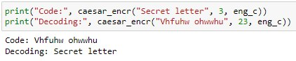
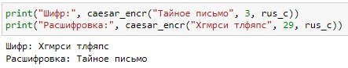
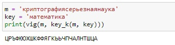
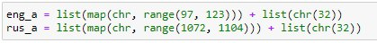
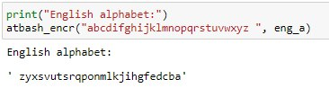
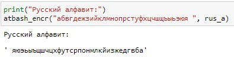

---
# Front matter
title: "Отчет по лабораторной работе №1"
subtitle: "Шифры простой замены"
author: "Бурдина Ксения Павловна"
group: NFImd-02-23
institute: RUDN University, Moscow, Russian Federation
date: 2023 Sep 13th

# Generic otions
lang: ru-RU
toc-title: "Содержание"

# Pdf output format
toc: true # Table of contents
toc_depth: 2
lof: true # List of figures
fontsize: 12pt
linestretch: 1.5
papersize: a4
documentclass: scrreprt
### Fonts
mainfont: PT Serif
romanfont: PT Serif
sansfont: PT Sans
monofont: PT Mono
mainfontoptions: Ligatures=TeX
romanfontoptions: Ligatures=TeX
sansfontoptions: Ligatures=TeX,Scale=MatchLowercase
monofontoptions: Scale=MatchLowercase,Scale=0.9
## Biblatex
biblatex: true
biblio-style: "gost-numeric"
biblatexoptions:
  - parentracker=true
  - backend=biber
  - hyperref=auto
  - language=auto
  - autolang=other*
  - citestyle=gost-numeric
## Misc options
indent: true
header-includes:
  - \linepenalty=10 # the penalty added to the badness of each line within a paragraph (no associated penalty node) Increasing the value makes tex try to have fewer lines in the paragraph.
  - \interlinepenalty=0 # value of the penalty (node) added after each line of a paragraph.
  - \hyphenpenalty=50 # the penalty for line breaking at an automatically inserted hyphen
  - \exhyphenpenalty=50 # the penalty for line breaking at an explicit hyphen
  - \binoppenalty=700 # the penalty for breaking a line at a binary operator
  - \relpenalty=500 # the penalty for breaking a line at a relation
  - \clubpenalty=150 # extra penalty for breaking after first line of a paragraph
  - \widowpenalty=150 # extra penalty for breaking before last line of a paragraph
  - \displaywidowpenalty=50 # extra penalty for breaking before last line before a display math
  - \brokenpenalty=100 # extra penalty for page breaking after a hyphenated line
  - \predisplaypenalty=10000 # penalty for breaking before a display
  - \postdisplaypenalty=0 # penalty for breaking after a display
  - \floatingpenalty = 20000 # penalty for splitting an insertion (can only be split footnote in standard LaTeX)
  - \raggedbottom # or \flushbottom
  - \usepackage{float} # keep figures where there are in the text
  - \floatplacement{figure}{H} # keep figures where there are in the text
---

# Цель работы

Целью данной работы является освоение шифров простой замены, таких как шифр Цезаря и шифр Атбаш, а также их программная реализация.

# Задание

1. Реализовать шифр Цезаря с произвольным ключом k.

2. Реализовать шифр Атбаш.

# Теоретическое введение

Шифрование является одним из механизмов безопасной передачи данных, которое гарантирует их конфиденциальность и целостность. Различают два метода шифрования для реализации механизма безопасности: криптографию и стенографию. В данном курсе мы рассматриваем первый метод.

Выделяют следующие механизмы [[1]](https://esystem.rudn.ru/pluginfile.php/2089861/mod_folder/content/0/mathsec_lection02-basic-concepts.pdf) криптографии:

- шифрование симметричными ключами
- шифрование асимметричными ключами
- хеширование

В данной лабораторной работе рассмотрим самые простые шифры с симметричными ключами - шифры простой замены.

В основе функционирования шифров простой замены лежит следующий принцип: для получения шифртекста отдельные символы или группы символов исходного алфавита заменяются символами или группами символов шифроалфавита.

## Шифр Цезаря

Шифр Цезаря - это моноалфавитная подстановка, то есть каждой букве открытого текста ставится в соответствие одна буква шифртекста. На практике при создании шифра простой замены в качестве шифроалфавита берется исодный алфавит, но с нарушенным порядком букв. Для запоминания нового порядка букв перемешивание алфавита осуществляется с помощью пароля. В качестве пароля могут выступать слово или несколько слов с неповторяющимися буквами. Шифровальная таблица состоит из двух строк: в первоц записывается стандартный алфавит открытого текста, во второй - начиная с некоторой позиции размещается пароль, а далее идут в алфавитном порядке оставшиеся буквы, не вошедшие в пароль. В случае несовпадения начала пароля с началом строки процесс после ее завершения циклически продолжается с первой позиции. Ключом шифра служит пароль вместе с числом, указывающим положение начальной буквы пароля. В процессе шифрования каждая буква открытого текста заменяется на стоящую под ней букву [[2]](https://intuit.ru/studies/courses/552/408/lecture/9350).

Во время войны с галлами в переписках со своими друзьями Ю. Цезарь заменял в сообщении первую букву латинского алфавита ($A$) на четвертую ($D$), вторую ($B$) - на пятую ($E$), наконец, последнюю - на третью:

{width=70%}

Математически процедуру шифрования можно описать следующим образом:

$$T_m=\lbrace T^j\rbrace ,   j=0,1,...,m-1,$$

$$T^j(a)=(a+j)\bmod m,$$

где $(a+j)\bmod m$ - операция нахождения остатка от целочисленного деления $a+j$ на $m$; $T_m$ - циклическая подгруппа. Пронумеруем буквы латинского алфавита от 0 до 25: $a=0, b=1, c=2, ..., z=25$. В латинском алфавите 26 букв и поэтому примем $m=26$. Тогда операцию шифрования запишем в виде: буква с номером $i$ заменяется на букву с номером $(i+3) \bmod 26$. Возможно и обобщение шифра Цезаря на случай произвольного ключа $k$: символ с номером $i$ заменится на символ с номером $(i+k) \bmod 26$.

Таким образом, открытый текст $a_0, a_1, ..., a_{N-1}$ преобразуется в криптограмму $T^j(a_0), T^j(a_1), ..., T^j(a_{N-1})$. При использовании для шифрования подстановки $T^j$ символ $a$ открытого текста заменяется символом $a+j$ шифрованного текста. Цезарь обычно для шифрования использовал подстановку $T^3$.

Взлом такого шифра осуществляется путем анализа частотных характеристик языка открытых текстов. Например, в русском тексте длиной $10000$ символов буква $О$ встречается в среднем $1047$ раз, $Е-836$, $А-808$, $Н-723$ и т.д. Поэтому, если в достаточно длинной криптограмме какой-то символ встречается чаще остальных, то есть все основания полагать, что это буква $О$.

## Шифр Атбаш

Данный шифр является шифром сдвига на всю длину алфавита. Для алфавита, состоящего только из русских букв и пробела, таблица шифрования будет иметь следующий вид:

{width=70%}

При программной реализации шифра Атбаш целесообразно использовать таблицу $ASCII$ и функции работы с ней ($ord$ и $chr$) [[3]](https://esystem.rudn.ru/pluginfile.php/2089865/mod_folder/content/0/lab01.pdf).

# Ход выполнения лабораторной работы

Для реализации шифров простой замены будем использовать среду JupyterLab. Выполним необходимую задачу.

1. Реализация шифра Цезаря с произвольным ключом $k$.

1.1. Пропишем функцию, в которой запишем принцип формирования нового алфавита для зашифровки сообщения из введенных данных - текста и ключа:

{width=80%}

Здесь мы применяем алгоритм поиска новых символов на основе принципа формирования шифра Цезаря - сначала вводим данные, на основании которых будет произведен поиск шифра, выводим индексы каждого символа, после чего находим каждый новый символ для шифровки по формуле сдвига всех символов на определенный ключ.

1.2. Далее определим функцию, которая будет преобразовывать введенный текст в зашифрованный и выводить итоговую строку на экран:

{width=80%}

1.3. Задаем переменную, которая будет отвечать за алфавит, который используется при шифровании текста. Находим порядковый номер каждого символа английского и русского алфавитов и затем собираем из них единый алфавит для работы с ранее описанной функцией:

{width=80%}

1.4. Делаем проверку работы функции нахождения шифра Цезаря. Вызываем нашу функцию для работы с текстом, вводим сообщение, которое необходимо зашифровать, и указываем ключ, то есть количество символов, на которые нужно сдвинуть алфавит для получения зашифрованного сообщения:

{width=80%}

Здесь видно, что изначально мы сдвигаем алфавит на 3 позиции, получаем зашифрованный текст, а потом при вызове функции с новым текстом делаем сдвиг на 23 позиции и возвращаемся к начальному алфавиту.

Также проверим работу функции для текста с использованием русского языка:

{width=80%}

2. Реализация шифра Атбаш.

2.1. Пропишем функцию, в которой запишем принцип формирования нового алфавита для зашифровки сообщения из введенных данных:

{width=80%}

Здесь мы применяем алгоритм поиска новых символов на основе принципа формирования шифра Атбаш - сначала вводим данные, на основании которых будет произведен поиск шифра, выводим индексы каждого символа, после чего находим каждый новый символ для шифровки по формуле отображения всех символов в зеркальном виде, то есть каждый символ алфавита сдвигаем полностью на его длину.

2.2. Далее определим функцию, которая будет преобразовывать введенный текст в зашифрованный и выводить итоговую строку на экран:

{width=80%}

2.3. Задаем переменную, которая будет отвечать за алфавит, который используется при шифровании текста. Находим порядковый номер каждого символа английского и русского алфавитов и затем собираем из них единый алфавит для работы с ранее описанной функцией, плюс добавляем для данного шифра символ пробела для использования в алфавите:

{width=80%}

2.4. Делаем проверку работы функции нахождения шифра Атбаш. Вызываем нашу функцию для работы с текстом, вводим полностью алфавит, который необходимо зашифровать, и выводим зашифрованный алфавит на экран:

{width=80%}

Видим, что в результате у нас выводится английский алфавит в обратном порядке с учетом символа пробел.

Также проверим работу функции для русского алфавита:

{width=80%}

# Листинг программы

    # Шифр Цезаря
    def caesar(text: chr, key: int, abc: list):
      def caesar(text: chr, key: int):
        return abc.index(text) + key
        
      if text.lower() not in abc:
        return text

      new_text = abc[caesar(text.lower(), key) % len(abc)]
      if text.isupper():
        new_text = new_text.upper()
      return new_text
    
    def caesar_encr(message: str, key: int, abc: list):
      a = list(map(lambda text: caesar(text, key, abc), message))
      return "".join(a)

    print(ord("a"), ord("z"))
    print(ord("а"), ord("я"))

    eng_c = list(map(chr, range(97, 123)))
    rus_c = list(map(chr, range(1072, 1104)))

    print("Code:", caesar_encr("Secret letter", 3, eng_c))
    print("Decoding:", caesar_encr("Vhfuhw ohwwhu", 23, eng_c))

    print("Шифр:", caesar_encr("Тайное письмо", 3, rus_c))
    print("Расшифровка:", caesar_encr("Хгмрси тлфяпс", 29, rus_c))

    # Шифр Атбаш
    def atbash(text: chr, abc: list):
      if text.lower() not in abc:
        return text
      new_text = abc[len(abc) - abc.index(text.lower()) - 1]
      if text.isupper():
        new_text = new_text.upper()
      return new_text

    def atbash_encr(message: str, abc: list):
      a = list(map(lambda text: atbash(text, abc), message))
      return "".join(a)

    eng_a = list(map(chr, range(97, 123))) + list(chr(32))
    rus_a = list(map(chr, range(1072, 1104))) + list(chr(32))

    print("English alphabet:")
    atbash_encr("abcdifghijklmnopqrstuvwxyz ", eng_a)

    print("Русский алфавит:")
    atbash_encr("абвгдежзийклмнопрстуфхцчшщъыьэюя ", rus_a)

# Выводы

В ходе работы мы изучили и реализовали шифры простой замены, такие как шифр Цезаря и шифр Атбаш.

# Список литературы

1. Основные понятия иноформационной безопасности [[1]](https://esystem.rudn.ru/pluginfile.php/2089861/mod_folder/content/0/mathsec_lection02-basic-concepts.pdf)

2. Фороузан Б. А. Криптография и безопасность сетей. - М.: Интернет-Университет Информационных Технологий : БИНОМ. Лаборатория знаний, 2010. - 784 с. [[2]](https://intuit.ru/studies/courses/552/408/lecture/9350)

3. Методические материалы курса [[3]](https://esystem.rudn.ru/pluginfile.php/2089865/mod_folder/content/0/lab01.pdf)

