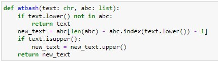

---
# Front matter
title: "Отчет по лабораторной работе №2"
subtitle: "Шифры перестановки"
author: "Бурдина Ксения Павловна"
institute: Российский университет дружбы народов, Москва, Россия
date: 23 сентября 2023

# Generic otions
lang: ru-RU
toc-title: "Содержание"

# Pdf output format
toc: true # Table of contents
toc_depth: 2
lof: true # List of figures
fontsize: 12pt
linestretch: 1.5
papersize: a4
documentclass: scrreprt
### Fonts
mainfont: PT Serif
romanfont: PT Serif
sansfont: PT Sans
monofont: PT Mono
mainfontoptions: Ligatures=TeX
romanfontoptions: Ligatures=TeX
sansfontoptions: Ligatures=TeX,Scale=MatchLowercase
monofontoptions: Scale=MatchLowercase,Scale=0.9
## Biblatex
biblatex: true
biblio-style: "gost-numeric"
biblatexoptions:
  - parentracker=true
  - backend=biber
  - hyperref=auto
  - language=auto
  - autolang=other*
  - citestyle=gost-numeric
## Misc options
indent: true
header-includes:
  - \linepenalty=10 # the penalty added to the badness of each line within a paragraph (no associated penalty node) Increasing the value makes tex try to have fewer lines in the paragraph.
  - \interlinepenalty=0 # value of the penalty (node) added after each line of a paragraph.
  - \hyphenpenalty=50 # the penalty for line breaking at an automatically inserted hyphen
  - \exhyphenpenalty=50 # the penalty for line breaking at an explicit hyphen
  - \binoppenalty=700 # the penalty for breaking a line at a binary operator
  - \relpenalty=500 # the penalty for breaking a line at a relation
  - \clubpenalty=150 # extra penalty for breaking after first line of a paragraph
  - \widowpenalty=150 # extra penalty for breaking before last line of a paragraph
  - \displaywidowpenalty=50 # extra penalty for breaking before last line before a display math
  - \brokenpenalty=100 # extra penalty for page breaking after a hyphenated line
  - \predisplaypenalty=10000 # penalty for breaking before a display
  - \postdisplaypenalty=0 # penalty for breaking after a display
  - \floatingpenalty = 20000 # penalty for splitting an insertion (can only be split footnote in standard LaTeX)
  - \raggedbottom # or \flushbottom
  - \usepackage{float} # keep figures where there are in the text
  - \floatplacement{figure}{H} # keep figures where there are in the text
---

# Цель работы

Целью данной работы является освоение шифров перестановки, таких как маршрутное шифрование, шифрование с помощью решеток и таблица Виженера, а также их программная реализация.

# Задание

1. Реализовать маршрутное шифрование.
2. Реализовать шифрование с помощью решеток.
3. Реализовать таблицу Виженера.

# Теоретическое введение

Шифры перестановки преобразуют открытый текст в криптограмму путем перестановки его символов. Способ, каким при шифровании переставляются буквы открытого текста, и является ключом шифра. Важным требованием является равенство длин ключа и исходного текста.

В данной работе рассмотрим такие шифры перестановки, как маршрутное шифрование, шифрование с помощью решеток и таблица Виженера [[1]](https://esystem.rudn.ru/pluginfile.php/2089869/mod_folder/content/0/%D0%A2%D1%80%D0%B0%D0%B4%D0%B8%D1%86%D0%B8%D0%BE%D0%BD%D0%BD%D1%8B%D0%B5%20%D1%88%D0%B8%D1%84%D1%80%D1%8B%20%D1%81%20%D1%81%D0%B8%D0%BC%D0%BC%D0%B5%D1%82%D1%80%D0%B8%D1%87%D0%BD%D1%8B%D0%BC%20%D0%BA%D0%BB%D1%8E%D1%87%D0%BE%D0%BC.pdf?forcedownload=1).

## Маршрутное шифрование

Данный способ шифрования разработал французский математик Франсуа Виет. Открытый текст записывают в некоторую геометрическую фигуру по некоторому пути, а затем, выписывая символы по другому пути, получают шифртекст. Пусть $m$ и $n$ - целые положительные числа, большие единицы. Открытый текст разбивается на блоки равной длины, состоящие из числа символов, равному произведению $mn$. Если последний блок получится меньше остальных, то в него следует дописать требуемое количество произвольных символов. Составляется таблица размерности $mn$. Блоки вписываются построчно в таблицу. Криптограмма получается выписыванием букв из таблицы в соответствии с некоторым маршрутом. Ключом такой криптограммы является маршрут и числа $m$ и $n$. Обычно буквы выписывают по столбцам, которые упорядочивают согласно паролю: внизу таблицы приписывается слово из $n$ неповторяющихся букв и столбцы нумеруются по алфавитному порядку букв пароля.

Например, для шифрования текста *нельзя недооценивать противника*, разобьем его на блоки длины $n=6$. Блоков получится $m=5$. К последнему блоку припишем букву $a$. В качестве пароля выберем слово *пароль*. Теперь будем выписывать буквы по столбцам в соответствии с алфавитным порядком букв пароля и получим следующую криптограмму: ЕЕНПНЗОАТАЬОВОКННЕЬВЛДИРИЯЦТИА:

{width=70%}

## Шифрование с помощью решеток

Данный способ шифрования предложил австрийский криптограф Эдуард Флейснер в 1881 году. Суть этого способа заключается в следующем: выбирается натуральное число $k>1$, строится квадрат размерности $k$ и построчно заполняется числами $1,2,...,k^2$. В качестве примера рассмотрим квадрат размерности $k=2$. Повернем его по часовой стрелке на $90^{\circ}$ b присоединим к исходному квадрату справа. Проделаем еще дважды такую процедуру и припишем получившиеся квдраты снизу. Получился большой квадрат размерности $2k$.

Дальше из большого квадрата вырезаются клетки, содержащие числа от $1$ до $k^2$. В каждой клетке должно быть только одно число. Получается своего рода решето. Шифрование осуществляется следующим образом. Решето накладывается на чистый квадрат $2k*2k$ и в прорези вписываются буквы исходного текста по порядку их следования. Когда заполнятся все прорези, решето поворачивается на $90^{\circ}$ и вписывание букв продолжается. После третьего поворота все клетки большого квадрата окажутся заполненными. Подобрав подходящий пароль, выпишем буквы по столбцам. Очередность столбцов определяется алфавитным порядком букв пароля [[2]](https://intuit.ru/studies/courses/552/408/lecture/9350).

Например, при исходном тексте *договор подписали* и пароле *шифр* с применением вышеуказанной решетки за пять шагов получим следующую криптограмму:

{width=70%}

Получившаяся криптограмма: ОВОРДЛГПАПИОСДОИ. Важно отметить, что число $k$ подбирается в соответствии с количеством букв $N$ исходного текста. В идеальном случае $k^2=N$. Если такого равенства достичь невозможно, то можно либо дописать произвольную букву к последнему слову открытого текста, либо убрать ее.

## Таблица Виженера

В 1585 году французский криптограф Блез Виженер опубликовал свой метод шифрования в "Трактате о шифрах". Шифр считался нераскрываемым до 1863 года, когда австриец Фридрих Казиски взломал его.

Открытый текст разбивается на блоки длины $n$. Ключ представляет собой последовательность из $n$ натуральных чисел: $a_1, a_2, ..., a_n$. Далее в каждом блоке первая буква циклически сдвигается вправо по алфавиту на $a_1$ позиций, вторая буква - на $a_2$ позиций, последняя - на $a_n$ позиций. Для лучшего запоминания в качестве ключа можно взять осмысленное слово, а алфавитные номера входящих в него букв использовать для осуществления сдвигов. Рассмотрим еще одну схему построения шифра Виженера. В таблицу в строки записываются буквы русского алфавита. При переходе от одной строке к другой происходит циклический сдвиг на одну позицию. Исходный текст: *криптография серьезная наука*; пароль - *математика*. Пароль записывается с повторениями над буквами сообщения:

{width=70%}

В горизонтальном алфавите в таблице находится буква *к*, а в вертикальном - буква *м*. На пересечении столбца и строки в таблице расположена буква *ц* [[3]](https://esystem.rudn.ru/pluginfile.php/2089868/mod_folder/content/0/mathsec_lection03-modular-arithmetic-2021.pdf?forcedownload=1). Далее переходим к буквам *р* и *а* соответственно. В итоге получается следующая криптограмма: ЦРЬФЯОХШКФФЯДКЭЬЧПЧАЛНТШЦА.

# Ход выполнения лабораторной работы

Для реализации шифров перестановки будем использовать среду JupyterLab. Выполним необходимую задачу.

1. Реализация маршрутного шифрования.

1.1. Зададим алфавит для дальнейшей работы с шифрами перестановки:

{width=70%}

1.2. Пропишем функцию, в которой запишем принцип формирования и работы метода маршрутного шифра, а также произведем вывод полученного зашифрованного текста по примеру на экран:

{width=80%}

Здесь мы подаем на ввод исходный текст, пароль, а также размерность матрицы, с которой работаем. Далее формируем текст в виде матрицы, а также записываем пароль под ней. После этого сортируем столбцы по алфавиту букв пароля, после чего выводим зашифрованный текст по полученным столбцам.

2. Реализация шифрования с помощью решеток.

2.1. Подключим для работы программы необходимые библиотеки. Зададим размерность используемой решетки, создадим матрицу для работы с зашифровкой вводимого текста, а также укажем параметры, по которым происходит заполнение решетки символами:

{width=80%}

2.2. Введем данные, с которыми будем работать. Пропишем метод вывода зашированного сообщения с помощью использования разворота матрицы с символами и пароля, который задается для шифровки. После этого выводим получившийся шифр на экран:

{width=80%}

3. Реализация таблицы Виженера.

3.1. Пропишем функции для реализации данного метода. В первой будет описан метод задания пароля для работы с текстом, то есть каким образом пароль накладывается на исходное сообщение. Во второй функции пропишем способ нахождения зашифрованного текста по исходному с помощью пересечения букв алфавита по таблице Виженера:

{width=80%}

По итогу при вызове функции получим зашифрованное сообщение:

{width=80%}

3.2. Далее определим функцию, которая будет обратно собирать исходное сообщение. Для этого так же через таблицу алфавита находим исходные символы по пересечению. В результате при вызове функции получаем наше исходное сообщение: 

{width=80%}

# Листинг программы

    rus = 'абвгдежзийклмнопрстуфхцчшщъыьэюя'
    # маршрутное шифрование
    def mar(text, key, m, n):
      global rus
      textws = text.replace(' ', '')
      if len(textws)<m*n:
        textws += rus[:m*n-len(textws)]
      t = iter(textws)
      matrix = [[next(t) for y in range(m)] for x in range(n)]
      ps = [rus.index(x) for x in key]
      pss = sorted(ps)
      output = ''
      for letter in pss:
        for x in range(n):
          output += matrix[x][ps.index(letter)]
      return output
    
    print(mar('нельзя недооценивать противника', 'пароль', 6, 5))

    import numpy as np

    # шифрование с помощью решеток
    k = 2
    k2 = [x+1 for x in range(k**2)]
    matrix = [[0 for x in range(2*k)] for y in range(2*k)]
    matrix = np.array(matrix)
    for x in range(k**2):
      c = 0
      for x in range(k):
        for y in range(k):
          matrix[x][y] = k2[c]
          c += 1
      matrix = np.rot90(matrix)
    ds = {k: 0 for k in k2}
    dss = {1:2, 2:4, 3:3, 4:3}
    for x in range(k**2):
      for y in range(k**2):
        ds[matrix[x][y]] += 1
        if ds[matrix[x][y]] != dss[matrix[x][y]]:
          matrix[x][y] = -1
        else:
          matrix[x][y] = 0
    
    text = 'договорподписали'
    key = 'шифр'
    ct = 0
    t = iter(text)
    matrixt = [['О' for y in range(k**2)] for x in range(k**2)]
    for d in range(4):
      for x in range(k**2):
        for y in range(k**2):
          if matrix[x][y] == 0:
            matrixt[x][y] = text[ct]
            ct += 1
      matrix = np.rot90(matrix, -1)
    ps = [rus.index(x) for x in key]
    pss = sorted(ps)
    output = ''
    for letter in pss:
      for x in range(k**2):
        output += matrixt[x][ps.index(letter)]
    print(output)

    # таблица Виженера
    def key_k(m, key):
      key.replace(' ', '')
      m.replace(' ', '')
      key = list(key)
      if len(m) == len(key):
        return(key)
      else:
        for i in range(len(m) - len(key)):
          key.append(key[i%len(key)])
      return(''.join(key))

    def vig(m, key):
      ct = []
      m.replace(' ', '')
      for i in range(len(m)):
        x = (ord(m[i]) + ord(key[i])) % 32
        x += ord('А')
        ct.append(chr(x))
      return(''.join(ct))
    
    m = 'криптографиясерьезнаянаука'
    key = 'математика'
    print(vig(m, key_k(m, key)))

    def unvig(ct, key):
      ot = []
      for i in range(len(ct)):
        x = (ord(ct[i]) - ord(key[i]) + 32) % 32
        x += ord('а')
        ot.append(chr(x))
      return(''.join(ot))
    
    ct = 'ЦРЪФЮОХШКФФЯГКЬЬЧПЧАЛНТШЦА'
    key = 'математика'
    print(unvig(ct, key_k(ct, key)))

# Выводы

В ходе работы мы изучили и реализовали шифры перестановки, такие как маршрутное шифрование, шифрование с помощью решеток и таблица Виженера.

# Список литературы

1. Традиционные шифры с симметричным ключом [[1]](https://esystem.rudn.ru/pluginfile.php/2089869/mod_folder/content/0/%D0%A2%D1%80%D0%B0%D0%B4%D0%B8%D1%86%D0%B8%D0%BE%D0%BD%D0%BD%D1%8B%D0%B5%20%D1%88%D0%B8%D1%84%D1%80%D1%8B%20%D1%81%20%D1%81%D0%B8%D0%BC%D0%BC%D0%B5%D1%82%D1%80%D0%B8%D1%87%D0%BD%D1%8B%D0%BC%20%D0%BA%D0%BB%D1%8E%D1%87%D0%BE%D0%BC.pdf?forcedownload=1)

2. Фороузан Б. А. Криптография и безопасность сетей. - М.: Интернет-Университет Информационных Технологий : БИНОМ. Лаборатория знаний, 2010. - 784 с. [[2]](https://intuit.ru/studies/courses/552/408/lecture/9350)

3. Методические материалы курса [[3]](https://esystem.rudn.ru/pluginfile.php/2089868/mod_folder/content/0/mathsec_lection03-modular-arithmetic-2021.pdf?forcedownload=1)

