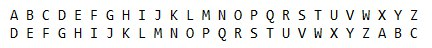
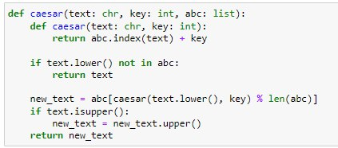
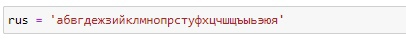
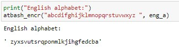
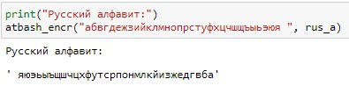

---
# Front matter
lang: ru-RU
title: Защита лабораторной работы №1. Шифры простой замены 
author: "Бурдина Ксения Павловна"
group: NFImd-02-23
institute: RUDN University, Moscow, Russian Federation
date: 2023 Sep 13th

# Formatting
toc: false
slide_level: 2
header-includes: 
 - \metroset{progressbar=frametitle,sectionpage=progressbar,numbering=fraction}
 - '\makeatletter'
 - '\beamer@ignorenonframefalse'
 - '\makeatother'
aspectratio: 43
section-titles: true
theme: metropolis

---

# Результат выполнения лабораторной работы №1

# Цель выполнения лабораторной работы 

## Цель выполнения лабораторной работы

- Освоение шифров простой замены - шифр Цезаря и шифр Атбаш
- Программная реализация шифров простой замены

# Теоретические сведения

## Теоретические сведения

Механизмы криптографии:

- шифрование симметричными ключами
- шифрование асимметричными ключами
- хеширование

## Теоретические сведения. Шифр Цезаря

Шифр Цезаря - это моноалфавитная подстановка, где каждой букве открытого текста ставится в соответствие одна буква шифртекста.

Математический вид процедуры шифрования:

$$T_m=\lbrace T^j\rbrace ,   j=0,1,...,m-1,$$

$$T^j(a)=(a+j)\bmod m,$$

{width=70%}

## Теоретические сведения. Шифр Атбаш

Шифр Атбаш - это шифр сдвига на всю длину алфавита.

Для алфавита, состоящего только из русских букв и пробела, таблица шифрования имеет следующий вид:

{width=70%}

# Результат выполнения лабораторной работы

## Результат выполнения лабораторной работы

Постановка задачи:

1. Рализовать шифр Цезаря с произвольным ключом $k$
2. Реализовать шифр Атбаш

## Результат выполнения лабораторной работы. Шифр Цезаря

Алгоритм поиска новых символов и вывода полученного текста на основе принципа формирования шифра Цезаря:

{width=80%}

{width=80%}

## Результат выполнения лабораторной работы. Шифр Цезаря

Нахождение порядковых номеров каждого символа алфавита и определение переменных для работы функций:

{width=80%}

## Результат выполнения лабораторной работы. Шифр Цезаря

Примеры работы функции по реализации шифра Цезаря:

{width=80%}

{width=80%}

## Результат выполнения лабораторной работы. Шифр Атбаш

Принцип формирования нового алфавита для зашифровки сообщения из введенных данных:

{width=80%}

{width=80%}

## Результат выполнения лабораторной работы. Шифр Атбаш

Примеры работы функции по реализации шифра Атбаш:

{width=80%}

{width=80%}

# Выводы

## Выводы

1. Изучили шифры простой замены
2. Реализовали шифр Цезаря с произвольным ключом $k$
3. Реализовали шифр Атбаш
