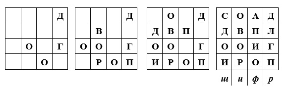
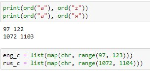
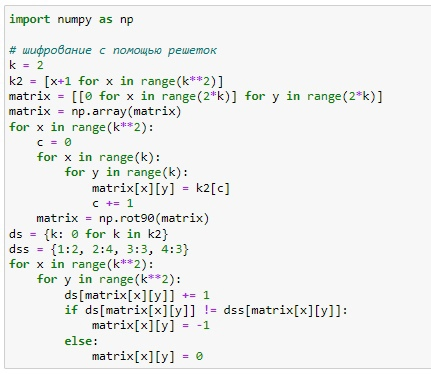
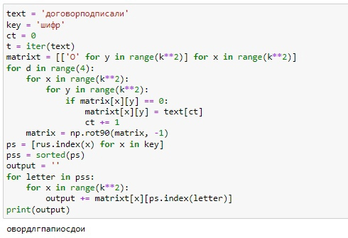
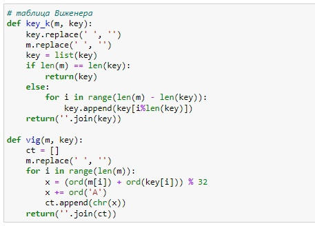
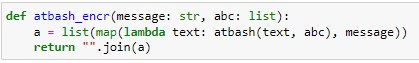

---
# Front matter
lang: ru-RU
title: Защита лабораторной работы №2
subtitle: Шифры перестановки 
author: "Бурдина К. П."
institute: Российский университет дружбы народов, Москва, Россия
date: 23 сентября 2023

# Formatting
toc: false
slide_level: 2
header-includes: 
 - \metroset{progressbar=frametitle,sectionpage=progressbar,numbering=fraction}
 - '\makeatletter'
 - '\beamer@ignorenonframefalse'
 - '\makeatother'
aspectratio: 43
section-titles: true
theme: metropolis

---

## Докладчик

:::::::::::::: {.columns align=center}
::: {.column width="70%"}

    * Бурдина Ксения Павловна
    * студентка группы НФИмд-02-23
    * студ. билет № 1132236896
    * Российский университет дружбы народов
    * 1132236896@rudn.ru

:::
::: {.column width="30%"}

{width=80%}

:::
::::::::::::::

# Вводная часть 

## Цель выполнения лабораторной работы

- Освоение шифров перестановки - маршрутное шифрование, шифрование с помощью решеток и таблица Виженера
- Программная реализация шифров перестановки

## Теоретические сведения. Маршрутное шифрование

При маршрутном шифровании открытый текст записывают в некоторую геометрическую фигуру по некоторому пути, а затем, выписывая символы по другому пути, получают шифртекст.

{width=70%}

## Теоретические сведения. Шифрование с помощью решеток

Шифрование с помощью решеток производится путем выбора натурального числа $k$, построения квадрата размерности данного числа и заполняется последовательно числами $1,...,k^2$. Затем квадрат поворачивают и подставляют рядом. Производят это до построения нового квадрата. Далее вырезаются некоторые клетки, в которые вписывают буквы исходного текста.

{width=70%}

## Теоретические сведения. Таблица Виженера

Схема построения шифра Виженера: в таблицу в строки записываются буквы русского алфавита. При переходе от одной строке к другой происходит циклический сдвиг на одну позицию. 

{width=70%}

# Результат выполнения лабораторной работы

## Результат выполнения лабораторной работы

Постановка задачи:

1. Рализовать маршрутное шифрование
2. Реализовать шифрование с помощью решеток
3. Реализовать таблицу Виженера

## Результат выполнения лабораторной работы. Маршрутное шифрование

Алгоритм поиска зашифрованного текста на основе принципа формирования маршрутного шифрования:

{width=80%}

## Результат выполнения лабораторной работы. Шифрование с помощью решеток

Алгоритм поиска зашифрованного текста на основе принципа формирования шифрования с помощью решеток:

{width=80%}

## Результат выполнения лабораторной работы. Шифрование с помощью решеток

Алгоритм поиска зашифрованного текста на основе принципа формирования шифрования с помощью решеток:

{width=80%}

## Результат выполнения лабораторной работы. Таблица Виженера

Алгоритм поиска зашифрованного текста на основе принципа формирования таблицы Виженера:

{width=70%}

{width=70%}

# Выводы

## Выводы

1. Изучили шифры перестановки
2. Реализовали маршрутное шифрование
3. Реализовали шифрование с помощью решеток
4. Реализовали таблицу Виженера
