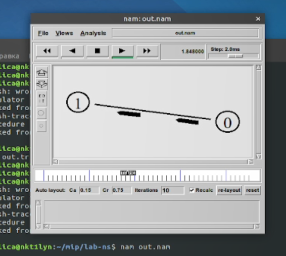
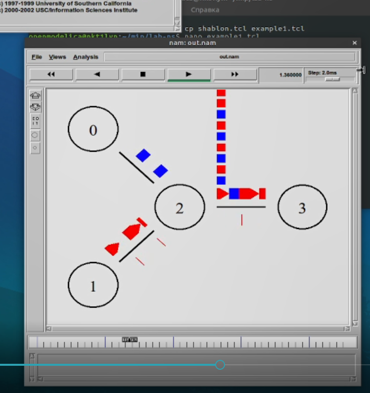
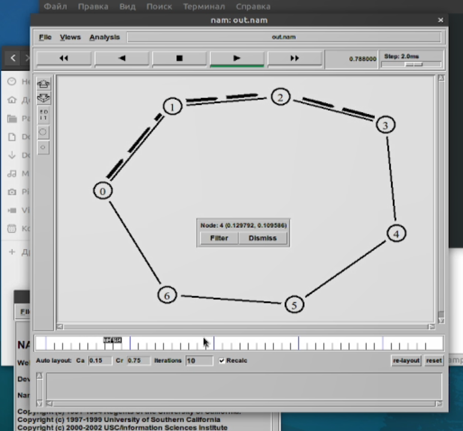
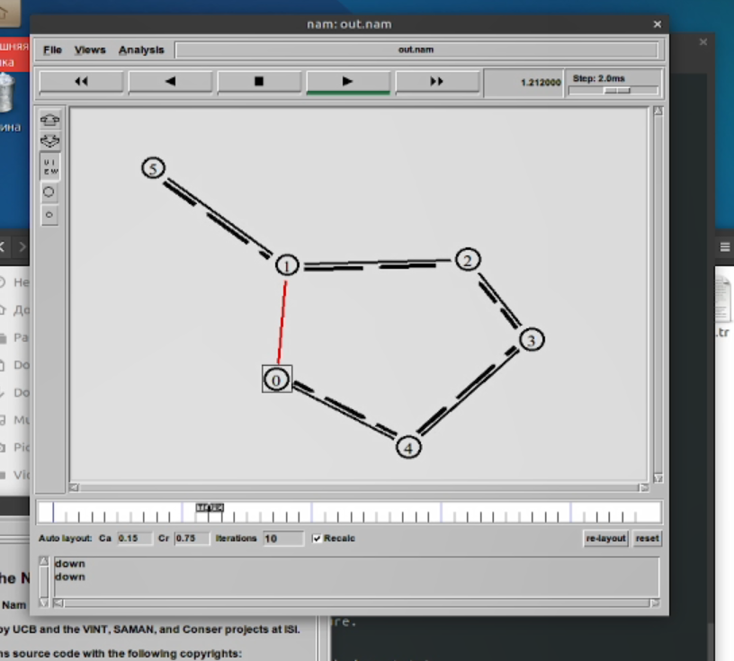

---
# Front matter
title: "Лабораторная работа 1. Простые модели компьютерной сети"
author: "Ильин Никита Евгеньевич"

# Formatting
toc: false
slide_level: 2
header-includes: 
 - \metroset{progressbar=frametitle,sectionpage=progressbar,numbering=fraction}
 - '\makeatletter'
 - '\beamer@ignorenonframefalse'
 - '\makeatother'
aspectratio: 43
section-titles: true
theme: metropolis
---

# Цель выполнения лабораторной работы 

Приобретение навыков моделирования сетей передачи данных с помощью сред-
ства имитационного моделирования NS-2, а также анализ полученных результатов
моделирования.

# Задача

1. Создать шаблон сценария для NS-2

2. Описать топологию простой сети

3. Описать топологию усложненной сети

4. Построить модель передачи данных по кольцевой сети

5. Выполнить упражнение

## Результат выполнения лабораторной работы

## Результат выполнения лабораторной работы

## Результат выполнения лабораторной работы

## Результат выполнения лабораторной работы

# Выводы по лабораторной работе

- Получены навыки моделирования сетей передачи данных в NS-2.