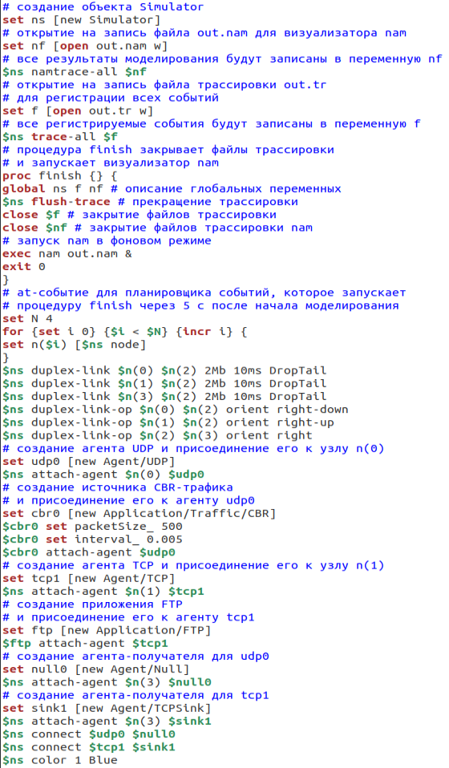

---
# Front matter
title: "Лабораторная работа 1. Простые модели компьютерной сети"
author: "Ильин Никита Евгеньевич"

# Generic otions
lang: ru-RU
toc-title: "Содержание"

# Pdf output format
toc: true # Table of contents
toc_depth: 2
lof: true # List of figures
lot: true # List of tables
fontsize: 12pt
linestretch: 1.5
papersize: a4
documentclass: scrreprt
## I18n
polyglossia-lang:
  name: russian
  options:
	- spelling=modern
	- babelshorthands=true
polyglossia-otherlangs:
  name: english
### Fonts
mainfont: PT Serif
romanfont: PT Serif
sansfont: PT Sans
monofont: PT Mono
mainfontoptions: Ligatures=TeX
romanfontoptions: Ligatures=TeX
sansfontoptions: Ligatures=TeX,Scale=MatchLowercase
monofontoptions: Scale=MatchLowercase,Scale=0.9
## Biblatex
biblatex: true
biblio-style: "gost-numeric"
biblatexoptions:
  - parentracker=true
  - backend=biber
  - hyperref=auto
  - language=auto
  - autolang=other*
  - citestyle=gost-numeric
## Misc options
indent: true
header-includes:
  - \linepenalty=10 # the penalty added to the badness of each line within a paragraph (no associated penalty node) Increasing the value makes tex try to have fewer lines in the paragraph.
  - \interlinepenalty=0 # value of the penalty (node) added after each line of a paragraph.
  - \hyphenpenalty=50 # the penalty for line breaking at an automatically inserted hyphen
  - \exhyphenpenalty=50 # the penalty for line breaking at an explicit hyphen
  - \binoppenalty=700 # the penalty for breaking a line at a binary operator
  - \relpenalty=500 # the penalty for breaking a line at a relation
  - \clubpenalty=150 # extra penalty for breaking after first line of a paragraph
  - \widowpenalty=150 # extra penalty for breaking before last line of a paragraph
  - \displaywidowpenalty=50 # extra penalty for breaking before last line before a display math
  - \brokenpenalty=100 # extra penalty for page breaking after a hyphenated line
  - \predisplaypenalty=10000 # penalty for breaking before a display
  - \postdisplaypenalty=0 # penalty for breaking after a display
  - \floatingpenalty = 20000 # penalty for splitting an insertion (can only be split footnote in standard LaTeX)
  - \raggedbottom # or \flushbottom
  - \usepackage{float} # keep figures where there are in the text
  - \floatplacement{figure}{H} # keep figures where there are in the text
---

# Цель работы

Приобретение навыков моделирования сетей передачи данных с помощью сред-
ства имитационного моделирования NS-2, а также анализ полученных результатов
моделирования.

# Ход работы

1. В своем рабочем каталоге создаем директорию mip, в которой будут выполнять лабораторные работы. Внутри нее создаем директорию lab-ns, а в ней файл shablon.tcl.

2. Пишем программу в файл shablon.tcl.

3. Пишем программу для моделирования простой сети в файл example1.tcl.

4. Запускаем моделирование с помощью команды nam out.nam.

5. Пишем программу для усложненной сети из четырех узлов в файл example2.tcl.

6. Запускаем моделирование с помощью команды nam out.nam

7. Пишем программу для моделирования кольцевой сети в файл example3.tcl.

8. Запускаем моделирование с помощью команды nam out.nam

9. Выполняем упражнение, записывая код в файл example4.tcl.

9. Запускаем моделирование с помощью команды nam out.nam

# Выводы

Получены навыки моделирования сетей передачи данных в NS-2.

# Библиография

1. Методические материалы курса