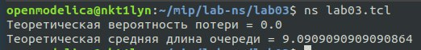

---
# Front matter
title: "Лабораторная работа 3. Моделирование стохастических процессов"
author: "Ильин Никита Евгеньевич"

# Formatting
toc: false
slide_level: 2
header-includes: 
 - \metroset{progressbar=frametitle,sectionpage=progressbar,numbering=fraction}
 - '\makeatletter'
 - '\beamer@ignorenonframefalse'
 - '\makeatother'
aspectratio: 43
section-titles: true
theme: metropolis
---

# Цель выполнения лабораторной работы 

Научиться разрабатывать сценарий, реализующий модель стохастических процессов. НАучиться строить графики в GNUplot

# Задача

1. Разработать сценарий для реализации модели

2. Получить результат работы первой программы

3. Написать код второй программы

4. Получить график

## Результат выполнения лабораторной работы

## Результат выполнения лабораторной работы

.png)

# Выводы по лабораторной работе

- Получены навыки работы с GNUplot