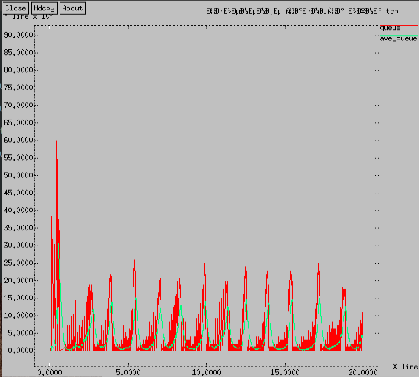
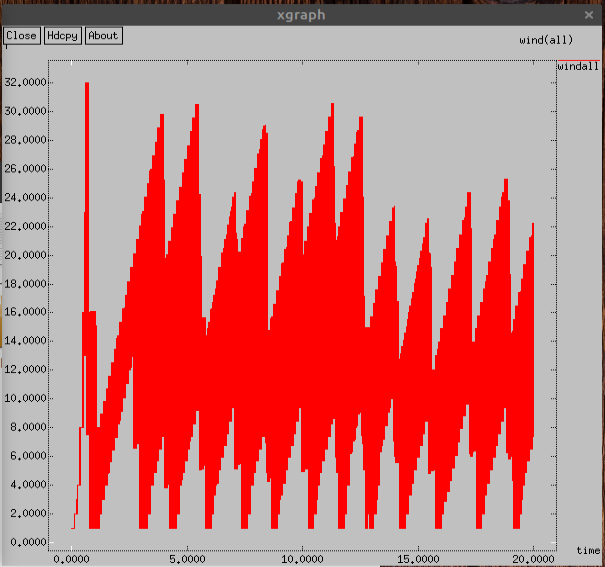
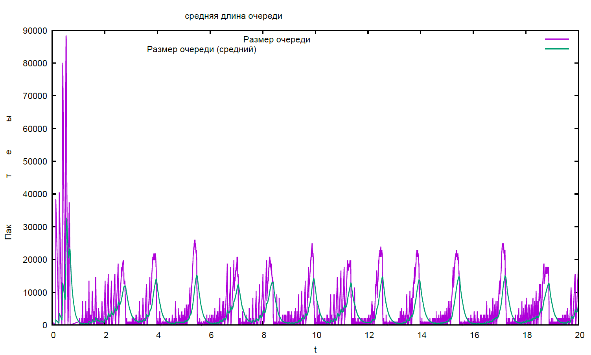
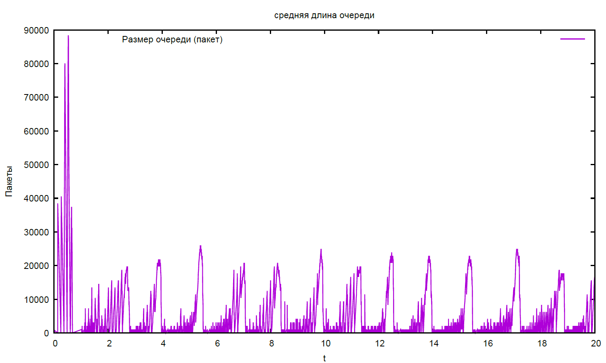
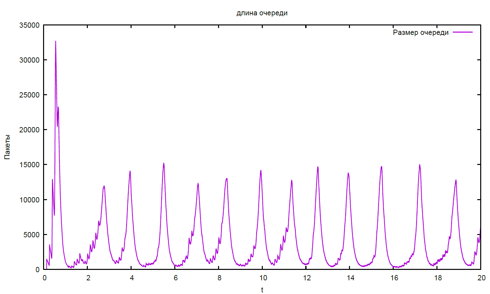
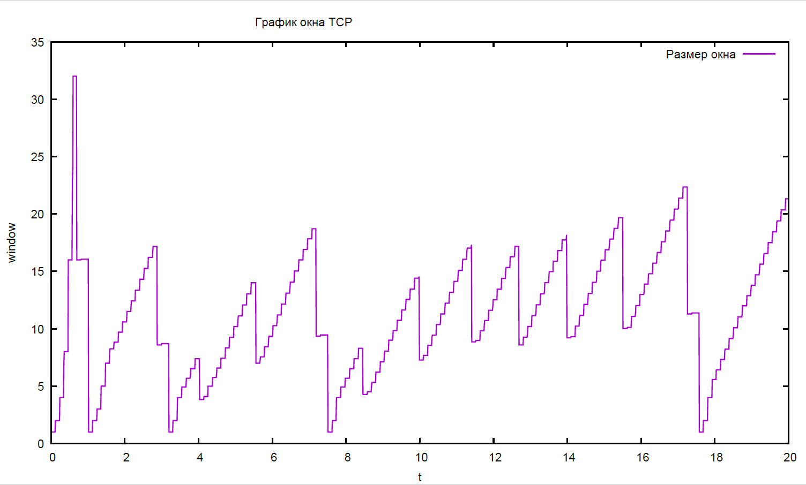
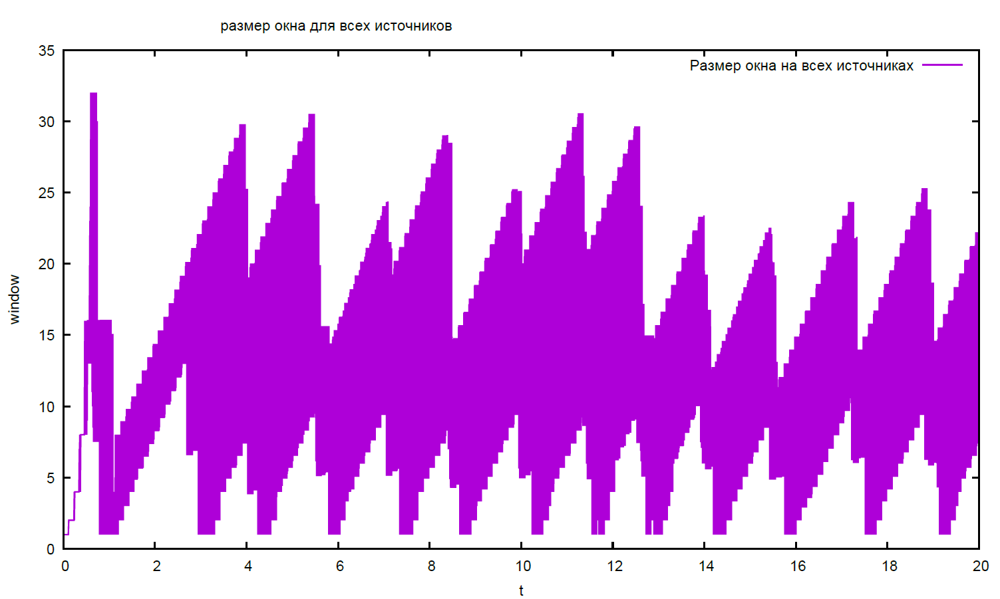

---
# Front matter
lang: ru-RU
title: "Презентация лабораторной работы №4"
subtitle: "Задание для самостоятельного выполнения"
author: "Ильин Никита Евгеньевич"
group: НФИбд-01-19
institute: RUDN University, Moscow, Russian Federation

# Formatting
toc: false
slide_level: 2
header-includes: 
 - \metroset{progressbar=frametitle,sectionpage=progressbar,numbering=fraction}
 - '\makeatletter'
 - '\beamer@ignorenonframefalse'
 - '\makeatother'
aspectratio: 43
section-titles: true
theme: metropolis
---

# Цель выполнения лабораторной работы 

Построить модель сети, и построить графики на ее основе, используя Xgraph и GNUplot.

# Задачи

1. Разработать модель для получения модели сети в ns-2

2. Разработать модель для построения график с помощью Xgraph и GNUplot

3. Получить и проанализировать результаты

4. Сделать отчет о выполненной работе

## Результат выполнения лабораторной работы

  {width=75%}

## Результат выполнения лабораторной работы

  {width=75%}

## Результат выполнения лабораторной работы

  

## Результат выполнения лабораторной работы

  

## Результат выполнения лабораторной работы

  

## Результат выполнения лабораторной работы

  

## Результат выполнения лабораторной работы

  

# Выводы по лабораторной работе

- В ходе работы были закреплены навыки моделирования сетей, а также были реализованы модель на ns2 и графики в XGraph и GNUplot.