---
# Front matter
title: "Отчет по лабораторной работе №4"
subtitle: "Задание для самостоятельного выполнения"
author: "Ильин Никита Евгеньевич"
group: НФИбд-01-19
institute: RUDN University, Moscow, Russian Federation

# Generic otions
lang: ru-RU
toc-title: "Содержание"

# Pdf output format
toc: true # Table of contents
toc_depth: 2
lof: true # List of figures
lot: true # List of tables
fontsize: 12pt
linestretch: 1.5
papersize: a4
documentclass: scrreprt
## I18n
polyglossia-lang:
  name: russian
  options:
	- spelling=modern
	- babelshorthands=true
polyglossia-otherlangs:
  name: english
### Fonts
mainfont: PT Serif
romanfont: PT Serif
sansfont: PT Sans
monofont: PT Mono
mainfontoptions: Ligatures=TeX
romanfontoptions: Ligatures=TeX
sansfontoptions: Ligatures=TeX,Scale=MatchLowercase
monofontoptions: Scale=MatchLowercase,Scale=0.9
## Biblatex
biblatex: true
biblio-style: "gost-numeric"
biblatexoptions:
  - parentracker=true
  - backend=biber
  - hyperref=auto
  - language=auto
  - autolang=other*
  - citestyle=gost-numeric
## Misc options
indent: true
header-includes:
  - \linepenalty=10 # the penalty added to the badness of each line within a paragraph (no associated penalty node) Increasing the value makes tex try to have fewer lines in the paragraph.
  - \interlinepenalty=0 # value of the penalty (node) added after each line of a paragraph.
  - \hyphenpenalty=50 # the penalty for line breaking at an automatically inserted hyphen
  - \exhyphenpenalty=50 # the penalty for line breaking at an explicit hyphen
  - \binoppenalty=700 # the penalty for breaking a line at a binary operator
  - \relpenalty=500 # the penalty for breaking a line at a relation
  - \clubpenalty=150 # extra penalty for breaking after first line of a paragraph
  - \widowpenalty=150 # extra penalty for breaking before last line of a paragraph
  - \displaywidowpenalty=50 # extra penalty for breaking before last line before a display math
  - \brokenpenalty=100 # extra penalty for page breaking after a hyphenated line
  - \predisplaypenalty=10000 # penalty for breaking before a display
  - \postdisplaypenalty=0 # penalty for breaking after a display
  - \floatingpenalty = 20000 # penalty for splitting an insertion (can only be split footnote in standard LaTeX)
  - \raggedbottom # or \flushbottom
  - \usepackage{float} # keep figures where there are in the text
  - \floatplacement{figure}{H} # keep figures where there are in the text
---

# Цель работы

Построить модель сети, и построить графики на ее основе, используя Xgraph и GNUplot.

# Задание

1. Для приведённой схемы разработать имитационную модель в пакете NS-2. Сеть имеет следующий вид: 

  – сеть состоит из N TCP-источников, N TCP-приёмников, двух маршрутизаторов R1 и R2 между источниками и приёмниками (N — не менее 20);
  
  – между TCP-источниками и первым маршрутизатором установлены дуплексные соединения с пропускной способностью 100 Мбит/с и задержкой 20 мс очередью типа DropTail;
  
  – между TCP-приёмниками и вторым маршрутизатором установлены дуплексные соединения с пропускной способностью 100 Мбит/с и задержкой 20 мс очередью типа DropTail;
  
  – между маршрутизаторами установлено симплексное соединение (R1–R2) с пропускной способностью 20 Мбит/с и задержкой 15 мс очередью типа RED, размером буфера 300 пакетов; в обратную сторону — симплексное соединение (R2–R1) с пропускной способностью 15 Мбит/с и задержкой 20 мс очередью типа DropTail;
  
  – данные передаются по протоколу FTP поверх TCPReno;
  
  – параметры алгоритма RED: qmin = 75, qmax = 150, qw = 0, 002, pmax = 0.1;
  
  – максимальный размер TCP-окна 32; размер передаваемого пакет

2. Построить график изменения размера окна TCP (в Xgraph и в GNUPlot);

3. Построить график изменения длины очереди и средней длины очереди на первом маршрутизаторе.

4. Оформить отчёт о выполненной работе.

# Ход работы

1. Создаю файл .tcl:

        touch lab04_1.tcl

  Записываю в него описание модели по заданию:

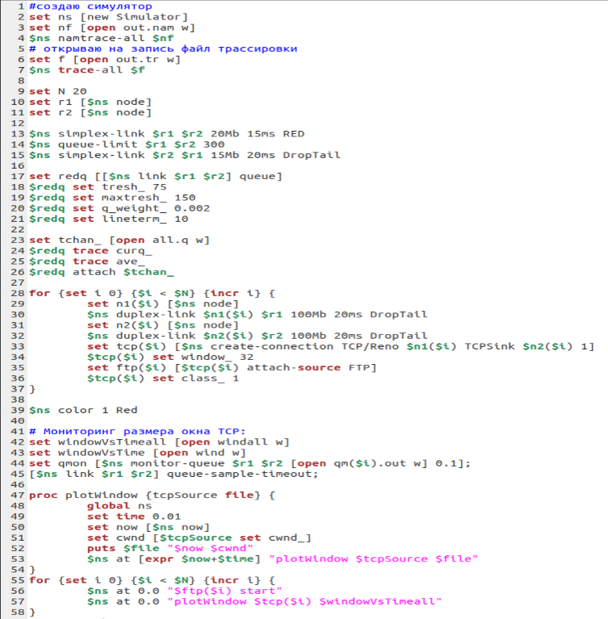

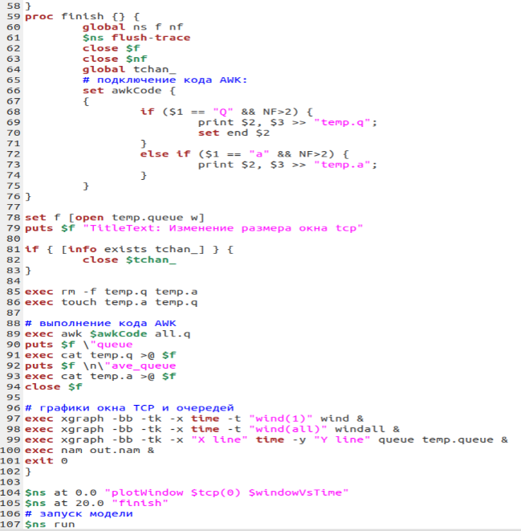

2. Создаю новый файл:

        touch graph

  И записываю в него код для построения графиков:

  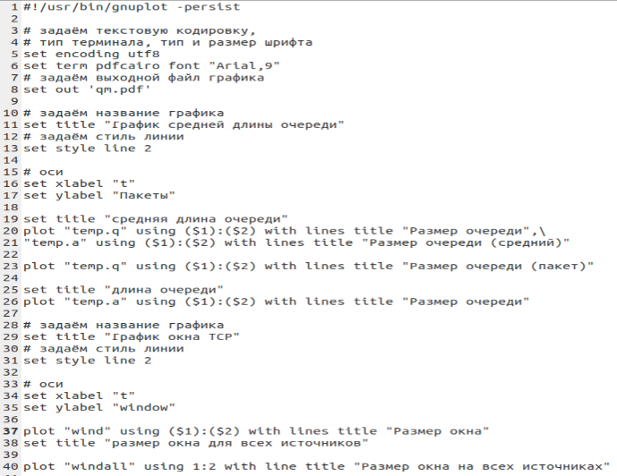

  Делаю файл исполняемым:

        chmod +x graph

3. Запускаю файл для построения графиков:

        ns lab03.tcl

  Получаю модель сети в ns2:

  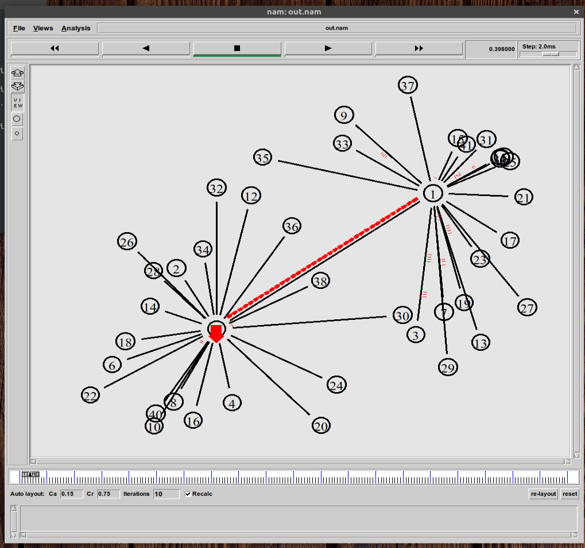

  Также получаю 2 графика:

  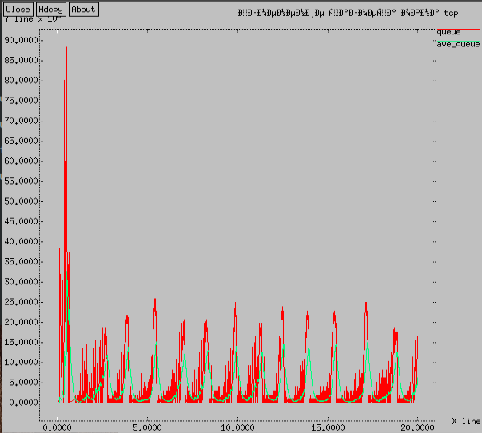

  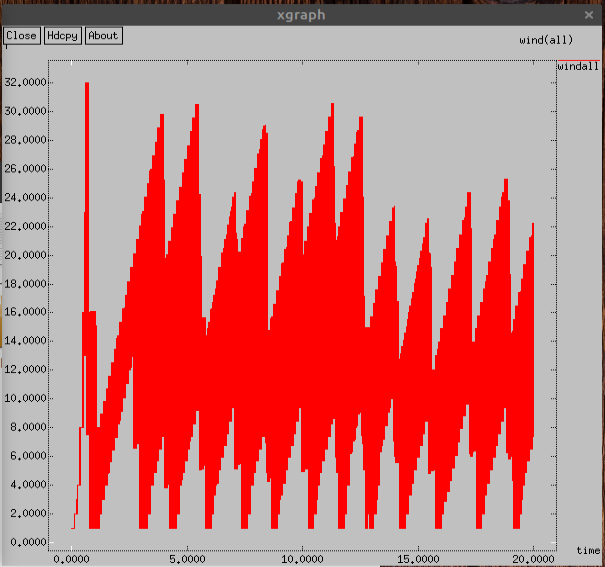

4. Запускаю файл graph:

        ./graph

  Получаю файл pdf, в который сохранены следующие графики:

  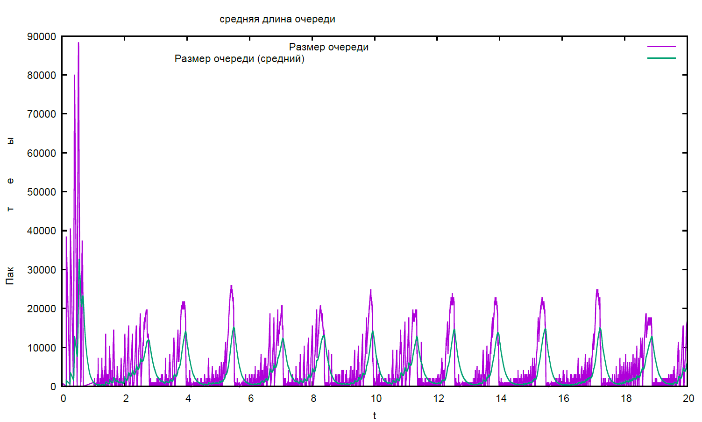

  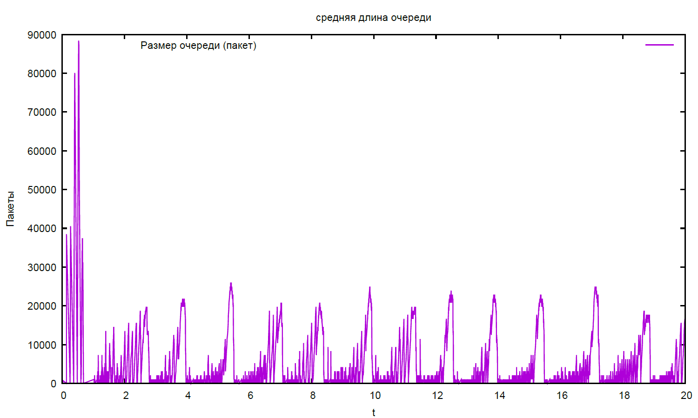

  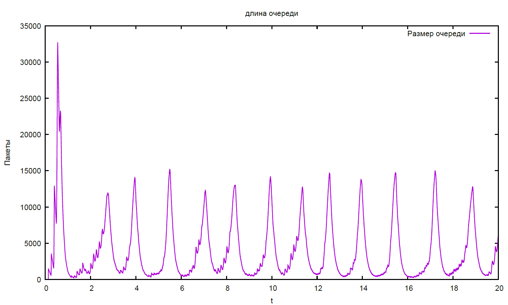

  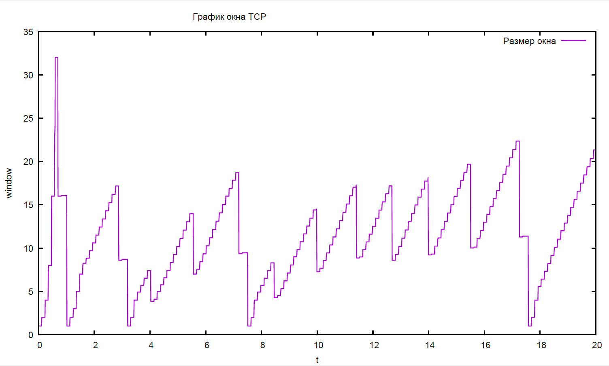

  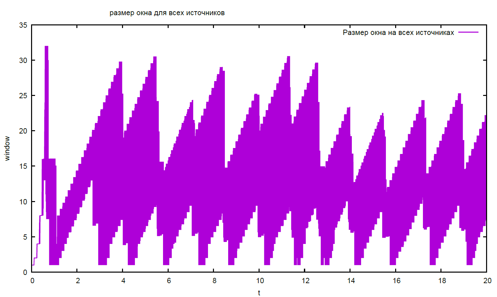

# Выводы

В ходе работы были закреплены навыки моделирования сетей, а также были реализованы модель на ns2 и графики в XGraph и GNUplot.

# Библиография

1. Методические материалы курса