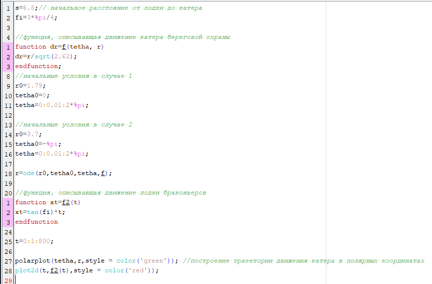

---
# Front matter
title: "Отчет по лабораторной работе №2"  
subtitle: "Задача о погоне"  
author: "Ильин Никита Евгеньевич"  
group: "NFIbd-01-19"    
institute: "RUDN University"  
date: "2022 Feb 10th"  

# Generic otions
lang: ru-RU
toc-title: "Содержание"

# Bibliography
bibliography: bib/cite.bib
csl: pandoc/csl/gost-r-7-0-5-2008-numeric.csl

# Pdf output format
toc: true # Table of contents
toc_depth: 2
lof: true # List of figures
lot: true # List of tables
fontsize: 12pt
linestretch: 1.5
papersize: a4
documentclass: scrreprt
## I18n
polyglossia-lang:
  name: russian
  options:
	- spelling=modern
	- babelshorthands=true
polyglossia-otherlangs:
  name: english
### Fonts
mainfont: PT Serif
romanfont: PT Serif
sansfont: PT Sans
monofont: PT Mono
mainfontoptions: Ligatures=TeX
romanfontoptions: Ligatures=TeX
sansfontoptions: Ligatures=TeX,Scale=MatchLowercase
monofontoptions: Scale=MatchLowercase,Scale=0.9
## Biblatex
biblatex: true
biblio-style: "gost-numeric"
biblatexoptions:
  - parentracker=true
  - backend=biber
  - hyperref=auto
  - language=auto
  - autolang=other*
  - citestyle=gost-numeric
## Misc options
indent: true
header-includes:
  - \linepenalty=10 # the penalty added to the badness of each line within a paragraph (no associated penalty node) Increasing the value makes tex try to have fewer lines in the paragraph.
  - \interlinepenalty=0 # value of the penalty (node) added after each line of a paragraph.
  - \hyphenpenalty=50 # the penalty for line breaking at an automatically inserted hyphen
  - \exhyphenpenalty=50 # the penalty for line breaking at an explicit hyphen
  - \binoppenalty=700 # the penalty for breaking a line at a binary operator
  - \relpenalty=500 # the penalty for breaking a line at a relation
  - \clubpenalty=150 # extra penalty for breaking after first line of a paragraph
  - \widowpenalty=150 # extra penalty for breaking before last line of a paragraph
  - \displaywidowpenalty=50 # extra penalty for breaking before last line before a display math
  - \brokenpenalty=100 # extra penalty for page breaking after a hyphenated line
  - \predisplaypenalty=10000 # penalty for breaking before a display
  - \postdisplaypenalty=0 # penalty for breaking after a display
  - \floatingpenalty = 20000 # penalty for splitting an insertion (can only be split footnote in standard LaTeX)
  - \raggedbottom # or \flushbottom
  - \usepackage{float} # keep figures where there are in the text
  - \floatplacement{figure}{H} # keep figures where there are in the text
---

# Цель работы

Цель данной работы --- Изучение основ работы с системой контроля версий git.

# Задание
| Номер задачи | Описание задачи                                                                                                          |
|--------------|----------------------------------------------------------------------------------------------------------------------------|
|2.1| Рассчитать данные для задачи своего варианта.|
|2.2| Написать программу.|
|2.3| Построить траекторию движения для первого случая.|
|2.4| Построить траекторию движения для второго случая.|
|2.5| Определить точку пересечения катера и лодки.|

# Теоретическое введение

| Имя каталога | Описание каталога                                                                                                          |
|--------------|----------------------------------------------------------------------------------------------------------------------------|
| Полярные координаты | координаты объекта, выраженные через направление и расстояние. |
| Полярная ось | угол между точкой и полуосью угла 0 °. |
| Тангенциальная скорость | это линейная скорость вращения катера относительно полюса.|
| Радиальная скорость | это скорость, с которой катер удаляется от полюса. |
| Угловая скорость | величина, которая представляет собой отношение от угла поворота в момент. |
| Дифференциальное уравнение. | уравнение, в которое входят производные функции и могут входить сама функция, независимая переменная и параметры. |

# Выполнение лабораторной работы

1. Рассчитываем данные расстрояние для первого и второго случая  

2. Рассчитываем тангенциальную и радиальную скорости  

3. Решаем дифферинциальное уравнение  

4. Пишем программу в Scilab  

5. Получаем график для первого случая   
  
6. Получаем график для второго случая  
  
7. Находим точку пересечения для первого случая  
  
8. Находим точку пересечения для второго случая  
  

# Выводы

В ходе данной работы были получены навыки работы с Scilab. Также в ходе данной работы был повторен материал лаб. работы №1 "Работа с Git".

