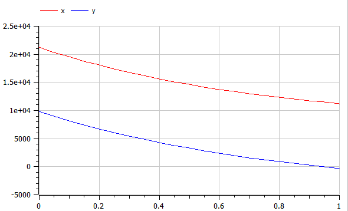
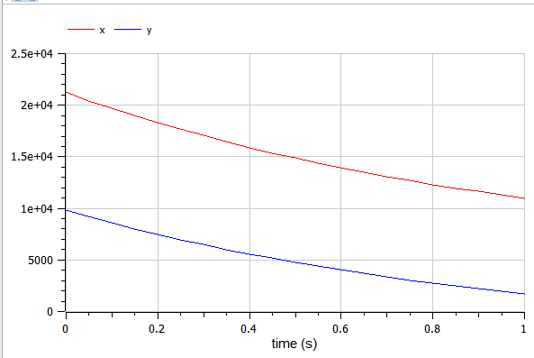

---
# Front matter
title: "Защита лабораторной работы №3. Модель боевых действий"  
author: "Ильин Никита Евгеньевич"  
group: "NFIbd-01-19"  
institute: "RUDN University"  
date: "2022 Feb 10th"  

# Formatting
toc: false
slide_level: 2
header-includes: 
 - \metroset{progressbar=frametitle,sectionpage=progressbar,numbering=fraction}
 - '\makeatletter'
 - '\beamer@ignorenonframefalse'
 - '\makeatother'
aspectratio: 43
section-titles: true
theme: metropolis

---

# Результат выполнения лабораторной работы №3

# Цель выполнения лабораторной работы 

Построить математические модели боя с помощью OpenModelica.

# Задачи выполнения лабораторной работы

1. Рассмотреть 2 модели боя:

    - Модель боевых действий между регулярными войсками

    - Модель ведение боевых действий с участием регулярных войск и партизанских отрядов

2. Построить графики y(t) и x(t)

3. Найти условие, при котором та или другая сторона выигрывают бой (для каждого случая).

# Уравнения

1. Модель боевых действий между регулярными войсками:

$$\frac{dx}{dt} = -a(t)x(t) - b(t)y(t) + P(t)$$

$$\frac{dy}{dt} = -c(t)x(t) - h(t)y(t) + Q(t)$$

2. Модель ведение боевых действий с участием регулярных войск и партизанских отрядов:

$$\frac{dx}{dt} = -a(t)x(t) - b(t)y(t) + P(t)$$

$$\frac{dy}{dt} = -c(t)x(t)y(t) - h(t)y(t) + Q(t)$$

# Условия задачи

Вариант 10:

x0 = 21200  
y0 = 9800

1. Модель боевых действий между регулярными войсками:  
a = 0.45  
b = 0.86  
c = 0.49  
h = 0.73 
P(t) = sin(t + 1)  
Q(t) = cos(t + 2) 

2. Модель ведение боевых действий с участием регулярных войск и
партизанских отрядов:  
a = 0.44  
b = 0.7  
c = 0.33  
h = 0.61  
P(t) = sin(2t)  
Q(t) = cos(t) + 1  

# Результат выполнения лабораторной работы

{ #fig:001 width=100% }

# Результат выполнения лабораторной работы

{ #fig:002 width=100% }

# Выводы

1. Рассмотрели 2 модели боя, и построили их графики  

2. Построили графики y(t) и x(t) и нашли победившую сторону  
