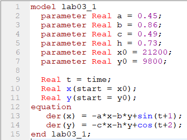
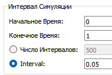
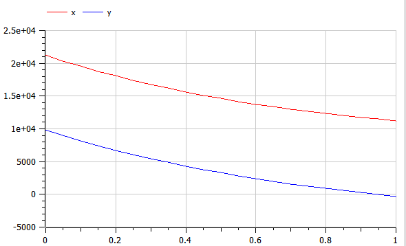
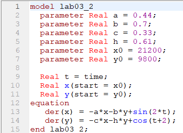
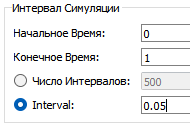
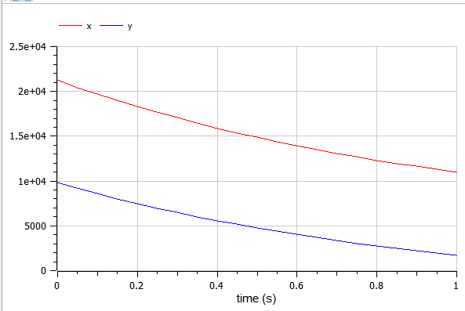

---
# Front matter
title: "Отчет по лабораторной работе №1"
subtitle: "Модель боевых действий"
author: "Ильин Никита Евгеньевич"
group: NFIbd-01-19
institute: RUDN University, Moscow, Russian Federation
date: 2022 Feb 10th

# Generic otions
lang: ru-RU
toc-title: "Содержание"

# Pdf output format
toc: true # Table of contents
toc_depth: 2
lof: true # List of figures
lot: true # List of tables
fontsize: 12pt
linestretch: 1.5
papersize: a4
documentclass: scrreprt
## I18n
polyglossia-lang:
  name: russian
  options:
	- spelling=modern
	- babelshorthands=true
polyglossia-otherlangs:
  name: english
### Fonts
mainfont: PT Serif
romanfont: PT Serif
sansfont: PT Sans
monofont: PT Mono
mainfontoptions: Ligatures=TeX
romanfontoptions: Ligatures=TeX
sansfontoptions: Ligatures=TeX,Scale=MatchLowercase
monofontoptions: Scale=MatchLowercase,Scale=0.9
## Biblatex
biblatex: true
biblio-style: "gost-numeric"
biblatexoptions:
  - parentracker=true
  - backend=biber
  - hyperref=auto
  - language=auto
  - autolang=other*
  - citestyle=gost-numeric
## Misc options
indent: true
header-includes:
  - \linepenalty=10 # the penalty added to the badness of each line within a paragraph (no associated penalty node) Increasing the value makes tex try to have fewer lines in the paragraph.
  - \interlinepenalty=0 # value of the penalty (node) added after each line of a paragraph.
  - \hyphenpenalty=50 # the penalty for line breaking at an automatically inserted hyphen
  - \exhyphenpenalty=50 # the penalty for line breaking at an explicit hyphen
  - \binoppenalty=700 # the penalty for breaking a line at a binary operator
  - \relpenalty=500 # the penalty for breaking a line at a relation
  - \clubpenalty=150 # extra penalty for breaking after first line of a paragraph
  - \widowpenalty=150 # extra penalty for breaking before last line of a paragraph
  - \displaywidowpenalty=50 # extra penalty for breaking before last line before a display math
  - \brokenpenalty=100 # extra penalty for page breaking after a hyphenated line
  - \predisplaypenalty=10000 # penalty for breaking before a display
  - \postdisplaypenalty=0 # penalty for breaking after a display
  - \floatingpenalty = 20000 # penalty for splitting an insertion (can only be split footnote in standard LaTeX)
  - \raggedbottom # or \flushbottom
  - \usepackage{float} # keep figures where there are in the text
  - \floatplacement{figure}{H} # keep figures where there are in the text
---

# Цель работы

Цель работы научиться строить математические модели в OpenModelica.

# Задание

Необходимо:

1. Рассмотреть 3 модели боя:

    1. Модель боевых действий между регулярными войсками

    2. Модель ведение боевых действий с участием регулярных войск и партизанских отрядов

2. Построить графики y(t) и x(t)

3. Найти условие, при котором та или другая сторона выигрывают бой (для каждого случая).

# Теоретическое введение

Моделирование боевых действий - ме­тод во­енно-тео­ре­тического или во­енно-тех­нического ис­сле­до­ва­ния объ­ек­тов (сис­тем, яв­ле­ний, со­бы­тий, про­цес­сов), уча­ст­вую­щих (про­ис­хо­дя­щих) в хо­де бое­вых дей­ст­вий, пу­тём соз­да­ния и изу­че­ния их мо­де­лей (ана­ло­гов) в це­лях по­лу­че­ния зна­ний о фи­зических, ин­фор­мационных и иных про­цес­сах воо­руженной борь­бы, а так­же для срав­не­ния ва­ри­ан­тов ре­ше­ний ко­ман­дую­щих (ко­ман­ди­ров), пла­нов и про­гно­зов ве­де­ния бое­вых дей­ст­вий, оцен­ки влия­ния на них различных фак­то­ров. [1]

Модель боевых действий
Рассмотрим некоторые простейшие модели боевых действий – модели
Ланчестера. В противоборстве могут принимать участие как регулярные войска,
так и партизанские отряды. В общем случае главной характеристикой соперников
являются численности сторон. Если в какой-то момент времени одна из
численностей обращается в нуль, то данная сторона считается проигравшей (при
условии, что численность другой стороны в данный момент положительна).
Рассмотри три случая ведения боевых действий:
1. Боевые действия между регулярными войсками
2. Боевые действия с участием регулярных войск и партизанских
отрядов
3. Боевые действия между партизанскими отрядами
В первом случае численность регулярных войск определяется тремя
факторами:
- скорость уменьшения численности войск из-за причин, не связанных с
боевыми действиями (болезни, травмы, дезертирство);
- скорость потерь, обусловленных боевыми действиями
противоборствующих сторон (что связанно с качеством стратегии,
уровнем вооружения, профессионализмом солдат и т.п.);
- скорость поступления подкрепления (задаётся некоторой функцией от
времени).
В этом случае модель боевых действий между регулярными войсками
описывается следующим образом:

$$\frac{dx}{dt} = -a(t)x(t) - b(t)y(t) + P(t)$$

$$\frac{dy}{dt} = -c(t)x(t) - h(t)y(t) + Q(t)$$

Потери, не связанные с боевыми действиями, описывают члены $-a(t)x(t)$ и $-h(t)y(t)$, члены $-b(t)y(t)$ и $-c(t)x(t)$ отражают потери на поле боя.Коэффициенты $b(t)$ и $c(t)$ указывают на эффективность боевых действий со стороны у и х соответственно, $a(t)$ и $h(t)$ - величины, характеризующие степень влияния различных факторов на потери. Функции $P(t)$, $Q(t)$ учитывают возможность подхода подкрепления к войскам Х и У в течение одного дня.

Во втором случае в борьбу добавляются партизанские отряды. Нерегулярные войска в отличии от постоянной армии менее уязвимы, так как действуют скрытно, в этом случае сопернику приходится действовать неизбирательно, по площадям, занимаемым партизанами. Поэтому считается, что тем потерь партизан, проводящих свои операции в разных местах на некоторой известной территории, пропорционален не только численности армейских соединений, но и численности самих партизан. В результате модель принимает вид:

$$\frac{dx}{dt} = -a(t)x(t) - b(t)y(t) + P(t)$$

$$\frac{dy}{dt} = -c(t)x(t)y(t) - h(t)y(t) + Q(t)$$

Модель ведение боевых действий между партизанскими отрядами с учетом предположений, сделанном в предыдущем случаем, имеет вид:

$$\frac{dx}{dt} = -a(t)x(t) - b(t)x(t)y(t) + P(t)$$

$$\frac{dy}{dt} = -c(t)x(t)y(t) - h(t)y(t) + Q(t)$$

# Выполнение лабораторной работы

1. Пишем программу для построения модели боевых действий между регулярными войсками, используя OpenModelica. Используем приведенные выше уравнения.  

{ #fig:001 width=100% }  

2. Совершаем симуляцию со следующими настройками:  

{ #fig:002 width=100% }  

3. Получаем следующий результат симуляции:  

{ #fig:003 width=100% }  

По графику видим, что численность армии Х превосходит численность армии У.  

4. Изменяем код программы под задачу №2:  

{ #fig:004 width=100% }  

5. Совершаем симуляцию со следующими настройками:  

{ #fig:005 width=100% }  

6. Получаем следующий результат симуляции:  

{ #fig:006 width=100% }  

По графику видим, что численность армии Х превосходит численность армии У.  

# Выводы

В ходе работы мы рассмотрели 2 модели боя: модель боевых действий между регулярными войсками, модель ведение боевых действий с участием регулярных войск и партизанских отрядов. Для этого были построены графики y(t) и x(t). 

# Список литературы

1. Д.В. Гор­ди­ен­ко "МОДЕЛИРОВАНИЕ БОЕВЫХ ДЕЙСТВИЙ",(https://clck.ru/cBXiK)

2. Методические материалы курса
