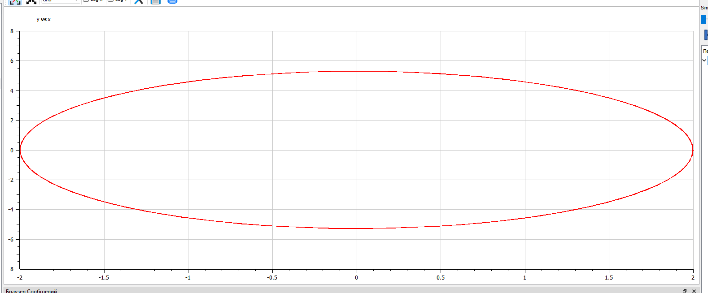
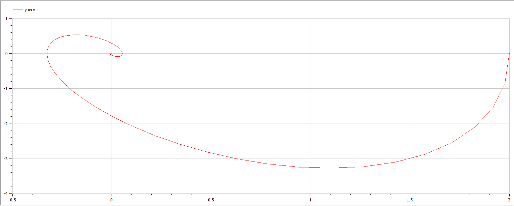
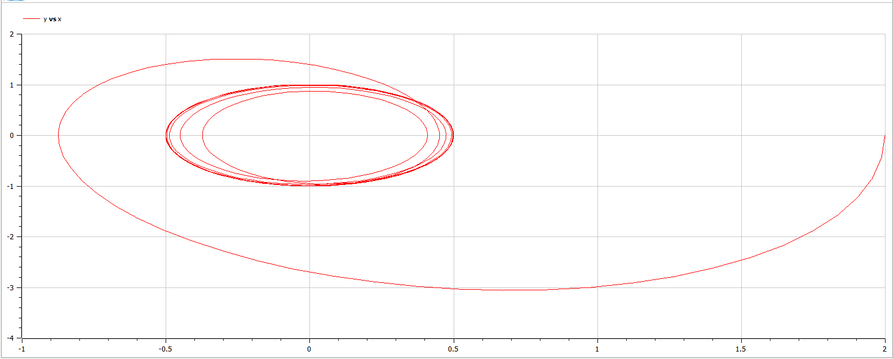

---
# Front matter
title: "Защита лабораторной работы №4. Модель гармонических колебаний"  
author: "Ильин Никита Евгеньевич"  
group: "NFIbd-01-19"  
institute: "RUDN University"  
date: "2022 Feb 10th"  

# Formatting
toc: false
slide_level: 2
header-includes: 
 - \metroset{progressbar=frametitle,sectionpage=progressbar,numbering=fraction}
 - '\makeatletter'
 - '\beamer@ignorenonframefalse'
 - '\makeatother'
aspectratio: 43
section-titles: true
theme: metropolis

---

# Результат выполнения лабораторной работы №4

# Цель выполнения лабораторной работы 

Построить математические модели гармонических с помощью OpenModelica.

# Задачи выполнения лабораторной работы

Построить фазовый портрет гармонического осциллятора и решение уравнения  для следующих случаев:

1. Колебания гармонического осциллятора без затуханий и без действий внешней силы

2. Колебания гармонического осциллятора c затуханием и без действий внешней силы

3. Колебания гармонического осциллятора c затуханием и под действием внешней силы

# Уравнения

Уравнение свободных колебаний гармонического осциллятора: 

$$\ddot x+2\gamma \dot x +\omega_0^2 x=0$$

# Условия задачи

Вариант 10:

1. Колебания гармонического осциллятора без затуханий и без действий внешней силы ${\ddot{x} + 7x = 0}$

2. Колебания гармонического осциллятора c затуханием и без действий внешней силы ${\ddot{x} + 9\dot{x} + 3x = 0}$

3. Колебания гармонического осциллятора c затуханием и под действием внешней силы ${\ddot{x} + 4\dot{x} + x = cos(2t)}$

На интервале $t \in [0; 30]$ (шаг 0.05) с начальными условиями $x_0 = 2, y_0 = 0$

# Результат выполнения лабораторной работы

{ #fig:001 width=100% }

# Результат выполнения лабораторной работы

{ #fig:002 width=100% }

# Результат выполнения лабораторной работы

{ #fig:003 width=100% }

# Выводы

1. Построили решения уравнений гармонического осциллятора дл я трех случаев.

2. Написали код программы, позволяющей построить модели, используя уравнения из задания.

3. Получили фазовый портрет колебаний для трех случаев.
