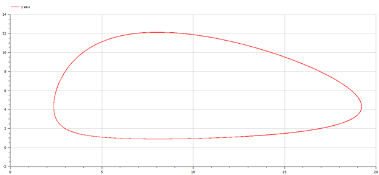
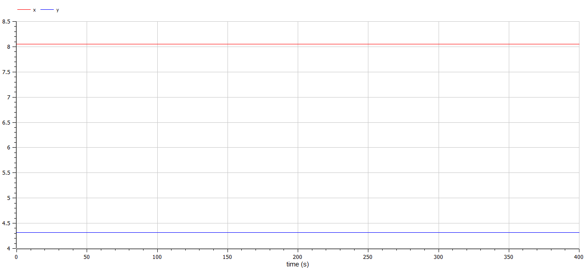

---
# Front matter
title: "Защита лабораторной работы №5. Модель хищник-жертва"  
author: "Ильин Никита Евгеньевич"  
group: "NFIbd-01-19"  
institute: "RUDN University"  
date: "2022 Feb 10th"  

# Formatting
toc: false
slide_level: 2
header-includes: 
 - \metroset{progressbar=frametitle,sectionpage=progressbar,numbering=fraction}
 - '\makeatletter'
 - '\beamer@ignorenonframefalse'
 - '\makeatother'
aspectratio: 43
section-titles: true
theme: metropolis

---

# Цель выполнения лабораторной работы 

Цель работы научиться строить модели взаимодействий хищник-жертва в OpenModelica.

# Задачи выполнения лабораторной работы

Необходимо:

1. Построить график зависимости численности хищников от численности жертв,
а также графики изменения численности хищников и численности жертв при
следующих начальных условиях: $x_0 = 3, \;  y_0 =8$. 

2. Найти стационарное состояние системы.

# Уравнения

$$\frac{dx}{dt} = ax(t)-bx(t)y(t)$$
$$\frac{dy}{dt} = -cx(t)-dx(t)y(t)$$

# Условия задачи

Вариант 10

$$
\begin{cases}
\frac{dx}{dt} = -0.22x(t)-0.051x(t)y(t)\\
\frac{dy}{dt} = -0.33x(t)-0.041x(t)y(t)\\
\end{cases}
$$

# Результат выполнения лабораторной работы

{ #fig:002 width=100% }

# Результат выполнения лабораторной работы

{ #fig:001 width=100% }

# Результат выполнения лабораторной работы

{ #fig:003 width=100% }

# Выводы

В ходе выполнения лабораторной работы познакомились с моделью взаимодей
ствия хищник - жертва (модель Лотки-Вольтерры), реализовали график зависимости численности хищников от численности жертв и график для стационарного состояния.
