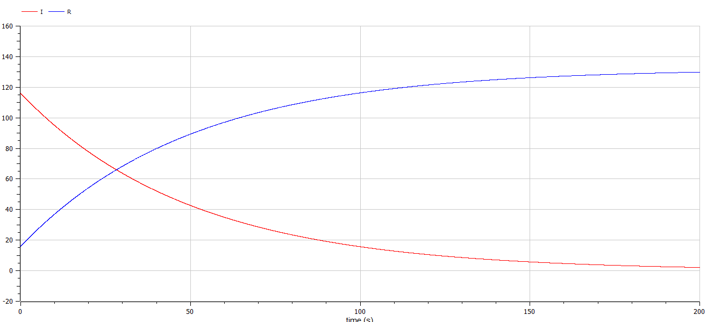
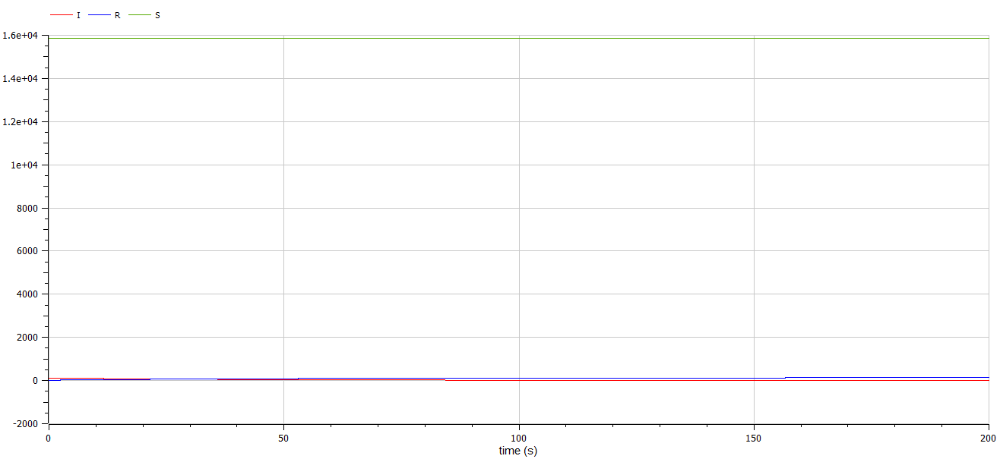
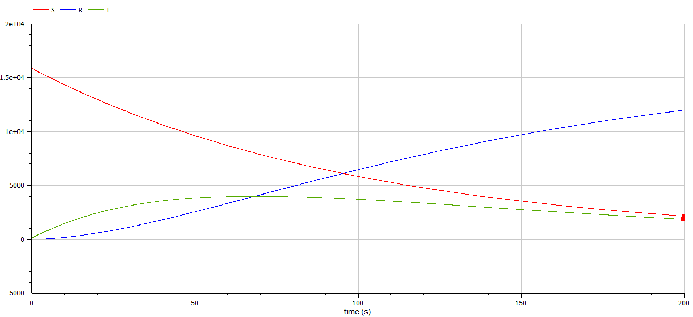

---
# Front matter
title: "Лабораторная работа 6. Задача об эпидемии"
subtitle: "Вариант 10"
author: "Ильин Никита Евгеньевич"  

# Formatting
toc: false
slide_level: 2
header-includes: 
 - \metroset{progressbar=frametitle,sectionpage=progressbar,numbering=fraction}
 - '\makeatletter'
 - '\beamer@ignorenonframefalse'
 - '\makeatother'
aspectratio: 43
section-titles: true
theme: metropolis

---

# Прагматика выполнения лабораторной работы

- Ознакомление с задачей об эпидемии
- Построение графиков для двух случаев задачи

# Цель выполнения лабораторной работы 

Цель работы научиться строить модели эпидемии в OpenModelica.

# Задача

На одном острове вспыхнула эпидемия. Известно, что из всех проживающих
на острове (N=16 000) в момент начала эпидемии (t=0) число заболевших людей
(являющихся распространителями инфекции) I(0)=116, А число здоровых людей с
иммунитетом к болезни R(0)=16. Таким образом, число людей восприимчивых к
болезни, но пока здоровых, в начальный момент времени S(0)=N-I(0)- R(0).

Постройте графики изменения числа особей в каждой из трех групп.

Рассмотрите, как будет протекать эпидемия в случае: 

1) если $I(0)\leq I^*$
2) если $I(0) > I^*$

# Условия задачи

Вариант 10

$$a = 0.01, b = 0.02$$
$$N = 16000$$
$$I_0 = 116, R_0 = 16$$
$$S_0 = N-I_0-R_0$$

## Cкорость изменения числа здоровых особей

$$ \frac{dS}{dt} =  \left\{
\begin{array}{c}
-\alpha S, I(t) > I^* \\
0, I(t)\leq I^*   \\
\end{array}
\right.$$

## Cкорость изменения числа инфицированных особей

$$ \frac{dI}{dt} =  \left\{
\begin{array}{c}
\alpha S - \beta I, I(t) > I^* \\ 
-\beta I, I(t)\leq I^*   \\
\end{array}
\right.$$

## Cкорость изменения числа здоровых особей с иммунитетом

$$\frac{dR}{dt} = \beta I $$

# Результат выполнения лабораторной работы

# График для случая $I(0)\leq I^*$

# Второй график для случая $I(0)\leq I^*$

# График для случая $I(0) > I^*$

# Выводы по лабораторной работе

- Изучена задача об эпидемии

- Был построен график для случая $I(0)\leq I^*$

- Был построен график для случая $I(0) > I^*$