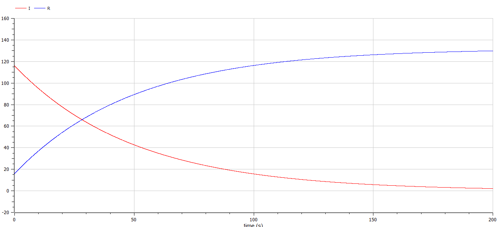
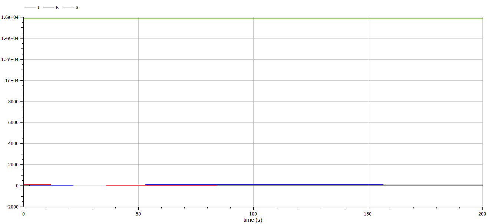

---
# Front matter
title: "Лабораторная работа 6. Задача об эпидемии"
subtitle: "Вариант 10"
author: "Ильин Никита Евгеньевич"

# Generic otions
lang: ru-RU
toc-title: "Содержание"

# Pdf output format
toc: true # Table of contents
toc_depth: 2
lof: true # List of figures
lot: true # List of tables
fontsize: 12pt
linestretch: 1.5
papersize: a4
documentclass: scrreprt
## I18n
polyglossia-lang:
  name: russian
  options:
	- spelling=modern
	- babelshorthands=true
polyglossia-otherlangs:
  name: english
### Fonts
mainfont: PT Serif
romanfont: PT Serif
sansfont: PT Sans
monofont: PT Mono
mainfontoptions: Ligatures=TeX
romanfontoptions: Ligatures=TeX
sansfontoptions: Ligatures=TeX,Scale=MatchLowercase
monofontoptions: Scale=MatchLowercase,Scale=0.9
## Biblatex
biblatex: true
biblio-style: "gost-numeric"
biblatexoptions:
  - parentracker=true
  - backend=biber
  - hyperref=auto
  - language=auto
  - autolang=other*
  - citestyle=gost-numeric
## Misc options
indent: true
header-includes:
  - \linepenalty=10 # the penalty added to the badness of each line within a paragraph (no associated penalty node) Increasing the value makes tex try to have fewer lines in the paragraph.
  - \interlinepenalty=0 # value of the penalty (node) added after each line of a paragraph.
  - \hyphenpenalty=50 # the penalty for line breaking at an automatically inserted hyphen
  - \exhyphenpenalty=50 # the penalty for line breaking at an explicit hyphen
  - \binoppenalty=700 # the penalty for breaking a line at a binary operator
  - \relpenalty=500 # the penalty for breaking a line at a relation
  - \clubpenalty=150 # extra penalty for breaking after first line of a paragraph
  - \widowpenalty=150 # extra penalty for breaking before last line of a paragraph
  - \displaywidowpenalty=50 # extra penalty for breaking before last line before a display math
  - \brokenpenalty=100 # extra penalty for page breaking after a hyphenated line
  - \predisplaypenalty=10000 # penalty for breaking before a display
  - \postdisplaypenalty=0 # penalty for breaking after a display
  - \floatingpenalty = 20000 # penalty for splitting an insertion (can only be split footnote in standard LaTeX)
  - \raggedbottom # or \flushbottom
  - \usepackage{float} # keep figures where there are in the text
  - \floatplacement{figure}{H} # keep figures where there are in the text
---

# Цель работы

Цель работы научиться строить модели эпидемии в OpenModelica.

# Задание

На одном острове вспыхнула эпидемия. Известно, что из всех проживающих на острове (N=11 700) в момент начала эпидемии (t=0) число заболевших людей (являющихся распространителями инфекции) I(0)=270, А число здоровых людей с иммунитетом к болезни R(0)=49. Таким образом, число людей восприимчивых к болезни, но пока здоровых, в начальный момент времени S(0)=N-I(0)- R(0).
Постройте графики изменения числа особей в каждой из трех групп.
Рассмотрите, как будет протекать эпидемия в случае: 

1) если $I(0)\leq I^*$
2) если $I(0) > I^*$

Предположим, что некая популяция, состоящая из N особей, (считаем, что популяция изолирована) подразделяется на три группы. Первая группа - это восприимчивые к болезни, но пока здоровые особи, обозначим их через S(t). Вторая группа – это число
инфицированных особей, которые также при этом являются распространителями инфекции, обозначим их I(t). А третья группа, обозначающаяся через R(t) – это здоровые особи с иммунитетом к болезни.
До того, как число заболевших не превышает критического значения
$I^*$, считаем, что все больные изолированы и не заражают здоровых. Когда $I(t)>I^*$, тогда инфицированные способны заражать восприимчивых к болезни особей.

Таким образом, скорость изменения числа S(t) меняется по следующему
закону:

$$ \frac{dS}{dt} =  \left\{
\begin{array}{c}
-\alpha S, I(t) > I^* \\
0, I(t)\leq I^*   \\
\end{array}
\right.$$

Поскольку каждая восприимчивая к болезни особь, которая, в конце концов, заболевает, сама становится инфекционной, то скорость изменения числа инфекционных особей представляет разность за единицу времени между заразившимися и теми, кто уже болеет и лечится, т.е.:

$$ \frac{dI}{dt} =  \left\{
\begin{array}{c}
\alpha S - \beta I, I(t) > I^* \\ 
-\beta I, I(t)\leq I^*   \\
\end{array}
\right.$$

А скорость изменения выздоравливающих особей (при этом приобретающие
иммунитет к болезни):

$$\frac{dR}{dt} = \beta I $$

Постоянные пропорциональности $\alpha, \beta$ - это коэффициенты заболеваемости и выздоровления соответственно.
Для того, чтобы решения соответствующих уравнений определялось
однозначно, необходимо задать начальные условия .Считаем, что на начало эпидемии в момент времени
$t = 0$ нет особей с иммунитетом к болезни R(0)=0, а
число инфицированных и восприимчивых к болезни особей
I(0) и S(0) соответственно. Для анализа картины протекания эпидемии необходимо рассмотреть два случая: $I(0)\leq I^*$, $I(0) > I^*$ [^1]

# Выполнение лабораторной работы

1. Пишем программу для первого случая.(риc.[-@fig:001])

{#fig:001 width=70%}

2. Задаем настройки симуляции.(риc.[-@fig:002])

{#fig:002 width=70%}

3. Получаем график изменения числа инфекционных особей I(t) и числа выздоравливающих особей R(t), если число инфицированных не превышает критического значения. (риc.[-@fig:003])

{ #fig:003 width=70%}

4. Получаем график изменения числа особей, восприимчивых к болезни
S(t), если число инфицированных не превышает критического значения. (риc.[-@fig:004])

{ #fig:004 width=70%}

5. Изменяем программу для второго случая. (риc.[-@fig:005])

{ #fig:005 width=70%}

6. Задаем настройки симуляции.(риc.[-@fig:006])

{#fig:006 width=70%}

6. Получаем график изменения числа особей, восприимчивых к болезни
S(t), числа инфекционных особей I(t) и числа выздоравливающих особей R(t), если число инфицированных выше критического значения. (риc.[-@fig:007])

{ #fig:007 width=70%}

# Выводы 

В данной лабораторной работе мы изучили задачу об эпидемии,построили графики изменения числа особей в каждой из трех групп, а также рассмотрели, как протекает эпидемия в двух разных случаях. 

# Список литературы

1. Кулябов, Д.С. Задача об эпидемии [Текст] / Д.С.Кулябов. - Москва: - 4 с.

[^1]: Кулябов, Д.С. Задача об эпидемии.