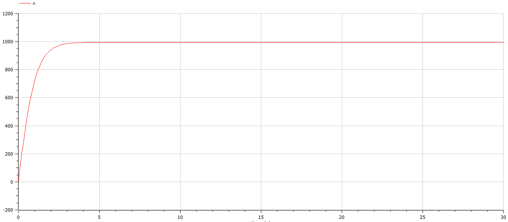
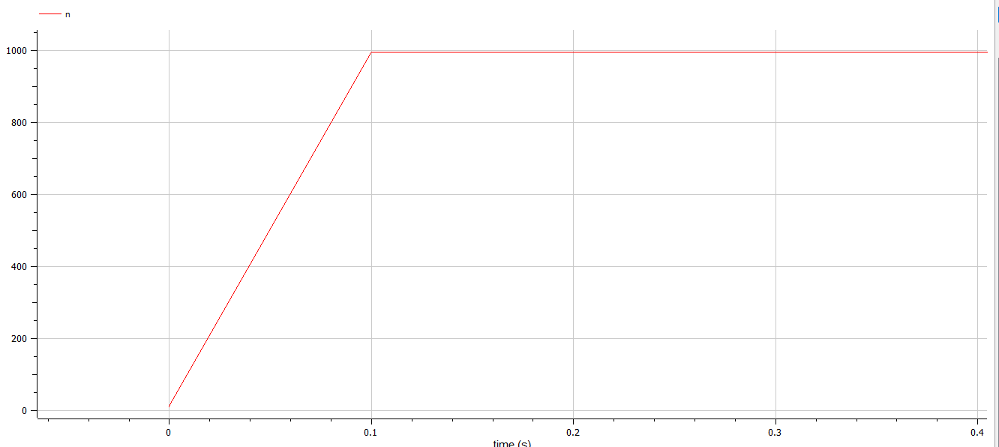
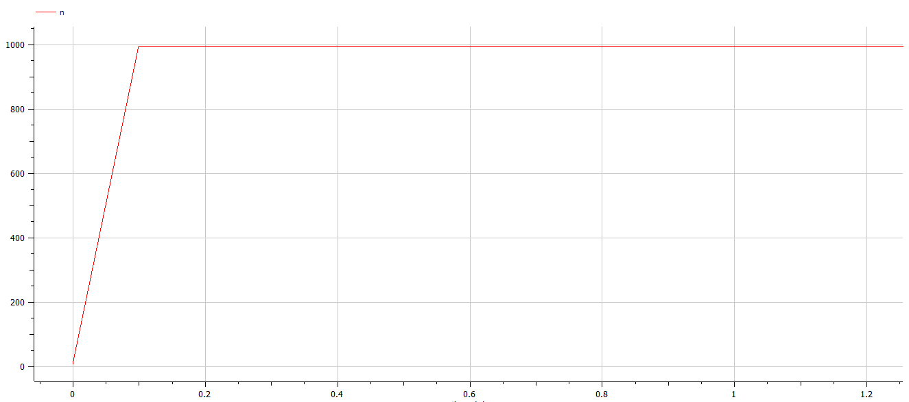

---
# Front matter
title: "Лабораторная работа 7. Эффективность рекламы"
subtitle: "Вариант 10"
author: "Ильин Никита Евгеньевич"  

# Formatting
toc: false
slide_level: 2
header-includes: 
 - \metroset{progressbar=frametitle,sectionpage=progressbar,numbering=fraction}
 - '\makeatletter'
 - '\beamer@ignorenonframefalse'
 - '\makeatother'
aspectratio: 43
section-titles: true
theme: metropolis
---

# Прагматика выполнения лабораторной работы

- Ознакомление с задачей об эффективности рекламы
- Построение графиков для трех случаев задачи

# Цель выполнения лабораторной работы 

Цель работы научиться строить модели эффективности рекламы в OpenModelica.

# Задача

29 января в городе открылся новый салон красоты. Полагаем, что на момент
открытия о салоне знали $N_0$ потенциальных клиентов. По маркетинговым
исследованиям известно, что в районе проживают N потенциальных клиентов
салона. Поэтому после открытия салона руководитель запускает активную
рекламную компанию. После этого скорость изменения числа знающих о салоне
пропорциональна как числу знающих о нем, так и числу не знаю о нем.
1. Построить график распространения рекламы о салоне красоты ( $N_0$ и N
задайте самостоятельно).
2. Сравнить эффективность рекламной кампании при $\alpha_1(t) > \alpha_2(t)$ и $\alpha_1(t) < \alpha_2(t)$
3. Определить в какой момент времени эффективность рекламы будет иметь
максимально быстрый рост (на вашем примере).
4. Построить решение, если учитывать вклад только платной рекламы
5. Построить решение, если предположить, что информация о товаре
распространятся только путем «сарафанного радио», сравнить оба решения

# Условия задачи

Вариант 10

$$1.\quad\frac{dn}{dt} = (0.95 + 0.0008n(t)(N - n(t))$$

$$2.\quad\frac{dn}{dt} = (0.000095 + 0.92n(t)(N - n(t))$$

$$3.\quad\frac{dn}{dt} = (0.95sin(t) + 0.93cos(9t)n(t)(N - n(t))$$

# Результат выполнения лабораторной работы

# График для случая 1

{ #fig:001 width=70%}

# Второй график для случая 2

{ #fig:002 width=70%}

# График для случая 3

{#fig:003 width=70%}

# Выводы по лабораторной работе

- Изучена задача об эффективности рекламы

- Были построены графики для трех случаев