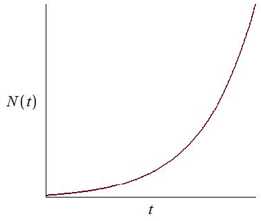
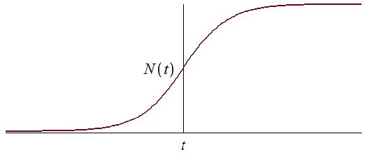
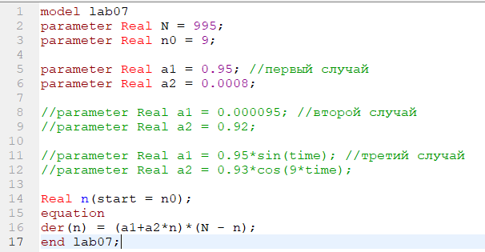
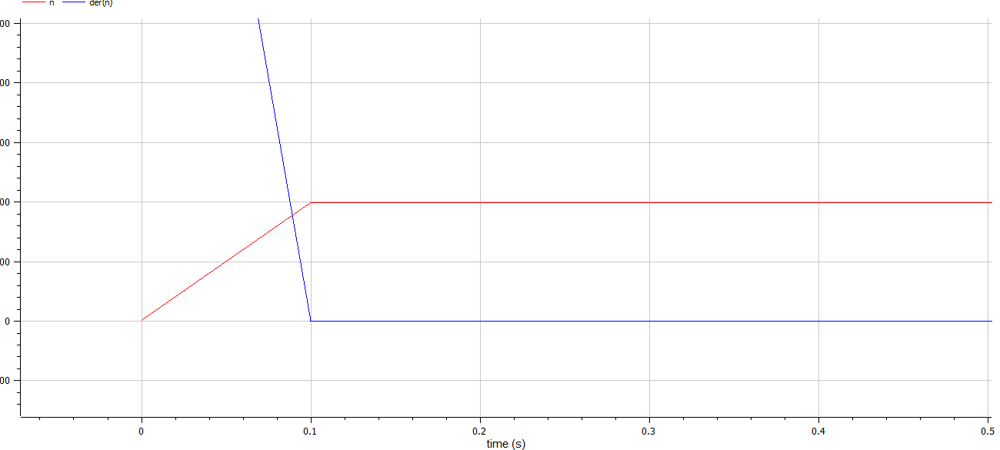
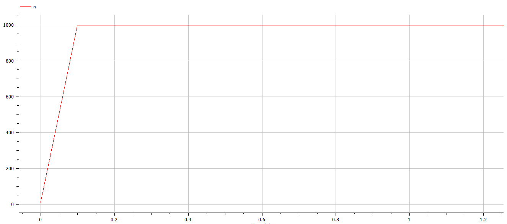

---
# Front matter
title: "Лабораторная работа 6. Задача об эпидемии"
subtitle: "Вариант 10"
author: "Ильин Никита Евгеньевич"

# Generic otions
lang: ru-RU
toc-title: "Содержание"

# Pdf output format
toc: true # Table of contents
toc_depth: 2
lof: true # List of figures
lot: true # List of tables
fontsize: 12pt
linestretch: 1.5
papersize: a4
documentclass: scrreprt
## I18n
polyglossia-lang:
  name: russian
  options:
	- spelling=modern
	- babelshorthands=true
polyglossia-otherlangs:
  name: english
### Fonts
mainfont: PT Serif
romanfont: PT Serif
sansfont: PT Sans
monofont: PT Mono
mainfontoptions: Ligatures=TeX
romanfontoptions: Ligatures=TeX
sansfontoptions: Ligatures=TeX,Scale=MatchLowercase
monofontoptions: Scale=MatchLowercase,Scale=0.9
## Biblatex
biblatex: true
biblio-style: "gost-numeric"
biblatexoptions:
  - parentracker=true
  - backend=biber
  - hyperref=auto
  - language=auto
  - autolang=other*
  - citestyle=gost-numeric
## Misc options
indent: true
header-includes:
  - \linepenalty=10 # the penalty added to the badness of each line within a paragraph (no associated penalty node) Increasing the value makes tex try to have fewer lines in the paragraph.
  - \interlinepenalty=0 # value of the penalty (node) added after each line of a paragraph.
  - \hyphenpenalty=50 # the penalty for line breaking at an automatically inserted hyphen
  - \exhyphenpenalty=50 # the penalty for line breaking at an explicit hyphen
  - \binoppenalty=700 # the penalty for breaking a line at a binary operator
  - \relpenalty=500 # the penalty for breaking a line at a relation
  - \clubpenalty=150 # extra penalty for breaking after first line of a paragraph
  - \widowpenalty=150 # extra penalty for breaking before last line of a paragraph
  - \displaywidowpenalty=50 # extra penalty for breaking before last line before a display math
  - \brokenpenalty=100 # extra penalty for page breaking after a hyphenated line
  - \predisplaypenalty=10000 # penalty for breaking before a display
  - \postdisplaypenalty=0 # penalty for breaking after a display
  - \floatingpenalty = 20000 # penalty for splitting an insertion (can only be split footnote in standard LaTeX)
  - \raggedbottom # or \flushbottom
  - \usepackage{float} # keep figures where there are in the text
  - \floatplacement{figure}{H} # keep figures where there are in the text
---

# Цель работы

Цель работы научиться строить модели эффективности рекламы в OpenModelica.

# Теоретическое введение

  Организуется рекламная кампания нового товара или услуги. Необходимо,
чтобы прибыль будущих продаж с избытком покрывала издержки на рекламу.
Вначале расходы могут превышать прибыль, поскольку лишь малая часть
потенциальных покупателей будет информирована о новинке. Затем, при
увеличении числа продаж, возрастает и прибыль, и, наконец, наступит момент,
когда рынок насытиться, и рекламировать товар станет бесполезным.

  Предположим, что торговыми учреждениями реализуется некоторая
продукция, о которой в момент времени t из числа потенциальных покупателей N
знает лишь n покупателей. Для ускорения сбыта продукции запускается реклама
по радио, телевидению и других средств массовой информации. После запуска
рекламной кампании информация о продукции начнет распространяться среди
потенциальных покупателей путем общения друг с другом. Таким образом, после
запуска рекламных объявлений скорость изменения числа знающих о продукции
людей пропорциональна как числу знающих о товаре покупателей, так и числу
покупателей о нем не знающих

  Модель рекламной кампании описывается следующими величинами.
Считаем, что $\frac{dn}{dt}$ - скорость изменения со временем числа потребителей,
узнавших о товаре и готовых его купить, t - время, прошедшее с начала рекламной
кампании, n(t) - число уже информированных клиентов. Эта величина
пропорциональна числу покупателей, еще не знающих о нем, это описывается
следующим образом: $\alpha_1(t)(N - n(t))$, где N - общее число потенциальных
платежеспособных покупателей, $\alpha_1(t)>0$ - характеризует интенсивность
рекламной кампании (зависит от затрат на рекламу в данный момент времени).
Помимо этого, узнавшие о товаре потребители также распространяют полученную
информацию среди потенциальных покупателей, не знающих о нем (в этом случае
работает т.н. сарафанное радио). Этот вклад в рекламу описывается величиной
$\alpha_2(t)n(t)(N - n(t))$ , эта величина увеличивается с увеличением потребителей
узнавших о товаре. Математическая модель распространения рекламы описывается
уравнением:

$$\frac{dn}{dt} = (\alpha_1(t) + \alpha_2(t)n(t)(N - n(t))$$

При $\alpha_1(t) >> \alpha_2(t)$ получается модель типа модели Мальтуса, решение которой
имеет вид (риc.[-@fig:001])

{#fig:001 width=70%}

В обратном случае, $\alpha_1(t) << \alpha_2(t)$ получаем уравнение логистической
кривой: (риc.[-@fig:002])

{#fig:002 width=70%}

# Задание

29 января в городе открылся новый салон красоты. Полагаем, что на момент
открытия о салоне знали $N_0$ потенциальных клиентов. По маркетинговым
исследованиям известно, что в районе проживают N потенциальных клиентов
салона. Поэтому после открытия салона руководитель запускает активную
рекламную компанию. После этого скорость изменения числа знающих о салоне
пропорциональна как числу знающих о нем, так и числу не знаю о нем.
1. Построить график распространения рекламы о салоне красоты ( $N_0$ и N
задайте самостоятельно).
2. Сравнить эффективность рекламной кампании при $\alpha_1(t) > \alpha_2(t)$ и $\alpha_1(t) < \alpha_2(t)$
3. Определить в какой момент времени эффективность рекламы будет иметь
максимально быстрый рост (на вашем примере).
4. Построить решение, если учитывать вклад только платной рекламы
5. Построить решение, если предположить, что информация о товаре
распространятся только путем «сарафанного радио», сравнить оба решения

# Условия варианта

Вариант 10

$$1.\quad\frac{dn}{dt} = (0.95 + 0.0008n(t)(N - n(t))$$

$$2.\quad\frac{dn}{dt} = (0.000095 + 0.92n(t)(N - n(t))$$

$$3.\quad\frac{dn}{dt} = (0.95sin(t) + 0.93cos(9t)n(t)(N - n(t))$$

# Выполнение лабораторной работы

1. Пишем программу для всех случаев.(риc.[-@fig:003])

{#fig:003 width=70%}

2. Задаем настройки симуляции.(риc.[-@fig:004])

{#fig:004 width=70%}

3. Получаем график распространения информации о товаре с учетом платной рекламы и с учетом сарафанного радио №1 (риc.[-@fig:005])

{ #fig:005 width=70%}

4. Получаем график распространения информации о товаре с учетом платной рекламы и с учетом сарафанного радио №1 (риc.[-@fig:006])

{ #fig:006 width=70%}

5. Момент максимально быстрого роста. (риc.[-@fig:007])

{ #fig:007 width=70%}

6. Получаем график распространения информации о товаре с учетом платной рекламы и с учетом сарафанного радио №3.(риc.[-@fig:008])

{#fig:008 width=70%}

# Выводы 

В данной лабораторной работе мы изучили задачу об эффективности рекламы, построили графики распространения информации о товаре в OpenModelica

# Список литературы

1. Кулябов, Д.С. Эффективность рекламы [Текст] / Д.С.Кулябов. - Москва: - 4 с.

[^1]: Кулябов, Д.С. Эффективность рекламы.