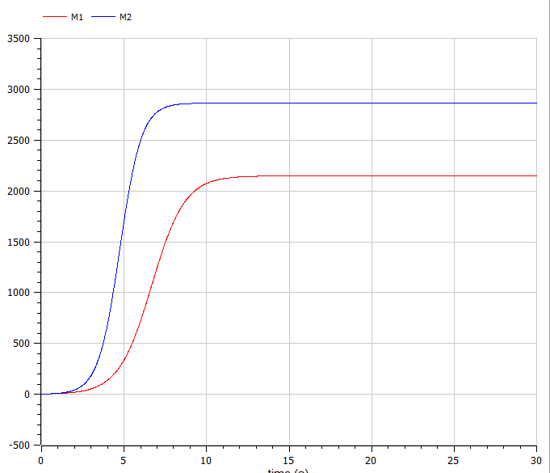
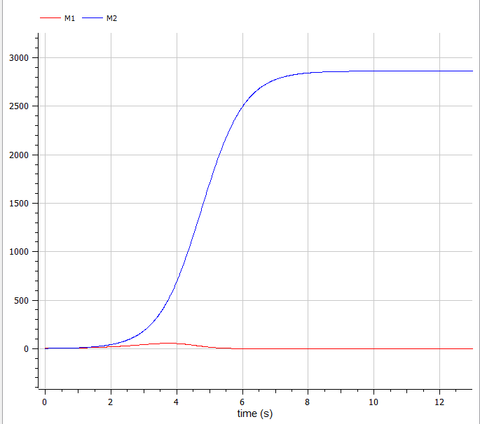

---
# Front matter
title: Защита лабораторной работы №8. Модель конкуренции двух фирм
subtitle: "Вариант 10"
author: "Ильин Никита Евгеньевич"  

# Formatting
toc: false
slide_level: 2
header-includes: 
 - \metroset{progressbar=frametitle,sectionpage=progressbar,numbering=fraction}
 - '\makeatletter'
 - '\beamer@ignorenonframefalse'
 - '\makeatother'
aspectratio: 43
section-titles: true
theme: metropolis
---

# Цель выполнения лабораторной работы 

Цель работы научиться строить модели конкуренции двух фирм в OpenModelica.

# Задача

1. Построить график измененме оборотных средств без учета постоянных издержек.
2. Построить график измененме оборотных средств с учетом постоянных издержек.

# Условия задачи

Вариант 10:

$$ M_0^1 = 2.7, M_0^2 = 2, p_cr = 22, N = 25, q = 1, \tau_1 = 18, \tau_2 = 21, p_1 = 15, p_2 = 12$$

N - число потребителей производимого продукта, $\tau$ - длительность производственного цикла, pcr - критическая стоимость продукта, p - себестоимость продукта, q - максимальная потребность одного человека в продукте в единицу времени, $\theta=\frac{t}{c_1}$ - безразмерное время.

# Результат выполнения лабораторной работы

## Уравнения

Система уравнений для первого случая (без учета социально-психологического фактора):

$$ \frac{dM_1}{d\theta} = M_1 - \frac{b}{c_1} M_1 M_2 - \frac{a_1}{c_1} M_1^2 $$

$$ \frac{dM_2}{d\theta} = \frac{c_2}{c_1} M_2 - \frac{b}{c_1} M_1 M_2-\frac{a_2}{c_1} M_2^2 $$

где $$ a_1 = \frac{p_{cr}}{{\tau}1^2 p_1^2 N q }, a_2 = \frac{p{cr}}{{\tau}2^2 p_2^2 N q}, b = \frac{p{cr}}{{\tau}_1^2 p_1^2 {\tau}2^2 p_2^2 N q } $$ $$ c_1 = \frac{p{cr} - p_1}{{\tau}1 p_1}, c_2 = \frac{p{cr} - p_2}{{\tau}_2 p_2}$$

Также введена нормировка $t = c_1 \theta$.

## Уравнения

Система уравнений для второго случая (с учетом социально-психологического фактора) принимает следующий вид:

$$ \frac{dM_1}{d\theta} = M_1 - (\frac{b}{c_1}-0.0019)M_1 M_2-\frac{a_1}{c_1} M_1^2 $$

$$ \frac{dM_2}{d\theta} = \frac{c_2}{c_1} M_2 - (\frac{b}{c_1}) M_1 M_2-\frac{a_2}{c_1} M_2^2 $$

# График для случая 1

{ #fig:001 width=70%}

# График для случая 2

{ #fig:002 width=70%}

# Выводы по лабораторной работе

- Изучена модель конкуренции

- Были построены графики для двух случаев