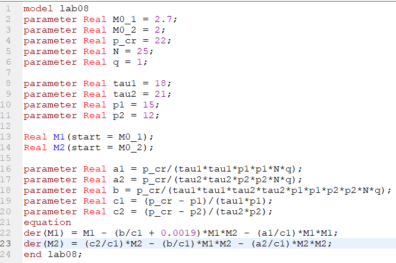

---
# Front matter
title: "Лабораторная работа 8. Модели конкуренции"
subtitle: "Вариант 10"
author: "Ильин Никита Евгеньевич"

# Generic otions
lang: ru-RU
toc-title: "Содержание"

# Pdf output format
toc: true # Table of contents
toc_depth: 2
lof: true # List of figures
lot: true # List of tables
fontsize: 12pt
linestretch: 1.5
papersize: a4
documentclass: scrreprt
## I18n
polyglossia-lang:
  name: russian
  options:
	- spelling=modern
	- babelshorthands=true
polyglossia-otherlangs:
  name: english
### Fonts
mainfont: PT Serif
romanfont: PT Serif
sansfont: PT Sans
monofont: PT Mono
mainfontoptions: Ligatures=TeX
romanfontoptions: Ligatures=TeX
sansfontoptions: Ligatures=TeX,Scale=MatchLowercase
monofontoptions: Scale=MatchLowercase,Scale=0.9
## Biblatex
biblatex: true
biblio-style: "gost-numeric"
biblatexoptions:
  - parentracker=true
  - backend=biber
  - hyperref=auto
  - language=auto
  - autolang=other*
  - citestyle=gost-numeric
## Misc options
indent: true
header-includes:
  - \linepenalty=10 # the penalty added to the badness of each line within a paragraph (no associated penalty node) Increasing the value makes tex try to have fewer lines in the paragraph.
  - \interlinepenalty=0 # value of the penalty (node) added after each line of a paragraph.
  - \hyphenpenalty=50 # the penalty for line breaking at an automatically inserted hyphen
  - \exhyphenpenalty=50 # the penalty for line breaking at an explicit hyphen
  - \binoppenalty=700 # the penalty for breaking a line at a binary operator
  - \relpenalty=500 # the penalty for breaking a line at a relation
  - \clubpenalty=150 # extra penalty for breaking after first line of a paragraph
  - \widowpenalty=150 # extra penalty for breaking before last line of a paragraph
  - \displaywidowpenalty=50 # extra penalty for breaking before last line before a display math
  - \brokenpenalty=100 # extra penalty for page breaking after a hyphenated line
  - \predisplaypenalty=10000 # penalty for breaking before a display
  - \postdisplaypenalty=0 # penalty for breaking after a display
  - \floatingpenalty = 20000 # penalty for splitting an insertion (can only be split footnote in standard LaTeX)
  - \raggedbottom # or \flushbottom
  - \usepackage{float} # keep figures where there are in the text
  - \floatplacement{figure}{H} # keep figures where there are in the text
---

# Цель работы

Цель работы научиться строить модели конкуренции двух фирм в OpenModelica.

# Задачи

1. Построить графики изменения оборотных средств фирмы 1 и фирмы 2 без учета постоянных издержек и с веденной нормировкой для случая 1 (без учета социально-психологического фактора).

2. Построить графики изменения оборотных средств фирмы 1 и фирмы 2 без учета постоянных издержек и с веденной нормировкой для случая 2 (с учетом социально-психологического фактора).

# Теоретическое введение

Система уравнений для первого случая (без учета социально-психологического фактора):

$$ \frac{dM_1}{d\theta} = M_1 - \frac{b}{c_1} M_1 M_2 - \frac{a_1}{c_1} M_1^2 $$

$$ \frac{dM_2}{d\theta} = \frac{c_2}{c_1} M_2 - \frac{b}{c_1} M_1 M_2-\frac{a_2}{c_1} M_2^2 $$

где $$ a_1 = \frac{p_{cr}}{{\tau}1^2 p_1^2 N q }, a_2 = \frac{p{cr}}{{\tau}2^2 p_2^2 N q}, b = \frac{p{cr}}{{\tau}_1^2 p_1^2 {\tau}2^2 p_2^2 N q } $$ $$ c_1 = \frac{p{cr} - p_1}{{\tau}1 p_1}, c_2 = \frac{p{cr} - p_2}{{\tau}_2 p_2}$$

Также введена нормировка $t = c_1 \theta$.

Система уравнений для второго случая (с учетом социально-психологического фактора) принимает следующий вид:

$$ \frac{dM_1}{d\theta} = M_1 - \frac{b}{c_1} M_1 M_2-\frac{a_1}{c_1} M_1^2 $$

$$ \frac{dM_2}{d\theta} = \frac{c_2}{c_1} M_2 - (\frac{b}{c_1} + 0.00043) M_1 M_2-\frac{a_2}{c_1} M_2^2 $$

N - число потребителей производимого продукта, $\tau$ - длительность производственного цикла, pcr - критическая стоимость продукта, p - себестоимость продукта, q - максимальная потребность одного человека в продукте в единицу времени, $\theta=\frac{t}{c_1}$ - безразмерное время.

# Начальные данные

В варианте 34 дано:

$$ M_0^1 = 3.6, M_0^2 = 2.9, p_cr = 32, N = 33, q = 1, \tau_1 = 25, \tau_2 = 15, p_1 = 8, p_2 = 10.5$$

# Ход работы

1. Напишем программу на языке Modelica.

2. Построим графики изменения оборотных средств фирмы 1 и фирмы 2 для случая 1 (без учета социально-психологического фактора)

3. Построим графики изменения оборотных средств фирмы 1 и фирмы 2 для случая 2 (с учетом социально-психологического фактора)

# Выводы

Были построены модели конкуренции двух фирм для двух случаев.

# Библиография

1. Методические материалы курса