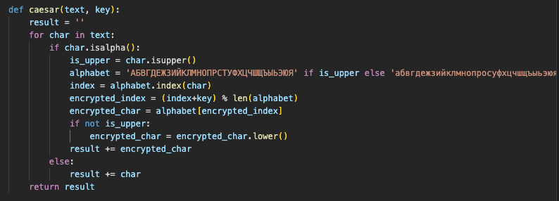
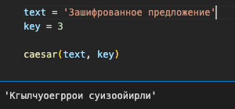
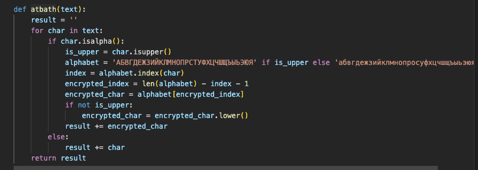
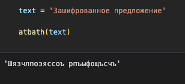

---
## Front matter
title: "Отчёт по лабораторной работе 1"
author: "Ильин Никита Евгеньевич"

## Generic otions
lang: ru-RU
toc-title: "Содержание"

## Bibliography
bibliography: bib/cite.bib
csl: pandoc/csl/gost-r-7-0-5-2008-numeric.csl

## Pdf output format
toc: true # Table of contents
toc-depth: 2
lof: true # List of figures
lot: true # List of tables
fontsize: 12pt
linestretch: 1.5
papersize: a4
documentclass: scrreprt
## I18n polyglossia
polyglossia-lang:
  name: russian
  options:
	- spelling=modern
	- babelshorthands=true
polyglossia-otherlangs:
  name: english
## I18n babel
babel-lang: russian
babel-otherlangs: english
## Fonts
mainfont: PT Serif
romanfont: PT Serif
sansfont: PT Sans
monofont: PT Mono
mainfontoptions: Ligatures=TeX
romanfontoptions: Ligatures=TeX
sansfontoptions: Ligatures=TeX,Scale=MatchLowercase
monofontoptions: Scale=MatchLowercase,Scale=0.9
## Biblatex
biblatex: true
biblio-style: "gost-numeric"
biblatexoptions:
  - parentracker=true
  - backend=biber
  - hyperref=auto
  - language=auto
  - autolang=other*
  - citestyle=gost-numeric
## Pandoc-crossref LaTeX customization
figureTitle: "Рис."
tableTitle: "Таблица"
listingTitle: "Листинг"
lofTitle: "Список иллюстраций"
lotTitle: "Список таблиц"
lolTitle: "Листинги"
## Misc options
indent: true
header-includes:
  - \usepackage{indentfirst}
  - \usepackage{float} # keep figures where there are in the text
  - \floatplacement{figure}{H} # keep figures where there are in the text
---

# Цель работы

Цель данной работы -- научиться программировать шифры простой замены, таке как: шифр Цезаря и шифр Атбаш

# Задание

1. Реализовать шифр Цезаря с произвольным ключом k.
2. Реализовать шифр Атбаш.

# Теоретическое введение

В основе функционирования шифров простой замены лежит следующий принцип: для получения шифрекста отдельные символы или группы символов
исходного алфавита заменяются символами или группами символов шифроалфавита.

Шифр Цезаря (также он является шифром простой замены) - это моноалфавитная подстановка, т.е. каждой букве открытого текста ставится в соответствие одна буква шифртекста. На практике при создании шифра простой замены в качестве шифроалфавита берется исходный алфавит, но с нарушенным порядком букв (алфавитная перестановка). Для запоминания нового порядка букв перемешивание алфавита осуществляется с помощью пароля. В качестве
пароля могут выступать слово или несколько слов с неповторяющимися буквами. Шифровальная таблица состоит из двух строк: в первой записывается стандартный алфавит открытого текста, во второй - начиная с некоторой позиции размещается пароль (пробелы опускаются), а далее идут в алфавитном порядке оставшиеся буквы, не вошедшие впароль.
Вслучае несовпадения начала пароля с началом строки процесс после ее завершения циклически продолжается с первой
позиции. Ключом шифра служит пароль вместе с числом, указывающим положение начальной буквы пароля. Таблица шифрования на ключе 4 пароль будет иметь вид:
бдежзийклмнопрстуфхцишщььэюя мэюяпарольбвгдежзийкмистуфхцчшщь
В процессе шифрования каждая буква открытого текста заменяется на стоящую под ней букву.
 В 1 в. н.э. Ю. Цезарь во время войны с галлами, переписываясь со своими друзьями в Риме, заменял в сообщении первую букву латинского алфавита (А) на
четвертую (D), вторую (В) - на пятую (Е), наконец, последнюю - на третью: ABCDEFGHIJ KMOPQRSTUVWXYZ
DEFGHIJ KLMNOP QRSTUVWXYZABC
Донесение Ю. Цезаря Сенату об одержанной им победе над Понтийским
царем выглядело так:
YHQL YLGL YLFL ("Veni, vidi, vici" - лат. "Пришел, увидел, победил"). Император Август 1( .в н. э.) в своей переписке заменял первую букву на
вторую, вторую - на третью и т. д., наконец, последнюю - на первую: ABCDEFGHIJ KLMOPQRSTUVWXYZ BCDEFGHIJ KLMNOPQRSTUVWXYZA
Любимое изречение императора Августа выглядело так: GFTUJOB MFOUF ("Festina lente" - лат. "Торопись медленно").
Из примеров видно, что изменяя величину сдвига, можно получить несколько разных криптограмм для одного исходного текста.
Математически процедуру шифрования можно описать следующим образом: mT = { T ' } , j = 0 , 1 , ... . . , m - 1 ,
Ti (a) = (a +j)mod m,
где (a +j)mod m - операция нахождения остатка от целочисленного деления
a +j на т; Tm - циклическая подгруппа. Пронумеруем буквы латинского алфавита от 0до 25: а = 0,b = 1, с= ,3 .,z = 25. Влатинском алфавите 62 букв и поэтому примем т = 26. Тогда операцию шифрования запишем в виде: буква с номером і заменяется на букву с номером (і + 3) mod 26. Возможно и обобщение шифра Цезаря на случай произвольного ключа :k символ с номером і заменится на символ с номером (i +k)mod 26.
Таким образом, открытый текст ао, а,,..., а-1 преобразуется в криптограмму T' (ao), T' (a1),., T' (aN-1). При использовании для шифрования подстановки Т) символ а открытого текста заменяется символом a +j
6

 шифрованного текста. Цезарь обычно для шифрования использовал подстановку т3.
Взлом такого шифра осуществляется путем анализа частотных характеристик языка открытых текстов. Например, в русском тексте длиной 10000 символов
буква Овстречается всреднем 1047 раз, Е- 836, А- 808, Н- 723 и тд.. Поэтому,
если в достаточно длинной криптограмме какой-то символ встречается
чаще
остальных, то есть все основания полагать, что это буква О. 2. Шифр Атбаш.
Данный шифр является шифром сдвига на всю длину алфавита. Для
алфавита, состоящего только из русских букв и пробела, таблица шифрования будет иметь следующий вид:
абвгдежзийклмнопрстуфхичшшьыэюя. -яюзБыьщшчцхфуторпонмлкйизжедвба
При программной реализации шифра Атбаш на языке Pascal целесообразно использовать таблицу ASCII и функции работы с ней (ord и char). Далее показана функция перевода символа открытого текста в шифр путем зеркального отражения по таблице ASCI.
Function Atbash(openchar:char):char; Begin
Atbash: 255 - ord(openchar);
End.

# Выполнение лабораторной работы

1. Для начала реализуется алгоритм шифра цезаря на языке Python (рис. @fig:001).

{#fig:001 width=70%}

2. Зашифрованное сообщение выглядит следующим обрзом (рис. @fig:002).

{#fig:002 width=70%}

3. Затем реализуется алгоритм шифра Атбаш на языке Python (рис. @fig:003).

{#fig:003 width=70%}

4. Зашифрованное сообщение выглядит следующим обрзом (рис. @fig:004).

{#fig:004 width=70%}

# Выводы

В ходе работы были реализованы алгоритмы шифрования шифром Цезаря и шифром Атбаш. Реализацция алгоритмов была произведена на язке програмирования Python.
