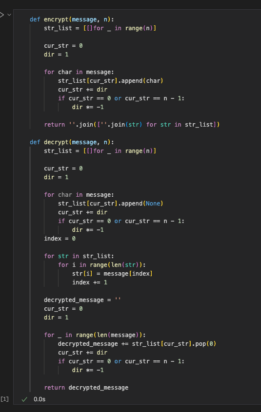
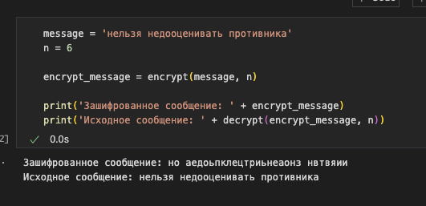
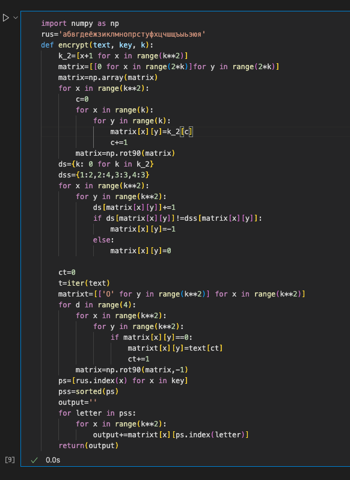
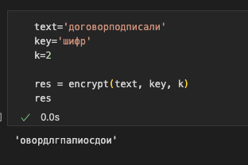
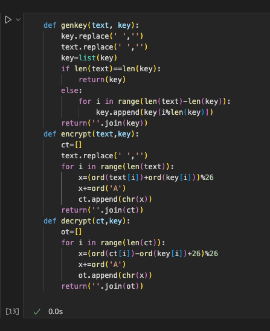
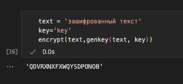

---
# Front matter
title: "Отчет по лабораторной работе №2. Шифры перестановки"
author: "Ильин Никита Евгеньевич"

# Formatting
toc: false
slide_level: 2
header-includes: 
 - \metroset{progressbar=frametitle,sectionpage=progressbar,numbering=fraction}
 - '\makeatletter'
 - '\beamer@ignorenonframefalse'
 - '\makeatother'
aspectratio: 43
section-titles: true
theme: metropolis
---

# Цель выполнения лабораторной работы 

Цель данной работы -- научиться программировать шифры перестановки

## Результат выполнения лабораторной работы

1. Для начала реализуется алгоритм маршрутного шифрования на языке Python (рис. @fig:001).

{#fig:001 width=70%}

2. Зашифрованное сообщение выглядит следующим образом (рис. @fig:002).

{#fig:002 width=70%}

## Результат выполнения лабораторной работы

3. Затем реализуется алгоритм шифрования с помощью решеток на языке Python (рис. @fig:003).

{#fig:003 width=70%}

4. Зашифрованное сообщение выглядит следующим образом (рис. @fig:004).

{#fig:004 width=70%}

## Результат выполнения лабораторной работы

5. Затем реализуется алгоритм таблицы Виженера на языке Python (рис. @fig:005).

{#fig:005 width=70%}

6. Зашифрованное сообщение выглядит следующим образом (рис. @fig:006).

{#fig:006 width=70%}

# Выводы по лабораторной работе

Реализованы программные алгоритмы шифров перестановки.