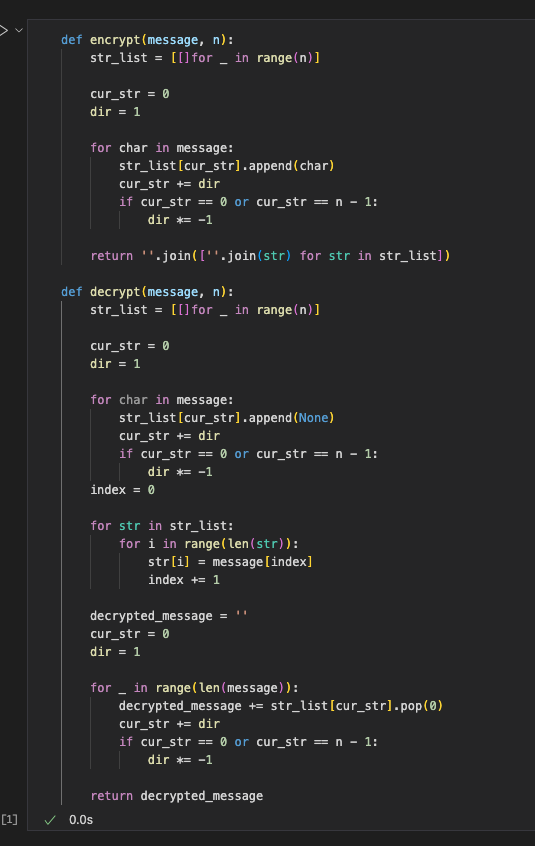
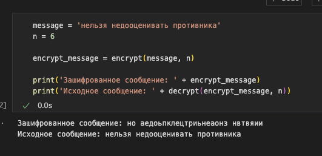
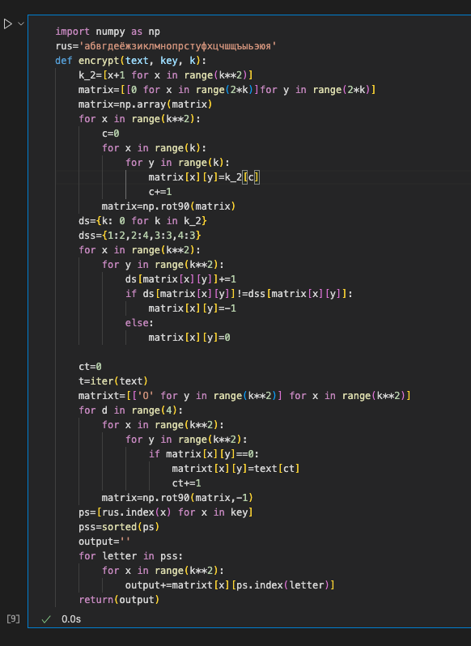
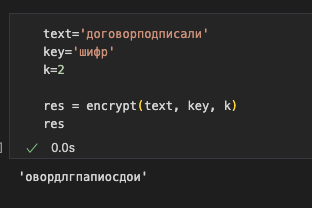
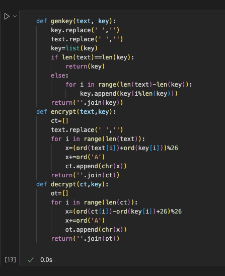
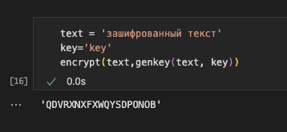

---
## Front matter
title: "Отчёт по лабораторной работе 2"
author: "Ильин Никита Евгеньевич"

## Generic otions
lang: ru-RU
toc-title: "Содержание"

## Bibliography
bibliography: bib/cite.bib
csl: pandoc/csl/gost-r-7-0-5-2008-numeric.csl

## Pdf output format
toc: true # Table of contents
toc-depth: 2
lof: true # List of figures
lot: true # List of tables
fontsize: 12pt
linestretch: 1.5
papersize: a4
documentclass: scrreprt
## I18n polyglossia
polyglossia-lang:
  name: russian
  options:
	- spelling=modern
	- babelshorthands=true
polyglossia-otherlangs:
  name: english
## I18n babel
babel-lang: russian
babel-otherlangs: english
## Fonts
mainfont: PT Serif
romanfont: PT Serif
sansfont: PT Sans
monofont: PT Mono
mainfontoptions: Ligatures=TeX
romanfontoptions: Ligatures=TeX
sansfontoptions: Ligatures=TeX,Scale=MatchLowercase
monofontoptions: Scale=MatchLowercase,Scale=0.9
## Biblatex
biblatex: true
biblio-style: "gost-numeric"
biblatexoptions:
  - parentracker=true
  - backend=biber
  - hyperref=auto
  - language=auto
  - autolang=other*
  - citestyle=gost-numeric
## Pandoc-crossref LaTeX customization
figureTitle: "Рис."
tableTitle: "Таблица"
listingTitle: "Листинг"
lofTitle: "Список иллюстраций"
lotTitle: "Список таблиц"
lolTitle: "Листинги"
## Misc options
indent: true
header-includes:
  - \usepackage{indentfirst}
  - \usepackage{float} # keep figures where there are in the text
  - \floatplacement{figure}{H} # keep figures where there are in the text
---

# Цель работы

Цель данной работы - научиться программировать шифры перестановки, такие как: маршрутное шифрование, шифрование с помощью решеток и таблица Виженера.

# Задание

1. Реализовать представленные в задании шифры.

# Теоретическое введение
Шифры перестановки преобразуют открытый текст в криптограмму путем
перестановки его символов. Способ, каким при шифровании переставляются
буквы открытого текста, и является ключом шифра. Важным требованием является равенство длин ключа и исходного текста.
Существует два широко распространенных метода перестановок: 1. Маршрутное шифрование.
Данный способ шифрования разработал французский математик Франсуа Виет. Открытый текст записывают в некоторую геометрическую фигуру (обычно
прямоугольник) по некоторому пути, а затем, выписывая символы по
другому пути, получают шифртекст. Пусть т и п - целые положительные числа, большие 1. Открытый текст разбивается на блоки равной длины, состоящие из числа символов, равному произведению тп. Если последний блок получится меньше
остальных, то в него следует дописать требуемое количество произвольных символов. Составляется таблица размерности тп. Блоки вписывается построчно в таблицу. КриптограммаК получается выписыванием букв из таблицы в
соответствии с некоторым маршрутом. Ключом такой криптограммы является маршрут и числа т и п. Обычно буквы выписывают по столбцам, которые
упорядочивают согласно паролю: внизу таблицы приписывается слово из n
неповторяющихся букв и столбцы нумеруются по алфавитному порядку букв пароля.
Например, для шифрования текста нельзя недооценивать противника, разобьем его на блоки длины n = 6. Блоков получится т = 5. К последнему блоку припишем букву а. В качестве пароля выберем слово пароль. Теперь будем выписывать буквы по столбцам в соответствии с алфавитным порядком букв пароля
и
получим
следующую
криптограмму: ЕЕНПНЗОАТАБОВОКННЕЬВЯЦТИА.
8

 •аратовсь
ствен
нельзя недооц
ени
ват
вникаа парол в
Рассмотренный способ шифрования (столбцовая перестановка) в годы первой мировой войны использовала легендарная немецкая шпионка Мата Хари.
2. Шифрование спомощью решеток. o l
Данный способ шифрования предложил австрийский криптограф Эдуард Флейснер в 181 году. Суть этого способа заключается в следующем. Выбирается натуральное число k > ,1 строится квадрат размерности k и построчно заполняется числами 1,2,..., k?. В качестве примера рассмотри квадрат размерности k = .2
R2
4
Повернем его по часовой стрелке на 90° и присоединим к исходному квадрату справа.
1123 1 34 42
Проделаем еще дважды такую процедуру и припишем получившиеся квадраты снизу. Получился большой квадрат размерности 2k.
1
1 32 23 1321
Далее из большого квадрата вырезаются клетки, содержащие числа от 1 до
k7. В каждой клетке должно быть только одно число. Получается своего рода решето. Шифрование осуществляется следующим образом. Решето
накладывается на чистый квадрат 2k × 2k и в прорези вписываются буквы 9

 исходного текста по порядку их следования. Когда заполнятся все прорези, решето поворачивается на 90° и вписывание букв продолжается. После третьего поворота все клетки большого квадрата окажутся заполненными. Подобрав подходящий пароль (число букв пароля должно равняться k? и они не должны повторяться), выпишем буквы по столбцам. Очередность столбцов определяется алфавитным порядком букв пароля.
Пример. Исходный текст - договор подписали; пароль
шифр. С применением вышеуказанной решетки за пять шагов получаем следующую криптограмму.
ддaд a
и ии
" ФР Получившаяся криптограмма: ОВОРДЛГПАПИОСДОИ. Важно отметить,
что число k подбирается в соответствии с количеством букв N исходного теста. В
идеальном случае k? = N. Если такого равенства достичь невозможно, от можно либо дописать произвольную букву к последнему слову открытого текста, либо
убрать е.
3. Таблица Виженера.
В 1585 году французский криптограф Блез Виженер опубликовал свой метод шифрования в «Трактате о шифрах». Шифр считался нераскрываемым од 1863 года, когда австриец Фридрих Казиски взломал его.
Открытый текст разбивается на блоки длины п. Ключ представляет собой
последовательность из п натуральных чисел: ал,а2, ..., ап. Далее в каждом блоке первая буква циклически сдвигается вправо по алфавиту на а, позиций, вторая
буква - на аз позиций, последняя - на а, позиций. Для лучшего запоминания в качестве ключа можно взять осмысленное слово, а алфавитные номера входящих в него букв использовать для осуществления сдвигов. Рассмотрим еще одну
10

 схему построения шифра Виженера. В нижеприведенной таблице в строчках записаны буквы русского алфавита. При переходе от одной строке к другой происходит циклический сдвиг на одну позицию. Исходный текст: криптография серьезная наука; пароль - математика. Пароль записывается с повторениями над
буквами сообщения.
ма ик ематикамат ма иaфиЯe3HЯHa
ГEXK3 П Ф 三bЫ]Я Б 30 三Щ10
Д E
EЖ H M
유
29 ШЩ
I
Вгоризонтальном алфавите находим букву «к», а в вертикальном - букву «м». На пересечении столбца истроки втаблице расположена буква «ц». Далее переходим кбуквам «р» и«а» соответственно. Витоге получается следующая криптограмма: ЦРЬФЯОХШКФФЯДКЭЬЧПЧАЛНТШЦА.
Задания к лабораторной работе Реализовать все рассмотренные шифры программно.
1
『 川E水31⁄41⁄4KJMHonPCTyexug目目bh3l
R ^-"-FeXmHHKAMHo=Pc- ox =
1 0 分A E B 「A E Z 3 H H K J MH O T P C T y のx 出可目 』
日A E B 「A E Z 3 H H K J MH O E P C T y e X I T 目目
6五21 AEBTHEW3HIKIMHOnPCTyexu
y のXニ目5531月AEB「AEZ3日MKJMHOnPCT
2OXTy目2日間 AEBTAE*3HiKJMHOTP
P C T Y のX 4 5 5 3 1 年A E B 「A E 水3 M H K J M H O I
山川 b N 9 0 % A E B 「 A E Z 3 W H K J M H O
Ty x
目bb3108ABBTAEZ3HHKJMH
C TyeX
目目55319A5BDAEZ3日日NJM
5 5 3 1 0 分 A B B 「 AE 水 3 H M K 』
b UI 9 1 9 A B B T 以 E X 3 H M K
3HMKH
6551O8AEBT AEZ 3日
三七五の10 AbB 川E水
293=시
iaeaeduxuxouo4nECwHmM:
H X o K i o d uO HW U M M ue X a x
-Z=AMMW*겨 hnXexHad O HN I M M M ×= =2:
JagYt acmr; EIXのKLOAUOHN HdGSVBOCl9. nhxexiadI
m Xe KIad M n x e K ao d
UMMHW
Au
^-
EE

# Выполнение лабораторной работы

1. Для начала реализуется алгоритм маршрутного шифрования на языке Python (рис. @fig:001).

{#fig:001 width=70%}

2. Зашифрованное сообщение выглядит следующим образом (рис. @fig:002).

{#fig:002 width=70%}

3. Затем реализуется алгоритм шифрования с помощью решеток на языке Python (рис. @fig:003).

{#fig:003 width=70%}

4. Зашифрованное сообщение выглядит следующим образом (рис. @fig:004).

{#fig:004 width=70%}

5. Затем реализуется алгоритм таблицы Виженера на языке Python (рис. @fig:005).

{#fig:005 width=70%}

6. Зашифрованное сообщение выглядит следующим образом (рис. @fig:006).

{#fig:006 width=70%}

# Выводы

В ходе работы были реализованы алгоритмы шифрования . Реализацция алгоритмов была произведена на языке програмирования Python.
