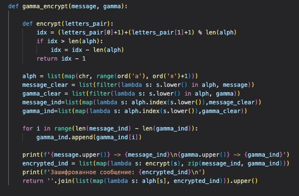
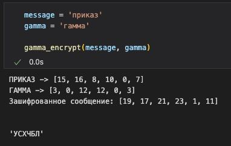

---
# Front matter
title: "Отчет по лабораторной работе №3. Шифрование гаммированием"
author: "Ильин Никита Евгеньевич"

# Formatting
toc: false
slide_level: 2
header-includes: 
 - \metroset{progressbar=frametitle,sectionpage=progressbar,numbering=fraction}
 - '\makeatletter'
 - '\beamer@ignorenonframefalse'
 - '\makeatother'
aspectratio: 43
section-titles: true
theme: metropolis
---

# Цель выполнения лабораторной работы 

Цель данной работы -- научиться программировать Шифрование гаммированием/

## Результат выполнения лабораторной работы

1. Для начала реализуется алгоритм шифра на языке Python (рис. @fig:001).

{#fig:001 width=70%}

## Результат выполнения лабораторной работы

2. Зашифрованное сообщение выглядит следующим образом (рис. @fig:002).

{#fig:002 width=70%}

# Выводы

В ходе работы был реализован алгоритм шифрования гаммированием.
