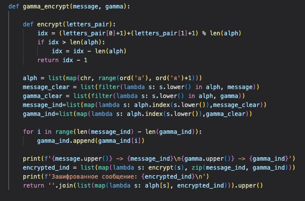
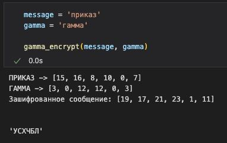

---
## Front matter
title: "Отчёт по лабораторной работе 3. Шифрование гаммированием"
author: "Ильин Никита Евгеньевич"

## Generic otions
lang: ru-RU
toc-title: "Содержание"

## Bibliography
bibliography: bib/cite.bib
csl: pandoc/csl/gost-r-7-0-5-2008-numeric.csl

## Pdf output format
toc: true # Table of contents
toc-depth: 2
lof: true # List of figures
lot: true # List of tables
fontsize: 12pt
linestretch: 1.5
papersize: a4
documentclass: scrreprt
## I18n polyglossia
polyglossia-lang:
  name: russian
  options:
	- spelling=modern
	- babelshorthands=true
polyglossia-otherlangs:
  name: english
## I18n babel
babel-lang: russian
babel-otherlangs: english
## Fonts
mainfont: PT Serif
romanfont: PT Serif
sansfont: PT Sans
monofont: PT Mono
mainfontoptions: Ligatures=TeX
romanfontoptions: Ligatures=TeX
sansfontoptions: Ligatures=TeX,Scale=MatchLowercase
monofontoptions: Scale=MatchLowercase,Scale=0.9
## Biblatex
biblatex: true
biblio-style: "gost-numeric"
biblatexoptions:
  - parentracker=true
  - backend=biber
  - hyperref=auto
  - language=auto
  - autolang=other*
  - citestyle=gost-numeric
## Pandoc-crossref LaTeX customization
figureTitle: "Рис."
tableTitle: "Таблица"
listingTitle: "Листинг"
lofTitle: "Список иллюстраций"
lotTitle: "Список таблиц"
lolTitle: "Листинги"
## Misc options
indent: true
header-includes:
  - \usepackage{indentfirst}
  - \usepackage{float} # keep figures where there are in the text
  - \floatplacement{figure}{H} # keep figures where there are in the text
---

# Цель работы

Цель данной работы -- научиться программировать Шифрование гаммированием/

# Задание

1. Реализовать алгоритм шифрование гаммированием

# Теоретическое введение

Из всех схем шифрования простейшей и наиболее надежной является схема
однократного использования (рис. 1). Формируется т- разрядная случайная двоичная последовательность - ключ шифра. Отправитель производит побитовое
сложение по модулю два (mod 2) ключа
k = k / k 2 . . . K i . . . mK и т- разрядной двоичной последовательности
p= P1P2 ...Pi...Pm, соответствующей посылаемому сообщению:
Ci = p i @ k ; , i = 1 , m ,
где рі - і-й бит исходного текста, і - і-й бит ключа, ® - операция побитового
сложения (XOR), с; - і-й бит получившейся криптограммы =C C1C2. Ci. Cm•
Операция побитного сложения является обратимой, т.е. (x0y)@y = x, поэтому дешифрование осуществляется повторным применением операции 0 к криптограмме:
Ключ к
Исходная
информация р XOR
Pi = c, 0 k , i = 1 , m .
Ключ k
Зашифрованная информация с XOR
Рис. 1
Расшифрованная информация р
Основным недостатком такой схемы является равенство объема ключевой информации и суммарного объема передаваемых сообщений. Данный недостаток
можно убрать, использовав ключ в качестве «зародыша», порождающего 12
 Черны
значительно более длинную ключевую последовательность. представлена такая схема, которая и называется гаммированием.
На рис. .2
Kuroy k
Исходная информация р
Зашифрованная информация с
Y
Расшифрованная информация р F-1
Ключ k GG
Гаммирование - процедура наложения при помощи некоторой функции F на
исходный текст гаммы шифра, т.е. псевдослучайной последовательности (ПСП) с
выходов генератора G. Псевдослучайная последовательность по своим статистическим свойствам неотличима от случайной последовательности, но
является детерминированной, т.е. известен алгоритм е формирования. Чаще
Обычно в качестве функции F берется
операция поразрядного сложения
по модулю два или по модулю N (N - число букв алфавита открытого текста).
Простейший генератор • псевдослучайной последовательности можно представить рекуррентным соотношением:
Vi = a • V i - 1 + b m o d ( m ) , i = 1 , m ,
где Vi - і-й член последовательности псевдослучайных чисел, а, Yo, b - ключевые параметры. Такая последовательность состоит из целых чисел от 0 од т - .1 Если
элементы Vi и Y; совпадут, то совпадут и последующие участки: Y+1 Yj+1, Vi+z = Vj+2. Таким образом, ПСП является периодической. Знание периода гаммы существенно облегчает криптоанализ. Максимальная длина периода равна т. Для ее достижения необходимо удовлетворить следующим условиям:
1 b и т - взаимно простые числа;
2. а - 1 делится на любой простой делитель числа т ; 3. а - 1 кратно 4, если т кратно 4.
13

 Стойкость шифров, основанных на процедуре гаммирования, зависит от характеристик гаммы - длины и равномерности распределения вероятностей
появления знаков гаммы.
При использовании генератора ПСП получаем бесконечную гамму. Однако,
возможен режим шифрования конечной гаммы. В роли конечной гаммы может выступать фраза. Как и ранее, используется алфавитный порядок букв, т.е. буква
«а» имеет порядковый номер 1, «б» - 2 и т.д.
Например, зашифруем слово «ПРИКАЗ» («16 17 09 1 01 08») гаммой
«ГАММА» («04 01 13 13 01»). Будем использовать операцию побитового сложения по модулю 3 (mod 33). Получаем:
C1 = 1 6 + 4 ( m o d 3 3 ) = 2 0
2 c = 7 1 + 1 m( o d 3 3 ) = 8 1 C3 = 9 + 1 3 ( m o d 3 3 ) = 2 2
C4 = 1 1 + 1 3 ( m o d 3 3 ) = 2 4
= s ( 1 + 1 m( o d 3 3 ) 2 = c 6 = 8 + 4 ( m o d 3 3 ) = 1 2 .
Криптограмма: «УСХЧБЛ» («20 18 22 24 02 12»).

# Выполнение лабораторной работы

1. Для начала реализуется алгоритм шифра на языке Python (рис. @fig:001).

{#fig:001 width=70%}

2. Зашифрованное сообщение выглядит следующим образом (рис. @fig:002).

{#fig:002 width=70%}

# Выводы

В ходе работы был реализован алгоритм шифрования гаммированием.
