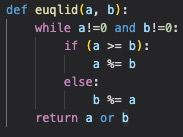
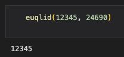
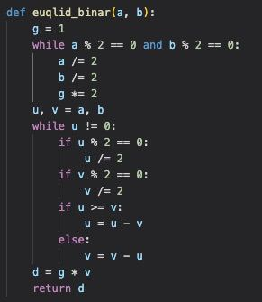
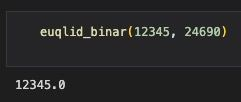
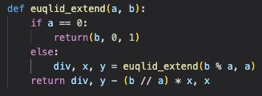
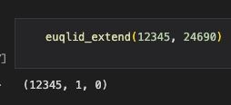
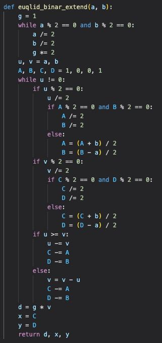
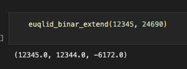

---
# Front matter
title: "Отчёт по лабораторной работе 4. Вычисление наибольшего общего делителя"
author: "Ильин Никита Евгеньевич"

# Formatting
toc: false
slide_level: 2
header-includes: 
 - \metroset{progressbar=frametitle,sectionpage=progressbar,numbering=fraction}
 - '\makeatletter'
 - '\beamer@ignorenonframefalse'
 - '\makeatother'
aspectratio: 43
section-titles: true
theme: metropolis
---

# Цель выполнения лабораторной работы 

Цель данной работы - научиться реализовывать алгоритмы поиска НОД.

## Выполнение лабораторной работы

1. Для начала реализуется функция алгоритма Эвклида  (рис. @fig:001).

{#fig:001 width=70%}

## Выполнение лабораторной работы

2. Результат работы функции (рис. @fig:002).

{#fig:002 width=70%}

## Выполнение лабораторной работы

3. Для начала реализуется функция бинарного алгоритма Евклида.  (рис. @fig:003).

{#fig:003 width=70%}

## Выполнение лабораторной работы

4. Результат работы функции (рис. @fig:004).

{#fig:004 width=70%}

## Выполнение лабораторной работы

5. Для начала реализуется функция алгоритма Эвклида  (рис. @fig:005).

{#fig:005 width=70%}

## Выполнение лабораторной работы

6. Результат работы функции (рис. @fig:006).

{#fig:006 width=70%}

## Выполнение лабораторной работы

7. Для начала реализуется функция алгоритма Эвклида  (рис. @fig:007).

{#fig:007 width=70%}

## Выполнение лабораторной работы

8. Результат работы функции (рис. @fig:008).

{#fig:008 width=70%}

# Выводы

В ходе работы были реализованы алгоритмы вычисления НОД.
