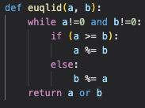
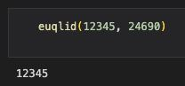
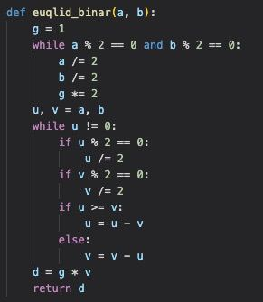
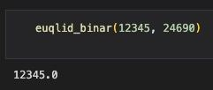
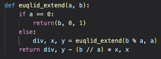
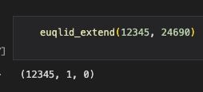
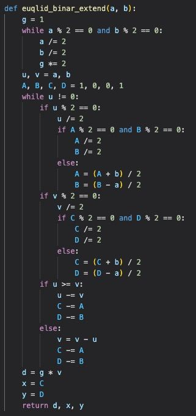
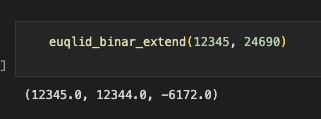

---
## Front matter
title: "Отчёт по лабораторной работе 4. Вычисление наибольшего общего делителя"
author: "Ильин Никита Евгеньевич"

## Generic otions
lang: ru-RU
toc-title: "Содержание"

## Bibliography
bibliography: bib/cite.bib
csl: pandoc/csl/gost-r-7-0-5-2008-numeric.csl

## Pdf output format
toc: true # Table of contents
toc-depth: 2
lof: true # List of figures
lot: true # List of tables
fontsize: 12pt
linestretch: 1.5
papersize: a4
documentclass: scrreprt
## I18n polyglossia
polyglossia-lang:
  name: russian
  options:
	- spelling=modern
	- babelshorthands=true
polyglossia-otherlangs:
  name: english
## I18n babel
babel-lang: russian
babel-otherlangs: english
## Fonts
mainfont: PT Serif
romanfont: PT Serif
sansfont: PT Sans
monofont: PT Mono
mainfontoptions: Ligatures=TeX
romanfontoptions: Ligatures=TeX
sansfontoptions: Ligatures=TeX,Scale=MatchLowercase
monofontoptions: Scale=MatchLowercase,Scale=0.9
## Biblatex
biblatex: true
biblio-style: "gost-numeric"
biblatexoptions:
  - parentracker=true
  - backend=biber
  - hyperref=auto
  - language=auto
  - autolang=other*
  - citestyle=gost-numeric
## Pandoc-crossref LaTeX customization
figureTitle: "Рис."
tableTitle: "Таблица"
listingTitle: "Листинг"
lofTitle: "Список иллюстраций"
lotTitle: "Список таблиц"
lolTitle: "Листинги"
## Misc options
indent: true
header-includes:
  - \usepackage{indentfirst}
  - \usepackage{float} # keep figures where there are in the text
  - \floatplacement{figure}{H} # keep figures where there are in the text
---

# Цель работы

Цель данной работы - научиться реализовывать алгоритмы поиска НОД.

# Задание

1. Реализовать алгоритмы поиска НОД.

# Теоретическое введение

 ЛАБОРАТОРНАЯ РАБОТА No4 Вычисление наибольшего общего делителя
Пусть числа а и в целые и b # 0. Разделить а на в с остатком - значит представить а в виде а = qb + r, где q,r € Z и 0 ≤ r ≤ |b|. Число д называется неполным частным, число г - неполным остатком от деления а на b.
Целое число d # 0 называется наибольшим общим делителем целых чисел
9,, а2, ..., ка (обозначается d= НОД(а, а2, ..., ак)), если выполняются следующие условия:
1. каждое из чисел 01, а2, ..., ак делится на d;
.2 если d, # 0 - другой общий делитель чисел а,, а2, ,. ак, то d делится на d1. Например, НОД(12345, 24690) = 12345, НОД(12345, 54321) = 3, НОД(12345,
12541) = 1.
Ненулевые целые числа а и b называются ассоциированными (обозначается
a~b), если а делится на в и в делится на а.
Для любых целых чисел а,, а2 ..,ак существует наибольший общий
делитель d и его можно представить в виде линейной комбинации этих чисел:
d = G,a, +c2a2 + . +Скак, C, E ZZ( - множество целых чисел). Например, НОД чисел 91, 105, 154 равен .7 В качестве линейного
представления можно взять
7= 7•91 + (-6) • 105 + 0• 154,
либо
7 = 4 • 91 + 1 • 1 0 5 - 3 • 154.
Целые числа а,, а2, .., ак называются взаимно простыми в совокупности, если НОД(а, а2, .., ак)=1. Целые числа а и в называются взаимно простыми, если НОД(a,b)=1.
Целые числа а,,а2, .., ак называются попарно взаимно простыми, если Н О Д ( а ; , а ; ) = 1 д л я в с е х 1 ≤ i # j ≤ k.
15

 
 41. Пока ичетное, полагать и«"
42. Пока очетное, полагать и+"
4.3.При и≥ иположить и- и- v. Впротивном случае положить о- г - и. 5. Положить d - gv.
.3 Расширенный алгоритм Евклида. Вход. Целые числа a, b; 0 < b ≤ а.
. 1 П о л о ж и т ь o r - a , r , - b , x o - 1 , 1 x - 0 , Y 0 - 0 У, 1 - 1 1 , - . 1 2. Разделить с остатком гі-1 на ri: ri-1 = airi + ri+1.
. 3 Е с л и ч і + 1 = 0 , от п о л о ж и т ь d - r i , х -
Х,і у + У.і В противном случає Положить Хі+1 - Хі-1 - ФіХ:,Уі+1 - Уі-1 - ФУ, і - і + 1 и вернуться на шаг 2.
4. Результат: d, x, у.
4. Расширенный бинарный алгоритм Евклида.
Вход. Целыечислаa,b;0<b≤a. Выход. d = НОД(a, b).
1. Положить д - 1.
.2Покачислааивчетные,выполнять а-4,b<b≥9+29 одполучения хотя бы одного нечетного значения а или b.
3. Положитьи- a,v- b,A- 1,B- 0,C- 0,D- 1.
4. Пока и ‡ 0 выполнять следующие действия:
4.1. Пока и четное:
4.1.1. Положить и - 2
4.1.2. Если оба числа А и В четные, то положить А ~ ^_,в - .5 Впротивном
случае положить А- А+b,
4.2. Пока и четное:
4.2.1. Положить 0 < 2
2.
17
2 , B < B-a

 Саратовский государственный унлииввееррсситетимени HI Чернышевског Сарат
овский государст
4.2.2. Если оба числа СиДчетные, от положить С+С
D. +.- Впротивном
случае положить С -
4 . 3 . П р и и ≥ v п о л о ж и т ь и - и - 0, А < А - С , В - В - D. В п р о т и в н о м с л у ч а е п о л о ж и т ь 0 - v - и , С ~ С - A D, - D - В.
5. Положить d - gv,x - C, y + D. 6. Результат: d, x, у.

# Выполнение лабораторной работы

1. Для начала реализуется функция алгоритма Эвклида  (рис. @fig:001).

{#fig:001 width=70%}

2. Результат работы функции (рис. @fig:002).

{#fig:002 width=70%}

3. Для начала реализуется функция бинарного алгоритма Евклида.  (рис. @fig:003).

{#fig:003 width=70%}

4. Результат работы функции (рис. @fig:004).

{#fig:004 width=70%}

5. Для начала реализуется функция алгоритма Эвклида  (рис. @fig:005).

{#fig:005 width=70%}

6. Результат работы функции (рис. @fig:006).

{#fig:006 width=70%}

7. Для начала реализуется функция алгоритма Эвклида  (рис. @fig:007).

{#fig:007 width=70%}

8. Результат работы функции (рис. @fig:008).

{#fig:008 width=70%}

# Выводы

В ходе работы были реализованы алгоритмы вычисления НОД.
