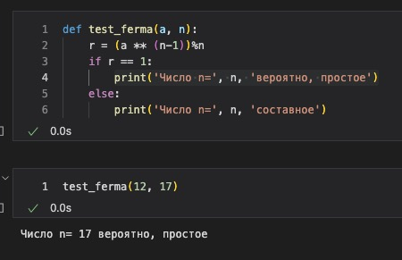
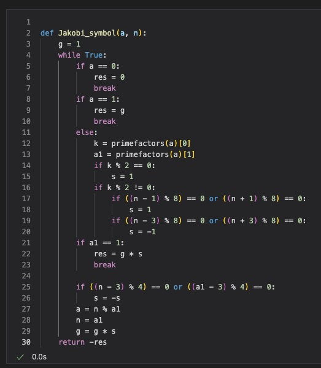
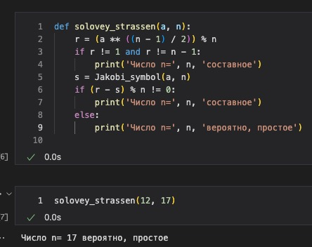

---
# Front matter
title: "Презентация лабораторной работы 5. Вероятностные алгоритмы проверки чисел на простоту"
author: "Ильин Никита Евгеньевич"

# Formatting
toc: false
slide_level: 2
header-includes: 
 - \metroset{progressbar=frametitle,sectionpage=progressbar,numbering=fraction}
 - '\makeatletter'
 - '\beamer@ignorenonframefalse'
 - '\makeatother'
aspectratio: 43
section-titles: true
theme: metropolis
---

# Цель выполнения лабораторной работы 

Цель данной работы - научиться реализовывать алгоритмы проверки чисел на простоту.

## Выполнение лабораторной работы

1. Реализуется функция алгоритма теста Ферма.  (рис. @fig:001).

{#fig:001 width=70%}

## Выполнение лабораторной работы

2. Реализуется функция алгоритма вычисления символа Якоби. (рис. @fig:002).

{#fig:002 width=70%}

## Выполнение лабораторной работы

3. Программная реализация алгоритма Соловэй-Штрассена.  (рис. @fig:003).

{#fig:003 width=70%}
## Выполнение лабораторной работы

4. Программная реализация алгоритма Миллера-Рабина. (рис. @fig:004).

{#fig:004 width=70%}

# Выводы

В ходе работы были реализованы алгоритмы проверки чисел на простоту.