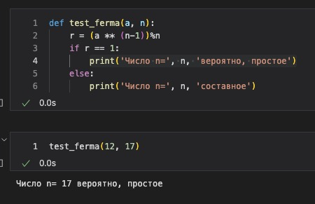
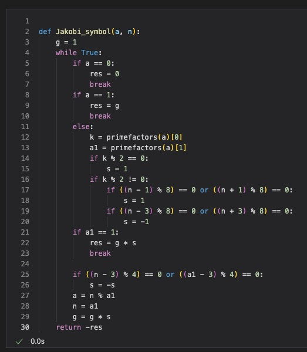

---
## Front matter
title: "Отчёт по лабораторной работе 5. Вероятностные алгоритмы проверки чисел на простоту"
author: "Ильин Никита Евгеньевич"

## Generic otions
lang: ru-RU
toc-title: "Содержание"

## Bibliography
bibliography: bib/cite.bib
csl: pandoc/csl/gost-r-7-0-5-2008-numeric.csl

## Pdf output format
toc: true # Table of contents
toc-depth: 2
lof: true # List of figures
lot: true # List of tables
fontsize: 12pt
linestretch: 1.5
papersize: a4
documentclass: scrreprt
## I18n polyglossia
polyglossia-lang:
  name: russian
  options:
	- spelling=modern
	- babelshorthands=true
polyglossia-otherlangs:
  name: english
## I18n babel
babel-lang: russian
babel-otherlangs: english
## Fonts
mainfont: PT Serif
romanfont: PT Serif
sansfont: PT Sans
monofont: PT Mono
mainfontoptions: Ligatures=TeX
romanfontoptions: Ligatures=TeX
sansfontoptions: Ligatures=TeX,Scale=MatchLowercase
monofontoptions: Scale=MatchLowercase,Scale=0.9
## Biblatex
biblatex: true
biblio-style: "gost-numeric"
biblatexoptions:
  - parentracker=true
  - backend=biber
  - hyperref=auto
  - language=auto
  - autolang=other*
  - citestyle=gost-numeric
## Pandoc-crossref LaTeX customization
figureTitle: "Рис."
tableTitle: "Таблица"
listingTitle: "Листинг"
lofTitle: "Список иллюстраций"
lotTitle: "Список таблиц"
lolTitle: "Листинги"
## Misc options
indent: true
header-includes:
  - \usepackage{indentfirst}
  - \usepackage{float} # keep figures where there are in the text
  - \floatplacement{figure}{H} # keep figures where there are in the text
---

# Цель работы

Цель данной работы - научиться реализовывать алгоритмы проверки чисел на простоту.

# Задание

1. Реализовать алгоритмы проверки чисел на простоту.

# Теоретическое введение

Пусть а - целое число. Числа ‡1, ‡а называются тривиальными делителями числа а.
Целое число р €Z/{0) называется простым, если оно не является делителем единицы и не имеет других делителей, кроме тривиальных. В противном случае число p €Z/{-1, 0, 1) называется составным.
являются
простыми.
Пусть т є N, т > .1 Целые числа а и в называются сравнимыми по модулю
т (обозначается а = b (mod m)) если разность а —6 делится на т. Также эта процедура называется нахождением остатка от целочисленного деления а на b.
Проверка чисел на простоту является составной частью алгоритмов генерации простых чисел, применяемых в криптографии с открытым ключом.
Алгоритмы проверки на простоту можно разделить на вероятностные и детерминированные.
Детерминированный алгоритм всегда действует по одной и той же схеме и гарантированно решает поставленную задачу (или не дает никакого ответа). Вероятностный алгоритм использует генератор случайных чисел и дает не гарантированно точный ответ. Вероятностные алгоритмы в общем случае не менее эффективны, чем детерминированные (если используемый генератор случайных чисел всегда дает набор одних и тех же чисел, зависящих от входных данных, от вероятностный алгоритм становится детерминированным).
Для проверки на простоту числа п вероятностным алгоритмом выбирают случайной число а 1( < а < n) и проверяют условия алгоритма. Если число и не
проходит тест по основанию а, то алгоритм выдает результат «Число п составное», ичисло идействительно является составным.
19
 Если же и проходит тест по основанию а, ничего нельзя сказать о том, действительно ли число п является простым. Последовательно проведя ряд проверок таким тестом для разных а и получив для каждого из них ответ «Число п, вероятно, простое», можно утверждать, что число и является простым с вероятностью, близкой к .1 После t независимых выполнений теста вероятность
того, что составное число и будет t раз объявлено простым (вероятность ошибки),
ен превосходит з
Схема вероятностного алгоритма проверки числа на простоту
Выбрать случайное число а, 1 < а < n
Число п прошло тест по основанию а
Число ,п вероятно, простое
Число п не прошло тест по основанию а
Число псоставное
Условие теста
Тест Ферма основан на малой теореме Ферма: для простого числа р и произвольного числа а, 1≤ а ≤ р- 1, выполняется сравнение
aP-1 = 1(mod p).
Следовательно, если для нечетного и существует такое целое а, что 1 ≤ а < n, НОД(a,n) = 1 и а"-1 ‡ 1(mod n), от число и составное. Отсюда получаем следующий вероятностный алгоритм проверки числа на простоту.
20
имени

 1. Алгоритм, реализующий тест Ферма.
Вход. Нечетное целое число п ≥ 5.
Выход. «Число п, вероятно, простое» или «Число и составное».
1. Выбрать случайное целое число а, 2 ≤ a ≤ n - 2. .2 Вычислить r - a"-1 (mod n).
3. При г = 1 результат: «Число п, вероятно, простое». В противном случае результат: «Число п составное».
На шаге 1мы ен рассматривали числа а= 1иа= n- 1, поскольку 11-1 = 1(mod n) для любого целого n и (n - 1)^-1 = (-1)^-1 = 1(mod n) для любого
нечетного п.
Тест Соловэя-Штрассена. Основан на критерии Эйлера: нечетное число n является простым тогда и только тогда, когда для любого целого числа а, 1 ≤ a ≤ n - 1, взаимно простого с n, выполняется сравнение:
где (Д) -символ Якоби.
Пусть т, п є Z, где п = P1P2 .Pr и числа Рі ‡ 2 простые (не обязательно различные). Символ Якоби (*) определяется равенством
()〇()()
2. Алгоритм вычисления символа Якоби.
Вход. Нечетное целое число п ≥ 3, целое число а, 0 ≤ а < n. Выход. Символ Якоби (д).
.1 Положить д - .1
21

 2. При а = 0 результат: 0.
3. При а = 1 результат: д.
.4 Представить а ввиде а = 2* a1, где число а, нечетное.
5. При четном k положить s - 1, при нечетном k положить s - 1, если п =
‡1 (mod 8); положить s < -1, если п = ‡3 (mod 8).
6. При а, = 1результат: 9•S.
.7Еслиn=3(mod4)иa1=3(mod4),ToS+ .s-
8. Положитьа- n(moda1),n- a1,9- g•sивернутьсянашаг.2 3. Алгоритм, реализующий тест Соловэя-Штрассена.
Вход. Нечетное целое число п ≥ 5.
Выход. «Число п, вероятно, простое» или «Число п составное».
1. Выбрать случайное целое число а, 2 ≤ а < n - 2.
2. Вычислить r - а 2 (mod n).
.3 При г ‡ 1 иг ‡ n - 1 результат: «Число п составное».
4. Вычислить символ Якоби ,s - (д).
5. При r s=(mod n) результат: «Число п составное». В противном случае результат: «Число п, вероятно, простое».
На сегодняшний день для проверки чисел на простоту чаще всего используется тест Миллера-Рабина, основанный на следующем наблюдении. Пусть число п нечетное и n - 1= 2oг, где г - нечетное. Если и простое, то для любого а ≥ 2, взаимно простого сп, выполняется условие а₽-1 = 1(mod p).
4. Алгоритм, реализующий тест Миллера-Рабина.
Вход. Нечетное целое число п ≥ 5.
Выход. «Число п, вероятно, простое» или «Число п составное».
.1 Представить n - 1 в виде n - 1= 25г, где число г нечетное. 2. Выбрать случайное целое число а, 2 ≤ а < n - 2.
2
ВСКО

 Саратовский государственный университет Саратовскийгосударственныйуниверситет ми
Чернышевского
.3 Вычислить у - а" (mod n).
4. При у ‡ 1 и у ‡ n - 1 выполнить следующие действия.
4.1. Положить j - 1.
4.2. Если j ≤ s - 1 иу ‡ n - 1, то
4.2.1. Положить у + у7 (mod n).
4.2.2. При у = 1 результат: «Число п составное». 4.2.3. Положить j - j + 1.
4.3.При у ‡ n - 1 результат: «Число п составное». .5 Результат: «Число п, вероятно, простое».

# Выполнение лабораторной работы

1. Реализуется функция алгоритма теста Ферма.  (рис. @fig:001).

{#fig:001 width=70%}

2. Реализуется функция алгоритма вычисления символа Якоби. (рис. @fig:002).

{#fig:002 width=70%}

3. Программная реализация алгоритма Соловэй-Штрассена.  (рис. @fig:003).

{#fig:003 width=70%}

4. Программная реализация алгоритма Миллера-Рабина. (рис. @fig:004).

{#fig:004 width=70%}

# Выводы

В ходе работы были реализованы алгоритмы проверки чисел на простоту.
