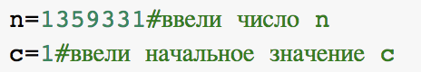
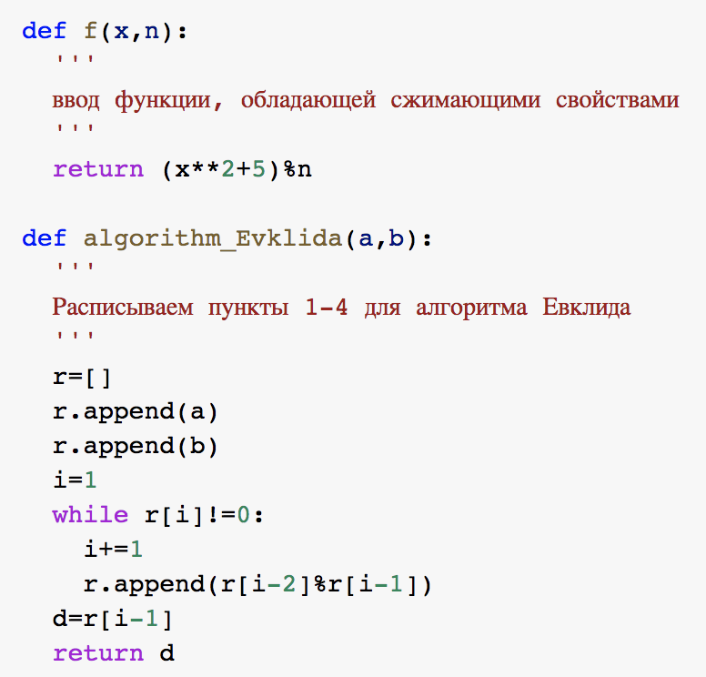
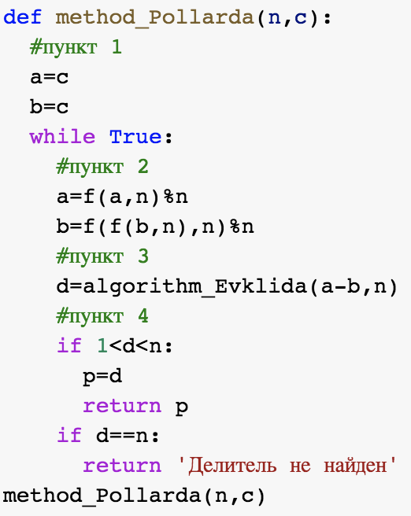
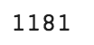

---
# Титульный лист
title: |
    Отчёт по лабораторной работе №6.  
    Разложение чисел на множители
author:
- "Студент: Ильин Никита Евгеньевич"
- "Группа: НФИмд-01-23"
- "Преподаватель: Кулябов Дмитрий Сергеевич,"
date: "Москва 2023"

# Общие опции
lang: ru-RU
toc-title: "Содержание"

# Библиография
bibliography: bib/cite.bib
csl: pandoc/csl/gost-r-7-0-5-2008-numeric.csl

# Конвертация в ПДФ
toc: true # Содержание
toc_depth: 2
lof: true # Список изображений
lot: true # Список таблиц
fontsize: 12pt
linestretch: 1.5
papersize: a4
documentclass: scrreprt

## I18n
polyglossia-lang:
  name: russian
  options:
	- spelling=modern
	- babelshorthands=true
polyglossia-otherlangs:
  name: english
### Шрифты
mainfont: PT Serif
romanfont: PT Serif
sansfont: PT Sans
monofont: PT Mono
mainfontoptions: Ligatures=TeX
romanfontoptions: Ligatures=TeX
sansfontoptions: Ligatures=TeX,Scale=MatchLowercase
monofontoptions: Scale=MatchLowercase,Scale=0.8
## Biblatex
biblatex: true
biblio-style: "gost-numeric"
biblatexoptions:
  - parentracker=true
  - backend=biber
  - hyperref=auto
  - language=auto
  - autolang=other*
  - citestyle=gost-numeric

## Misc options
indent: true
header-includes:
  - \linepenalty=10 # the penalty added to the badness of each line within a paragraph (no associated penalty node) Increasing the value makes tex try to have fewer lines in the paragraph.
  - \interlinepenalty=0 # value of the penalty (node) added after each line of a paragraph.
  - \hyphenpenalty=50 # the penalty for line breaking at an automatically inserted hyphen
  - \exhyphenpenalty=50 # the penalty for line breaking at an explicit hyphen
  - \binoppenalty=700 # the penalty for breaking a line at a binary operator
  - \relpenalty=500 # the penalty for breaking a line at a relation
  - \clubpenalty=150 # extra penalty for breaking after first line of a paragraph
  - \widowpenalty=150 # extra penalty for breaking before last line of a paragraph
  - \displaywidowpenalty=50 # extra penalty for breaking before last line before a display math
  - \brokenpenalty=100 # extra penalty for page breaking after a hyphenated line
  - \predisplaypenalty=10000 # penalty for breaking before a display
  - \postdisplaypenalty=0 # penalty for breaking after a display
  - \floatingpenalty = 20000 # penalty for splitting an insertion (can only be split footnote in standard LaTeX)
  - \raggedbottom # or \flushbottom
  - \usepackage{float} # keep figures where there are in the text
  - \floatplacement{figure}{H} # keep figures where there are in the text

  - \usepackage{titling}
  - \setlength{\droptitle}{-9em}
  - \pretitle{\begin{center}
      \textbf{РОССИЙСКИЙ УНИВЕРСИТЕТ ДРУЖБЫ НАРОДОВ}\\
      \textbf{Факультет физико-математических и естественных наук}\\
      \textbf{Кафедра прикладной информатики и теории вероятностей}
      \vspace{9cm}
      \LARGE\\}
  - \posttitle{\vskip 1em \Large \emph{\textit{Дисциплина$:$ Математические основы защиты информации и информационной безопасности}} \end{center}}
  - \preauthor{\vskip 3em \begin{flushright} \large \begin{tabular}[t]{c}}
  - \postauthor{\end{tabular}\par\end{flushright} \vfill \vskip 5em}
---

# Цель работы

Целью данной лабораторной работы является ознакомление с алгоритмами для разложения чисел на множители.

# Задание

1. Реализовать рассмотренный в инструкции к лабораторной работе алгоритм для разложения чисел на множители программно.

2. Разложить на множители данное в примере к лабораторной работе число.

# Теоретическое введение
В данной лабораторной работе предметом нашего изучения стал P-метод Полларда.
## Факторизация целых чисел

Факторизацией натурального числа называется его разложение в произведение простых множителей. Существование и единственность (с точностью до порядка следования множителей) такого разложения следует из основной теоремы арифметики.

В отличие от задачи распознавания простоты числа, факторизация предположительно является вычислительно сложной задачей. В настоящее время неизвестно, существует ли эффективный не квантовый алгоритм факторизации целых чисел. Однако доказательства того, что не существует решения этой задачи за полиномиальное время, также нет.

Предположение о том, что для больших чисел задача факторизации является вычислительно сложной, лежит в основе широко используемых алгоритмов (например, RSA). Многие области математики и информатики находят применение в решении этой задачи.

## P-алгоритм Полларда

Ро-алгоритм ($\rho$ -алгоритм) — предложенный Джоном Поллардом в 1975 году алгоритм, служащий для факторизации (разложения на множители) целых чисел. Данный алгоритм основывается на алгоритме Флойда поиска длины цикла в последовательности и некоторых следствиях из парадокса дней рождения. Алгоритм наиболее эффективен при факторизации составных чисел с достаточно малыми множителями в разложении.

Также хотелось бы упомянуть P-1 алгоритм Полларда.

## (P-1) алгоритм Полларда

(P-1) алгоритм Полларда впервые опубликован британским математиком Джоном Поллардом в 1974 году. Именно появление данного алгоритма привело к изменению понятия сильного простого числа, используемого в криптографии, нестрого говоря, простого числа, для которого p-1 имеет достаточно большие делители. В современных криптосистемах стараются использовать именно сильные простые числа, так как это повышает стойкость используемых алгоритмов и систем в целом 

# Выполнение лабораторной работы

**Примечание:** комментарии по коду представлены на скриншотах к каждому из проделанных заданий.

В соответствии с заданием, была написана программа по воплощению алгоритма по разложение чисел на множители.

Программный код и результаты выполнения программ представлен ниже.

## P-метод Полларда

{ #fig:001 width=70% }

{ #fig:002 width=70% }

{ #fig:003 width=70% }

Был взяты данные из пояснения к лабораторной работе. Они были подставлены в программу. Получен следующий результат (см. рис. (-@fig:04).

{ #fig:004 width=70% }

# Выводы

Таким образом, была достигнута цель, поставленная в начале лабораторной работы: я ознакомилась с алгоритмом разложения чисел (P-методом Полларда), реализовала данный алгоритмй на языке программирования Python 3, получила результат, схожий с данным в описании к лабораторной работе.

