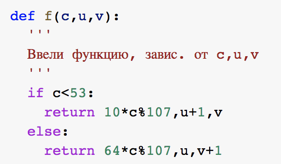

---
## Front matter
lang: ru-RU
title: |
    Отчёт по лабораторной работе №7.  
    Дискретное логарифмирование в конечном поле
author: |
    *Дисциплина: Математические основы защиты информации*  
    *и информационной безопасности*  
    \vspace{2pt}
    **Студент:** Ильин Никита Евгеньевич  
		**Группа:** НФИмд-01-23 
		**Преподаватель:** д-р.ф.-м.н., проф. Кулябов Дмитрий Сергеевич
    \vspace{2pt}

## Formatting
toc: false
slide_level: 2
theme: metropolis
header-includes:
 - \metroset{progressbar=frametitle,sectionpage=progressbar,numbering=fraction}
 - '\makeatletter'
 - '\beamer@ignorenonframefalse'
 - '\makeatother'
aspectratio: 43
section-titles: true
linestretch: 1.25

mainfont: PT Serif
romanfont: PT Serif
sansfont: PT Sans
monofont: PT Mono
mainfontoptions: Ligatures=TeX
romanfontoptions: Ligatures=TeX
sansfontoptions: Ligatures=TeX,Scale=MatchLowercase
monofontoptions: Scale=MatchLowercase,Scale=0.7
---

# Цели и задачи работы

## Цель лабораторной работы

\centering \Large \textbf{Целью} данной лабораторной работы является ознакомление с алгоритмом, реализующим p-метод Полларда для дискретного логарифмирования, а также программное воплощение данного алгоритма.

## Задание

1. Реализовать рассмотренный в инструкции к лабораторной работе алгоритм программно.

2. Подставить численное значение из примера в программный код, проверить правильность полученного ответа.

# Ход выполнения и результаты

## Ввод функции, зависящей от c,u,v

{ #fig:001 width=70% }

## Ввод функции для внедрения расш. алгоритма Евклида

{ #fig:002 width=70% }

## Алгоритм, реализующий Po-метод Полларда. Реализация

{ #fig:003 width=70% }

## Алгоритм, реализующий Po-метод Полларда. Реализация

{ #fig:004 width=70% }

## Результат проверки по данным из примера

{ #fig:005 width=70% }

## Вывод

В результате выполнения данной лабораторной работы нам удалось осуществить программно алгоритм, рассмотренный в описании к лабораторной работе. А также получить ответ, совпадающий с ответом из инструкции.

## {.standout}

Спасибо за внимание
