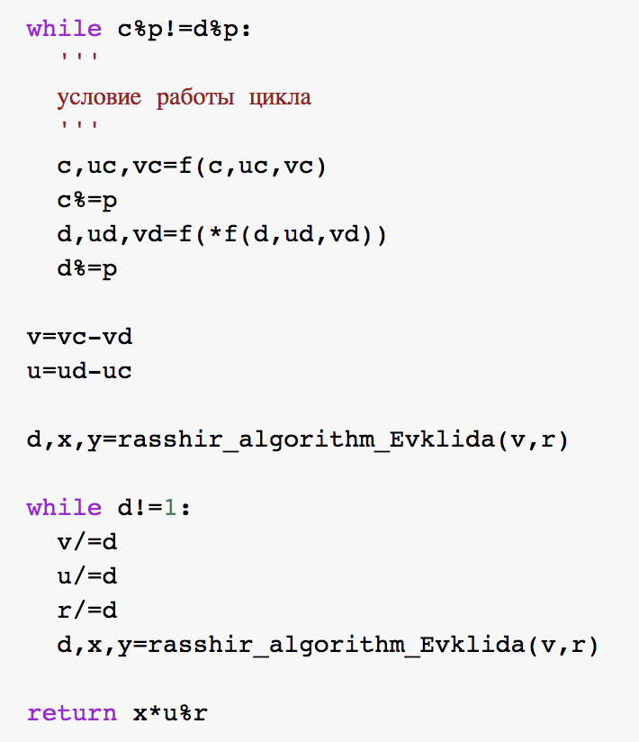
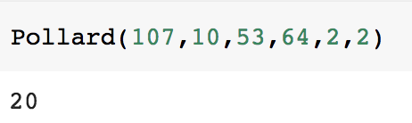

---
# Титульный лист
title: |
    Отчёт по лабораторной работе №7.  
    Дискретное логарифмирование в конечном поле
author:
- "Студент: Ильин Никита Евгеньевич"
- "Группа: НФИмд-01-23"
- "Преподаватель: Кулябов Дмитрий Сергеевич,"
- "д-р.ф.-м.н., проф."
date: "Москва 2021"

## Bibliography
bibliography: bib/cite.bib
csl: pandoc/csl/gost-r-7-0-5-2008-numeric.csl

## Pdf output format
toc: true # Table of contents
toc-depth: 2
lof: true # List of figures
lot: true # List of tables
fontsize: 12pt
linestretch: 1.5
papersize: a4
documentclass: scrreprt
## I18n polyglossia
polyglossia-lang:
  name: russian
  options:
	- spelling=modern
	- babelshorthands=true
polyglossia-otherlangs:
  name: english
## I18n babel
babel-lang: russian
babel-otherlangs: english
## Fonts
mainfont: PT Serif
romanfont: PT Serif
sansfont: PT Sans
monofont: PT Mono
mainfontoptions: Ligatures=TeX
romanfontoptions: Ligatures=TeX
sansfontoptions: Ligatures=TeX,Scale=MatchLowercase
monofontoptions: Scale=MatchLowercase,Scale=0.9
## Biblatex
biblatex: true
biblio-style: "gost-numeric"
biblatexoptions:
  - parentracker=true
  - backend=biber
  - hyperref=auto
  - language=auto
  - autolang=other*
  - citestyle=gost-numeric
## Pandoc-crossref LaTeX customization
figureTitle: "Рис."
tableTitle: "Таблица"
listingTitle: "Листинг"
lofTitle: "Список иллюстраций"
lotTitle: "Список таблиц"
lolTitle: "Листинги"
## Misc options
indent: true
header-includes:
  - \usepackage{indentfirst}
  - \usepackage{float} # keep figures where there are in the text
  - \floatplacement{figure}{H} # keep figures where there are in the text
---

# Цель работы

Целью данной лабораторной работы является ознакомление с алгоритмом, реализующим Po-метод Полларда для дискретного логарифмирования, а также программное воплощение данного алгоритма.

# Задание

1. Реализовать рассмотренный в инструкции к лабораторной работе алгоритм программно.

2. Подставить численное значение из примера в программный код, проверить правильность полученного ответа.

# Теоретическое введение

В данной лабораторной работе предметом нашего изучения стал Pо-метод Полларда для задач дискретного логарифмирования.

## Po-метод Полларда

Ро-метод Полларда для дискретного логарифмирования ($\rho$ -метод) — алгоритм дискретного логарифмирования в кольце вычетов по простому модулю, имеющий экспоненциальную сложность. Предложен британским математиком Джоном Поллардом  в 1978 году, основные идеи алгоритма очень похожи на идеи ро-алгоритма Полларда для факторизации чисел. Данный метод рассматривается для группы ненулевых вычетов по модулю p, где p — простое число, большее 3 [@wiki:pol].

## Постановка задачи дискретного логарифмирования

Постановка задачи дискретного логарифмирования представлена следующим образом:

{ #fig:001 width=70% }

## Алгоритм Ро-метода Полларда

Исходя из теоретических сведений, алгоритм Ро-метода Полларда представлен ниже [@wiki:pol2].

{ #fig:002 width=70% }

При этом, важно учесть следующие замечания [@mind:pol]:

{ #fig:003 width=70% }

## Сложность алгоритма

Эвристическая оценка сложности составляет $O ({p}^{1/2})$.

# Выполнение лабораторной работы

**Примечание:** комментарии по коду представлены на скриншотах к каждому из проделанных заданий.

В соответствии с заданием, была написана программа по воплощению алгоритма Ро-метода Полларда для задач дискретного логарифмирования.

Программный код и результаты выполнения программ представлен ниже.

## Pо-метод Полларда

{ #fig:004 width=70% }

{ #fig:005 width=70% }

{ #fig:006 width=70% }

{ #fig:007 width=70% }

Были взяты данные из пояснения к лабораторной работе. Они были подставлены в программу. Получен следующий результат (см. рис. [-@fig:008).

{ #fig:008 width=70% }

# Выводы

Таким образом, была достигнута цель, поставленная в начале лабораторной работы: в результате выполнения данной лабораторной работы нам удалось изучить алгоритм Po-Полларда осуществить программно алгоритм, рассмотренный в описании к лабораторной работе на языке Python 3. А также получить ответ, совпадающий с ответом из инструкции.

# Список литературы{.unnumbered}

::: {#refs}
:::
