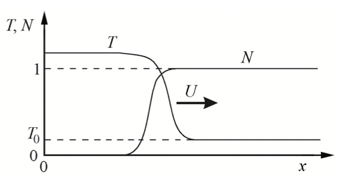

---
## Front matter
lang: ru-RU
title: Теплопроводность, детерминированное горение
author: |
  Воробьев А. О.; Ильин Н. Е.; Дмитревская С. А.; Бурдина К. П.
institute: |
  РУДН, Москва
date: 26.02.2022

## Formatting
toc: false
slide_level: 2
theme: metropolis
header-includes: 
 - \metroset{progressbar=frametitle,sectionpage=progressbar,numbering=fraction}
 - '\makeatletter'
 - '\beamer@ignorenonframefalse'
 - '\makeatother'
aspectratio: 43
section-titles: true
---

# Введение

Горение - химический процесс соединения веществ с кислородом с выделением тепла и света, являющийся интересным объектом для исследований. 
Уже при помощи простых моделей можно качественно описывать реальные особенности этого горения, несмотря на сложность физико-химических процессов.
Даже в простой системе возможно наблюдать различные режимы горения. Для этого понадобится среда, обладающая теплопроводностью и возможностью протекания экзотермической реакции.

## Введение

Рассмотрим среду с учётом теплопроводности, в которой возможна экзотермическая химическая реакция, в которой исследуем различные режимы горения в одномерном и двумерном случаях, численно решая систему дифференциальных уравнений.

# 1. Размерная система уравнений

Положим, что при увеличении температуры, будет расти скорость химической реакции. В рассматриваемой системе также допускается распространение тепла из уже разогретой зоны вещества в новые слои, ускоряя химическую реакцию. Определенные условия дают возможность процессу распространяться на неограниченном пространстве.

## 1. Размерная система уравнений

В первом приближении для моделирования волны горения ограничимся системой с постоянными коэффициентами теплоемкости и теплопроводности. Будем моделировать химическую реакцию простейшим образом: вещество вида A переходит в B, при этом выделяется тепло. Для скорости химической реакции воспользуемся законом Аррениуса для реакции первого порядка:

$$\frac{\partial{N}}{\partial{t}} = -\frac{N}{\tau}  e^{-E/RT}$$

где N — доля непрореагировавшего вещества A, меняющаяся от 1 — исходное состояние, до 0 — все прореагировало, 
E — энергия активации химической реакции,  
${\tau}$ — характерное время перераспределения энергии,  
T — температура в данной точке.  

## 1. Размерная система уравнений

В одномерном случае необходимо добавить уравнение теплопроводности с дополнительным членом, отвечающим за энерговыделение,  

$${\rho}c\frac{\partial{T}}{\partial{t}} = {\kappa}-\frac{\partial^2{T}}{\partial{x^2}}-{\rho}Q\frac{\partial{N}}{\partial{t}}$$

где ${\rho}$ — плотность,  
c — удельная теплоемкость,  
${\kappa}$ — коэффициент теплопроводности,  
Q — удельное энерговыделение при химической реакции.

## 1. Размерная система уравнений

В отличие от реальности, коэффициенты постоянны. Однако модель все равно качественно отражает стороны явления. В этой системе уравнений возможен режим в виде самостоятельно распространяющейся волны горения.
На рис. 2.11 показан пример волны, распространяющейся вдоль оси X со скоростью U (T0 — температура перед волной горения).

{ #fig:001 width=70% }  

# 2. Система уравнений для безразмерных величин

Поделив уравнение теплопроводности на ${\rho}Q$ и перейдя к безразмерным температуре $\tilde{T} = \frac{cT}{Q}$ и энергии активации $\tilde{E} = \frac{cE}{RQ}$, получим систему уравнений:

$$\frac{\partial{T}}{\partial{t}} = {\chi}\frac{\partial^2{T}}{\partial{x^2}}-\frac{\partial{N}}{\partial{t}},$$

$$\frac{\partial{N}}{\partial{t}} = -\frac{N}{\tau}e^{-E/T},$$

где ${\chi} = {\kappa}/{\rho}c$ называется коэффициентом температуропроводности. 

из закона сохранения энергии следует, что в волне горения температура всегда должна подниматься на единицу от начальной температуры среды ${T_0}$.

# 3. Различные режимы горения

Из имеющихся в системе уравнений (2.20) и (2.21) трех параметров наиболее интересна безразмерная энергия активации E. Именно этот параметр определяет режим волны горения, а остальные параметры ${\tau}$ и ${\chi}$ только масштабируют явление во времени и в пространстве. Для начала рассмотрим одномерный случай. Здесь возможны два режима горения: стационарный и пульсирующий (автоколебательный). В первом — скорость распространения волны постоянна, а профили температуры и концентрации переносятся вдоль оси X не деформируясь (рис. 2.11). Во втором — скорость волны переменная, и горение распространяется в виде чередующихся вспышек и угасаний. От значения параметра E, зависит какой режим реализуется.

## 3. Различные режимы горения

При ${E < E∗}$ — стационарное горение, а при ${E > E∗}$ — пульсирующее.  При увеличении начальной температуры T0 критическое значение E∗ возрастает [42]. Для моделирования волны горения в двумерном случае в уравнение (2.20) нужно добавить перенос тепла по второй координате — ${\chi}\frac{\partial^2{T}}{\partial{y^2}}$

## 3. Различные режимы горения

Кроме стационарного и пульсирующего режимов для этой двухмерной системы возможен третий режим распространения волны горения — спиновый. Область существования спинового режима — ${E > E∗∗}$.
На рисунке 2.12 приведен характерный пример численного моделирования спинового режима горения. Градациями серого цвета показано поле температур: черный — маленькая, белый — большая температура. Отдельно черными пятнами выделены горячие зоны. Волна горения распространяется слева направо, по вертикали — периодические граничные условия.
Примером реальной физической системы, где бы реализовывались все выше перечисленные режимы, может служить горение бенгальской свечи. При внимательном рассмотрении во фронте горения хорошо заметны яркие точки, «бегающие» вдоль фронта, это и есть аналог спинового режима. Пульсирующий режим наиболее ярко проявляется незадолго до угасания самой свечи.

# 4. Явная разностная схема

Рассмотрим численные методы решения одномерного уравнения теплопроводности без химических реакций.

$$\frac{\partial{T}}{\partial{t}} = {\chi}\frac{\partial^2{T}}{\partial{x^2}}$$

Для этого в уравнении теплопроводности заменим частные производные на разностные. Для сетки с постоянным шагом получаем соотношение, связывающее температуру в узле на новом шаге по времени с температурой в узлах текущего временного слоя.

$$\frac{\tilde{T_i}-T_i}{\Delta t} = {\chi}\frac{\frac{T_{i+1}-T_i}{h}-\frac{T_i-T_{i-1}}{h}}{h} = {\chi}\frac{(T_{i+1}-2T_i+T_{i-1})}{h^2}$$

## 4. Явная разностная схема

Здесь ${\hat{T_i}}$  — новая температура в узле. Проделав эту процедуру для каждого узла, мы «явно» найдем температуру на новом слое по времени. Такая разностная схема называется явной. Метод требует два массива для хранения старой и новой температур, устойчив при условии ${{\chi}\Delta t/h^2} < 0.5$, на практике значения ${{\chi}\Delta t/h^2} = 0.4$ вполне достаточно. Для вычисления температуры в крайних точках предлагается использовать адиабатические граничные условия: ${(T_2-T_0)/2h = 0}$ и ${(T_{n+1}-T_{n-1})/2h = 0}$, что эквивалентно условиям ${T_0 = T_2}$, ${T_{n+1} = T_{n-1}}$.

## 4. Явная разностная схема

Теперь, чтобы учесть ХР, добавим к (2.22) изменение безразмерной температуры за счет энерговыделения в химических реакциях за шаг по времени
$$ \Delta N_i = - \frac{N_i}{\tau} e^{-E/T_i}\Delta t, $$

$$ \hat{T_i} = T_i  + \frac{\chi \Delta t}{h^2} (T_{i+1} - 2Ti + T_{i-1}) - \Delta N_i, $$
$$ \hat{N_i} = N_i - \Delta N_i, $$
где ${i = 1, 2, ..., n.}$

Используя эту разностную схему, можно численно решать изначальную систему дифференциальных уравнений (2.20) и (2.21) для безразмерных величин.
